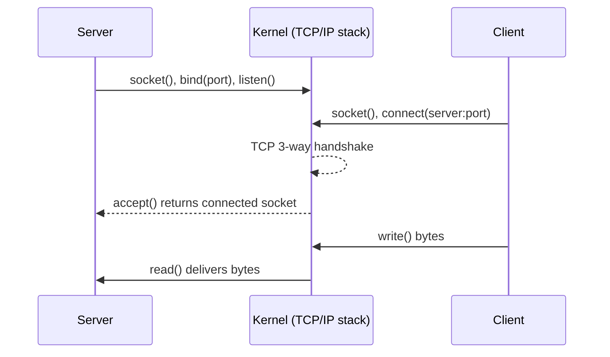

# Networking on Linux

Linux networking is the [general TCP/IP model](../computer-science/computer-networks.md)
made concrete inside a running kernel. The interesting part is not the protocols in the
abstract — those are universal — but *how the kernel exposes them*: as configurable
**interfaces**, a **socket** programming interface, a **routing table** that decides where
packets go, and pluggable layers for **name resolution** and **filtering**. Understanding
the Linux realization of the stack is what lets you reason about why a connection fails,
where a packet is dropped, or how a container gets its own network.

## Interfaces: the kernel's view of "a network"

An **interface** is the kernel's handle on a link over which packets travel. `lo` is the
loopback interface (the host talking to itself, `127.0.0.1`); `eth0`/`enp3s0` is a physical
NIC; `wlan0` is Wi-Fi. But interfaces need not map to hardware — Linux creates **virtual**
interfaces freely: bridges that join interfaces like a switch, `veth` pairs (a virtual
cable with two ends), tunnels, and VLANs. This virtualization is the hinge on which
container networking turns (below). Each interface carries one or more IP addresses and a
set of properties (MTU, up/down state) that the kernel consults for every packet.

## The sockets API: the boundary between app and kernel

Applications never touch packets directly. They ask the [kernel](the-linux-kernel.md) for a
**socket** — an endpoint for communication — via the same system-call interface Unix has
offered since BSD. The sequence is the mental model worth keeping:

Consistent with Linux's [everything-is-a-file](everything-is-a-file.md) principle, a socket
is a file descriptor — the same integer handle as an open file — so the same `read`/`write`/
`poll` calls work on network connections, and the kernel owns the TCP state machine, buffers,
retransmission, and congestion control beneath that simple interface.

## Routing: deciding where a packet goes

When the kernel has a packet to send, it consults the **routing table** to pick the outgoing
interface and next hop. The rule is longest-prefix match: the most specific matching route
wins, with a **default route** (the gateway) as the catch-all for anything not on a local
subnet. This one table is why a machine on `192.168.1.0/24` reaches a local peer directly but
sends everything else to its router. Turn on `ip_forward` and the host itself becomes a
router, moving packets *between* interfaces — the mechanism behind every Linux gateway,
container host, and VPN box.

## DNS: turning names into addresses

TCP/IP routes on numbers; humans use names. **Resolution** is the translation, and on Linux
it is a userspace concern layered over the socket API, not a kernel feature. A program calls
a resolver library (historically `getaddrinfo`), which consults a configured order of
sources — typically the local `hosts` file first, then DNS servers listed in the resolver
configuration (increasingly mediated by a local stub resolver like `systemd-resolved`). A
failure here looks like a network outage but isn't: the route may be fine while the name
simply can't be resolved. Separating "can I resolve the name" from "can I reach the address"
is the first cut in almost any connectivity diagnosis.

## Firewalling: filtering at the kernel

Packet filtering lives *in* the kernel, in the **netfilter** framework. The classic userspace
front-end was **iptables**, organized as tables of chains of rules that a packet traverses at
defined hook points (as it arrives, as it's forwarded, as it leaves). Its successor, **nftables**,
replaces the several fragmented iptables tools with one unified syntax and a more efficient
in-kernel representation, but the model is the same: rules match on packet fields (source,
destination, port, state) and take an action (accept, drop, reject, translate). **NAT** —
rewriting addresses so many hosts share one public IP — is just a special filtering action,
and it is exactly how containers reach the outside world from private internal addresses.

## Network namespaces: the root of container networking

The feature that ties Linux networking to the modern platform is the **network namespace**.
A namespace gives a set of processes their *own* copy of the entire network stack — their own
interfaces, routing table, and firewall rules — fully isolated from the host's. Create a
namespace, drop one end of a `veth` pair inside it and attach the other end to a bridge on
the host, and you have a container with its own IP that can talk to the host and, via NAT,
the wider network. There is no special "container network" technology: it is ordinary Linux
interfaces, routes, and netfilter rules, partitioned by namespaces. This is why
[containers are best understood as kernel features](containers-and-namespaces.md), not as
virtual machines — and why debugging container networking is just debugging Linux networking
inside a different namespace.

## Why it matters

Every layer above — service meshes, load balancers, Kubernetes CNI plugins — is built on this
same primitive set: interfaces, sockets, routes, resolution, netfilter, and namespaces. Knowing
the Linux realization means a networking problem decomposes into concrete questions with concrete
tools, instead of a fog of "the network is down."

## References

- [How Linux Works (Ward)](ward-how-linux-works.md)
- [The Linux Programming Interface (Kerrisk)](kerrisk-linux-programming-interface.md)
- [Unix and Linux System Administration Handbook (Nemeth et al.)](nemeth-unix-linux-sysadmin.md)
