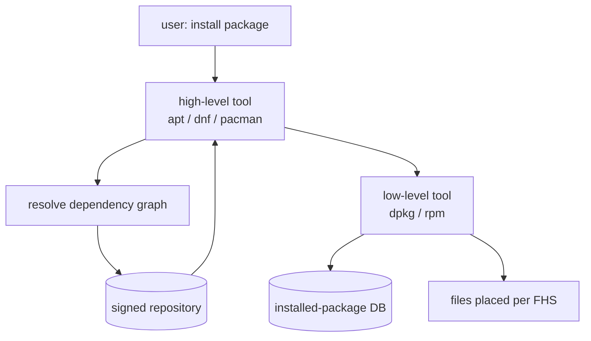

# Package Management and Distributions

"Linux" names a kernel, not an operating system. What a person actually installs and
runs is a **distribution**: a curated assembly of the [Linux kernel](the-linux-kernel.md),
a userland (the GNU coreutils, a C library, a shell, an [init system](init-and-services.md)),
a **package manager**, and a set of **conventions** — where files live per the
[filesystem hierarchy](the-filesystem-and-fhs.md), how services start, how the system is
configured. The kernel is common; the distribution is the opinions layered on top. This
is why Debian, Fedora, and Arch feel like different operating systems despite sharing a
kernel: they differ in their userland choices, release cadence, and — most visibly — their
package manager and the social contract around its repositories.

## What a package manager solves

Before package managers, installing software meant compiling from source and manually
tracking what depended on what. A **package** bundles compiled files plus **metadata**:
its version, the files it installs, and — critically — its **dependencies** on other
packages. A package manager is the tool that reads that metadata, computes a consistent
set of packages to install or remove, fetches them from a **repository**, and records
what is present so it can be upgraded or cleanly removed later. The hard part is
**dependency resolution**: given a package that needs libssl ≥ 3.0 and another that needs
a conflicting version, find an installable set — a constraint-satisfaction problem that
modern resolvers treat with real SAT-solver machinery.

The ecosystem splits into two historical lineages plus a rolling-release outlier:

| Family | Low-level tool | High-level tool | Package format | Distros |
|---|---|---|---|---|
| Debian | `dpkg` | `apt` | `.deb` | Debian, Ubuntu |
| Red Hat | `rpm` | `dnf` (was `yum`) | `.rpm` | Fedora, RHEL, openSUSE |
| Arch | — | `pacman` | `.pkg.tar.zst` | Arch, Manjaro |

The **low-level tool** (`dpkg`, `rpm`) installs a single package file and knows nothing
about fetching dependencies; the **high-level tool** (`apt`, `dnf`) sits above it,
resolves the dependency graph, and pulls the needed packages from repositories. Arch
collapses the two into `pacman` and pairs it with a rolling release — no discrete versions,
packages update continuously.

## Repositories and the chain of trust

A repository is a server hosting packages plus an **index** of what's available. Because
you are downloading executable code that will run with system privileges, trust is the
whole game. Distributions solve it with **cryptographic signing**: the repository's index
(and often each package) is signed with a private key, and the distribution ships the
corresponding public key with the installer. The package manager verifies the signature
before installing, so a tampered mirror or a man-in-the-middle over the
[network](networking-on-linux.md) cannot inject malicious code without breaking the
signature. This is the same public-key trust model as TLS, applied to software supply
rather than transport. The practical upshot: install from your distribution's official
repositories, and adding a third-party repo means adding its key — an explicit trust
decision, not a convenience.

## The cross-distro turn

The classic model has a weakness: a `.deb` built for Ubuntu may not install on Fedora,
and an application depending on a newer library than the distribution ships is stuck. Two
responses emerged.

**Bundle-everything formats** ship the application *with* its dependencies so it runs on
any distribution:

- **Flatpak** — apps run against shared *runtimes* and are sandboxed (via the same
  [namespaces](containers-and-namespaces.md) that power containers), so an app's file and
  network access is constrained. Desktop-focused.
- **Snap** — Canonical's format; similar bundling and sandboxing, with a single central
  store.
- **AppImage** — a single executable file carrying its dependencies; no installation, no
  daemon, just run it. The simplest model, the weakest sandboxing.

These trade disk space and some system integration for portability and isolation.

**Nix** takes a different, deeper stance: **reproducibility**. Every package is built in
isolation and stored under a path keyed by a hash of *all* its inputs
(`/nix/store/<hash>-openssl-3.0.8`). Two versions of a library can coexist because their
hashes differ; an upgrade never mutates an existing package in place. Because the build is
a pure function of its declared inputs, the same expression yields a bit-for-bit identical
result anywhere — the packaging equivalent of
[infrastructure as code](../devops-sre/infrastructure-as-code.md), where the entire system
is a declarative, version-controlled specification rather than an accreted pile of
imperative install steps. This makes rollbacks trivial (point back at the old store paths)
and eliminates "works on my machine" drift at the package layer.

## Why it matters

The package manager is where a distribution's philosophy becomes concrete. Debian's caution,
Arch's minimalism-and-immediacy, and Nix's determinism are all *packaging* decisions before
they are anything else. For anyone provisioning servers or building reproducible
environments, understanding dependency resolution and repository trust is the difference
between a system you can reason about and one that mysteriously breaks on the next upgrade.
The move toward bundled and hash-pinned formats is the same instinct that drives containers
and IaC: make the software's dependencies **explicit and reproducible** rather than implicit
in the host's accumulated state.

## References

- [How Linux Works (Ward)](ward-how-linux-works.md)
- [Unix and Linux System Administration Handbook (Nemeth et al.)](nemeth-unix-linux-sysadmin.md)
