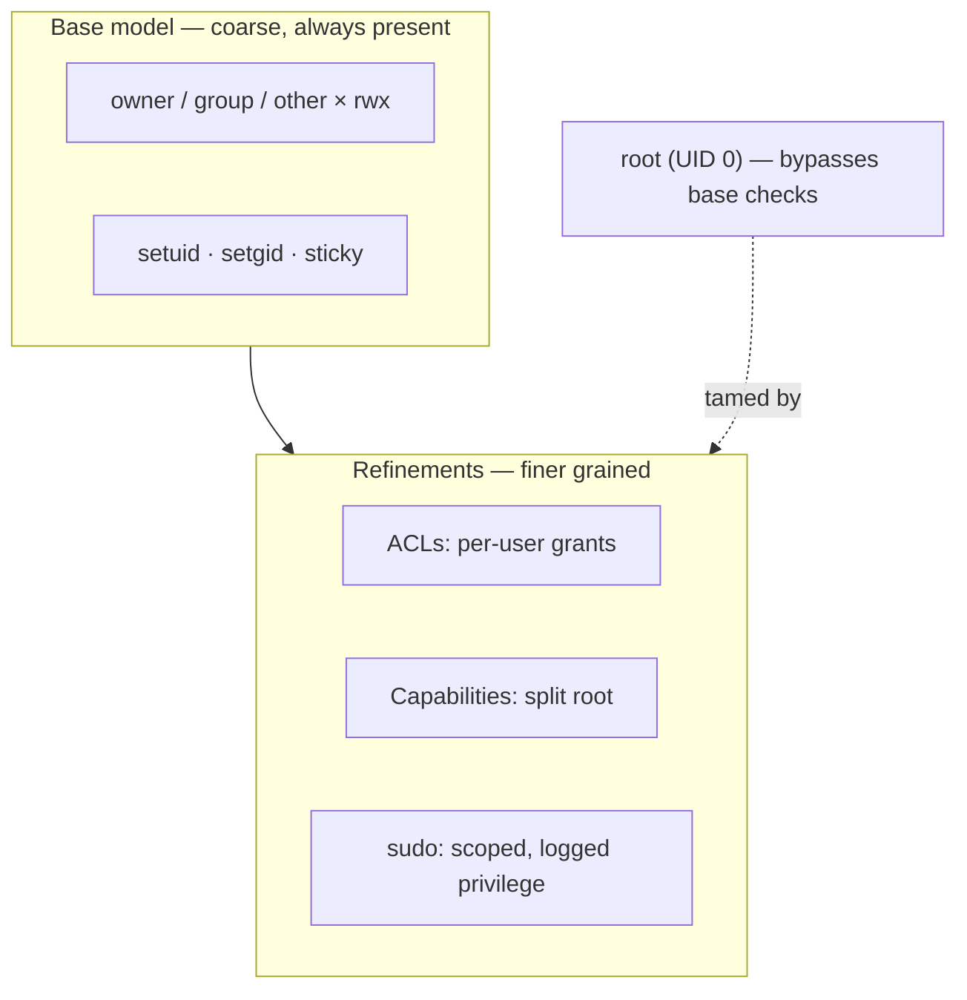

# Permissions and Users

Unix security starts from a small, blunt model and extends outward. The base model is old,
coarse, and remarkably durable: every process runs *as a user*, every file is *owned by a
user and a group*, and access is decided by comparing the two. Everything else — ACLs,
capabilities, `sudo` — is a refinement layered on that core because the core alone is too
coarse for modern needs.

## Users and groups

A **user** is an identity, represented internally by a numeric **UID**; a **group** is a
named collection of users, a **GID**. Names (`ian`, `wheel`) are for humans; the kernel only
sees numbers. Every process carries the identity of the user that started it, and it is that
identity — not the human at the keyboard — that the kernel checks on every access. A user
belongs to one *primary* group and any number of *supplementary* groups, which is how you
grant a set of people shared access to a resource without opening it to everyone.

## The rwx bits and three classes

Each file records permissions for **three classes** of accessor, in fixed priority order:

1. **owner** (`u`) — the user who owns the file
2. **group** (`g`) — members of the file's group
3. **other** (`o`) — everyone else

For each class there are three permission bits — **read (r)**, **write (w)**, **execute
(x)** — giving the familiar nine-bit string `rwxr-xr--`. The kernel applies the *first
matching class*: if you are the owner, only the owner bits apply, even if the group bits are
more permissive. On a **directory**, the bits mean something adapted: `r` lists names, `w`
adds/removes entries, and `x` is *permission to traverse into* it (to use a name inside).
You can have `x` without `r` on a directory — pass through it but not list it.

## Octal notation

The nine bits pack naturally into three octal digits, one per class, each the sum of
read=4, write=2, execute=1:

| Octal | Bits | Meaning |
|-------|------|---------|
| `755` | `rwxr-xr-x` | owner full, others read+traverse (typical program/dir) |
| `644` | `rw-r--r--` | owner read/write, others read (typical file) |
| `600` | `rw-------` | owner only (secrets, keys) |
| `700` | `rwx------` | owner-only directory |

Reading `chmod 640 file` as "owner rw, group r, other nothing" is the fluency that makes the
model fast to use.

## The special bits: setuid, setgid, sticky

Three extra bits handle cases the base model can't express:

- **setuid** — on an executable, the process runs as the *file's owner*, not the caller.
  This is how an ordinary user runs `passwd` to edit the system password file: the binary is
  owned by root and setuid, so it momentarily gains root's authority. Powerful and dangerous
  — a bug in a setuid-root program is a privilege-escalation hole, which is why the trend is
  to replace setuid binaries with narrower [capabilities](#beyond-the-base-model).
- **setgid** — same idea for the group; on a *directory* it also makes new files inherit the
  directory's group, the standard trick for shared project directories.
- **sticky bit** — on a shared-writable directory like `/tmp`, it restricts deletion so a
  user can only remove *their own* files, not everyone's.

## Root vs. least privilege

**root** (UID 0) is the superuser: the permission checks above are *skipped entirely* for
it. Root can read, write, and execute anything, bind low ports, load kernel modules, and
change any identity. That omnipotence is the model's greatest weakness — a compromised
root process compromises the whole machine. The countervailing principle is **least
privilege**: run each process with the *minimum* authority it needs, for the *minimum* time.
This is the same principle that governs [containers-and-namespaces](containers-and-namespaces.md)
and the sandboxing discussed in [execution-sandboxing](../ai-platform/execution-sandboxing.md),
and it is a cornerstone of practical [security](../security/index.md).

## sudo: mediated privilege

Rather than hand out the root password or leave people logged in as root, **`sudo`** lets a
policy file (`/etc/sudoers`) grant *specific users* the right to run *specific commands* as
root (or another user), each invocation authenticated and logged. This turns "become
omnipotent" into "perform this one privileged action, on the record" — auditable, revocable,
and scoped. It is least privilege applied to human administrators.

## Beyond the base model

The owner/group/other scheme is too coarse when you need per-user grants or want to slice up
root's power. Two extensions address that:

- **ACLs (Access Control Lists)** — attach a *list* of additional user/group grants to a
  file, escaping the single-owner/single-group limit. "Give exactly these three users write
  access" without inventing a group.
- **Capabilities** — split root's monolithic power into ~40 independent privileges
  (`CAP_NET_BIND_SERVICE`, `CAP_SYS_ADMIN`, …). A web server can be granted *only* the
  capability to bind port 80, instead of running as full root. This is the modern
  least-privilege replacement for setuid-root binaries and a building block of container
  security.

## Why it matters

The permission model is where the filesystem and process worlds meet: every access is a
process identity checked against a file's [inode metadata](the-filesystem-and-fhs.md). Its
simplicity is a feature — you can hold the whole base model in your head — but its coarseness
is why the layered refinements exist. The through-line from `600` on a private key to
capabilities on a container is one idea applied at every scale: *grant the least authority
that gets the job done.* See [nemeth-unix-linux-sysadmin](nemeth-unix-linux-sysadmin.md) for
operational practice and [kerrisk-linux-programming-interface](kerrisk-linux-programming-interface.md)
for the syscall-level details of credentials and capabilities.

## References

- [nemeth-unix-linux-sysadmin](nemeth-unix-linux-sysadmin.md)
- [kerrisk-linux-programming-interface](kerrisk-linux-programming-interface.md)
- [the-filesystem-and-fhs](the-filesystem-and-fhs.md)
- [containers-and-namespaces](containers-and-namespaces.md)
- [../security/index.md](../security/index.md)
- [../ai-platform/execution-sandboxing.md](../ai-platform/execution-sandboxing.md)
