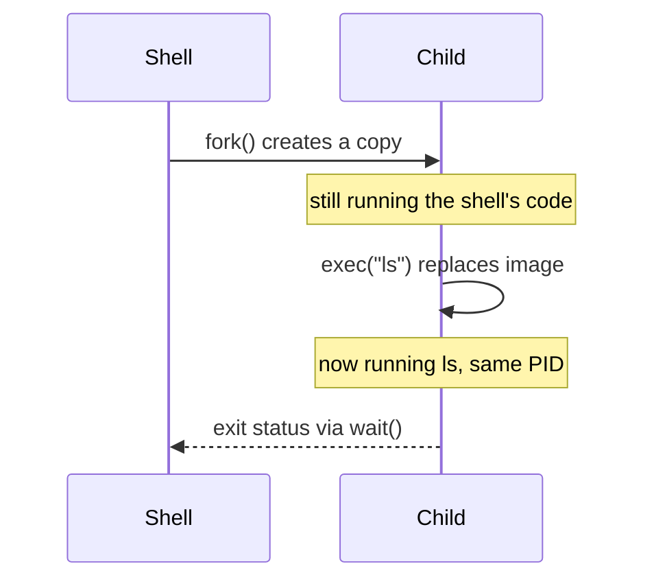

# Processes and Signals

A **process** is a running program: an instance of executable code plus the state
it needs to run — its memory, its open [file descriptors](everything-is-a-file.md),
its registers, and its scheduling context. The Unix process model is unusually
elegant, and understanding it explains a great deal about how the whole system
behaves: how programs start, how the shell works, how services are supervised,
and how the system shuts down cleanly.

## PIDs and the process tree

Every process has a unique **process ID (PID)**, and every process (except the
first) has a **parent** — the process that created it, recorded as the PPID. This
makes all processes a **tree**, not a flat list. The root is **PID 1**, the
[init system](init-and-services.md), started by the [kernel](the-linux-kernel.md)
at boot; every other process descends from it. `pstree` renders this tree; it is
the literal ancestry of everything running.

The tree is not just bookkeeping — it is how the system tracks responsibility. A
parent is accountable for its children: it can wait on them, be notified when
they exit, and is where their exit status is delivered.

## fork and exec

New processes are created by a deliberately minimal, two-step mechanism that is
one of Unix's signature design choices:

- **`fork()`** clones the calling process. The child is a near-identical copy of
  the parent — same code, same memory (copy-on-write), same open descriptors —
  differing only in its PID and `fork`'s return value (0 in the child, the
  child's PID in the parent). After `fork` there are two nearly identical
  processes running the same program.
- **`exec()`** replaces the current process's memory image with a *different*
  program. Same PID, same descriptors — but now running new code. `exec` does not
  return on success; there is nothing left to return to.

Splitting creation (`fork`) from loading (`exec`) is what makes the shell simple
and powerful: **between the two steps**, the child can rearrange its own
environment — redirect descriptors, set up [pipes](the-shell-and-pipes.md),
change directory — and only *then* `exec` the target program. All of shell
redirection and piping lives in that gap. It is a clean example of separating
mechanism from policy: the kernel provides the two primitives; the shell composes
them into whatever it needs.

## Parent, child, and zombies

When a child exits, it does not vanish immediately. It becomes a **zombie**: a
husk retaining just its exit status, waiting for the parent to collect it via
`wait()`. This is deliberate — the exit status is the child's final message, and
throwing it away before the parent reads it would lose information (the same
`0`-means-success status the [shell](the-shell-and-pipes.md) branches on).

- A **zombie** is a *dead* child not yet reaped. Harmless individually, but a
  parent that never reaps leaks entries in the process table.
- An **orphan** is a *live* child whose parent died first. It is re-parented to
  PID 1 (or a subreaper), which dutifully reaps it when it exits. This is why
  init must never neglect reaping — it is the backstop for every orphan.

## Foreground, background, and job control

An interactive shell manages processes through **job control**:

- A command run normally is a **foreground** job — it owns the terminal and
  receives keyboard input.
- Appending `&` runs it in the **background**; the shell returns the prompt
  immediately.
- `Ctrl-Z` suspends the foreground job; `bg` resumes it in the background, `fg`
  brings it back. `jobs` lists them.

Underneath, this rests on **process groups** and **sessions** — the kernel groups
related processes so a signal (like the `Ctrl-C` interrupt) can be delivered to a
whole job at once, not just one process.

## Signals

**Signals** are the system's lightweight asynchronous notifications — a way to
poke a process to tell it something happened. A signal interrupts the process,
which either runs a registered **handler**, ignores it, or takes the default
action. The ones that matter most concern **shutdown**:

| Signal | Default | Meaning / use |
|--------|---------|---------------|
| `SIGINT` (2) | terminate | interrupt — what `Ctrl-C` sends |
| `SIGTERM` (15) | terminate | **polite** "please shut down"; *catchable* |
| `SIGKILL` (9) | terminate | **forceful** kill; *cannot* be caught or ignored |
| `SIGHUP` (1) | terminate | terminal hung up; often repurposed as "reload config" |
| `SIGSTOP` / `SIGCONT` | stop / resume | suspend and resume (job control) |
| `SIGCHLD` | ignore | sent to a parent when a child changes state |

## Graceful shutdown: the SIGTERM → SIGKILL pattern

The distinction between `SIGTERM` and `SIGKILL` encodes a whole shutdown
philosophy. The correct way to stop a process is to send **`SIGTERM` first**: a
catchable request that lets the process clean up — flush buffers, close files,
finish in-flight work, remove lock files — and exit on its own terms. Only if it
refuses to leave after a grace period do you escalate to **`SIGKILL`**, which the
kernel enforces unconditionally and which gives the process *no* chance to clean
up (risking corrupt state and orphaned resources). This "ask nicely, then compel"
sequence is exactly what [init and service managers](init-and-services.md) like
systemd do when stopping a service, and what container runtimes do when stopping a
[container](containers-and-namespaces.md). Reaching straight for `kill -9` is a
code smell: it skips the graceful path and invites the very corruption the
two-signal design exists to prevent.

`SIGHUP` deserves a note: originally "the terminal hung up," long-running daemons
with no terminal repurposed it by convention to mean **"reload your
configuration without restarting"** — a neat reuse of a signal that would
otherwise be meaningless to them.

## Why it matters

The process model is the substrate everything else stands on. `fork`/`exec`
explains how the [shell](the-shell-and-pipes.md) launches and wires programs;
the process tree and reaping explain how [init](init-and-services.md) supervises
the system; signals and graceful shutdown explain how services stop cleanly and
how orchestration tools behave. It is also a concrete instance of the OS-level
process abstraction and its relationship to
[concurrency](../computer-science/concurrency-and-parallelism.md) — isolated
processes communicating through pipes and signals rather than shared memory (see
[operating systems](../computer-science/operating-systems.md)).

## References

Anchored in [The Linux Programming Interface](kerrisk-linux-programming-interface.md)
(Kerrisk), the authoritative reference on `fork`/`exec`, signals, and process
management; see [How Linux Works](ward-how-linux-works.md) (Ward) for the process
tree and job control in practice, and
[operating systems](../computer-science/operating-systems.md) for the underlying
process abstraction.
