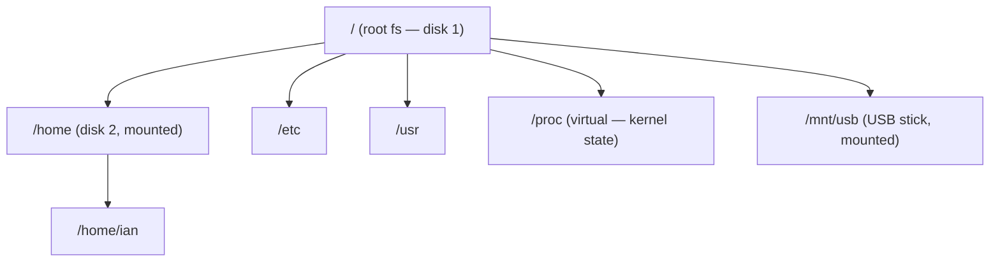
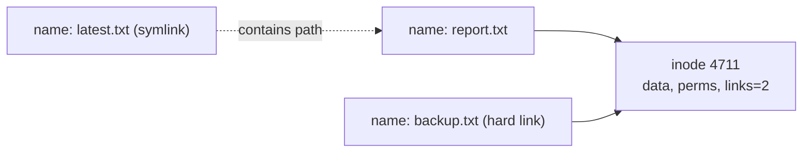
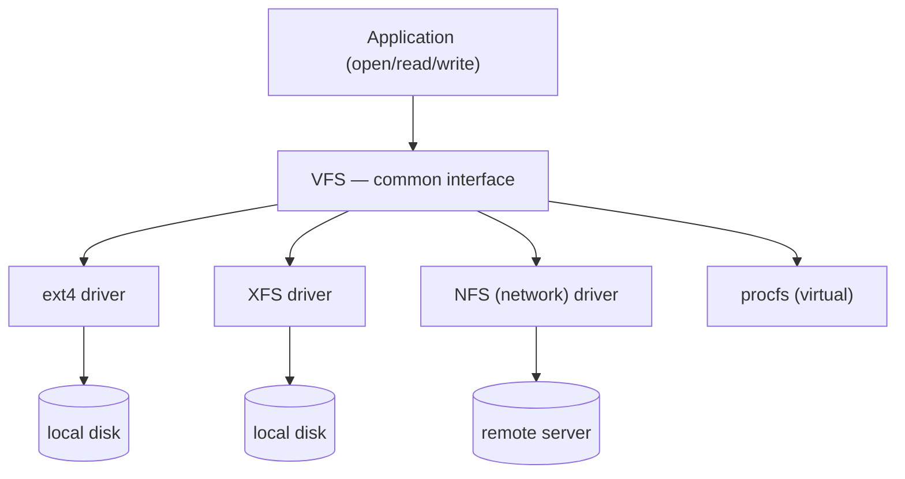

# The Filesystem and the FHS

The Unix filesystem is not a picture of your disks — it is a *single, unified namespace*
that everything on the system hangs from. There is one tree, rooted at `/`, and every file,
directory, device, and even many kernel data structures appear somewhere inside it. This is
the structural counterpart to [everything-is-a-file](everything-is-a-file.md): once there is
one tree and one kind of thing hanging from it, one set of tools (`ls`, `cat`, `cp`, `find`)
addresses all of it.

## One tree, no drive letters

Windows exposes storage as separate lettered volumes (`C:`, `D:`). Unix rejects that. There
is exactly one hierarchy, and additional storage is *grafted into it* at a chosen directory
called a **mount point**. A second disk, a USB stick, a network share, or a virtual
filesystem all become subtrees of the one tree:

The act of attaching a filesystem is **mounting**; removing it is **unmounting**. The mount
point's identity (its path) is stable even though what backs it can change — you can move
`/home` to a bigger disk and no program that reads `/home/ian` ever notices. This
indirection is the whole point: *location in the tree is decoupled from physical storage.*

## The Filesystem Hierarchy Standard (FHS)

The tree is not arbitrary. The **FHS** standardizes what lives where, so that software,
admins, and packagers can rely on fixed locations across distributions. The mental model is
to separate files along two axes: **shareable vs. host-specific**, and **static vs.
variable**.

| Path | Holds | Axis |
|------|-------|------|
| `/etc` | host-specific configuration (text files) | host-specific, static |
| `/usr` | read-only programs, libraries, docs — the bulk of installed software | shareable, static |
| `/usr/local` | software installed by the local admin, not the package manager | host-specific, static |
| `/var` | data that changes at runtime: logs, spools, caches, databases | host-specific, variable |
| `/home` | users' personal files | host-specific, variable |
| `/bin`, `/sbin` | essential binaries needed early in boot (often symlinks into `/usr`) | static |
| `/tmp` | scratch space, cleared on reboot | variable |
| `/dev` | device nodes (see [everything-is-a-file](everything-is-a-file.md)) | virtual |
| `/proc`, `/sys` | kernel and process state exposed as files | virtual |
| `/boot` | kernel image and bootloader files | static |
| `/root` | the root user's home directory | host-specific |

The recurring pattern: **config in `/etc`, changing data in `/var`, programs in `/usr`.**
Knowing that triad lets you find or place almost anything without memorizing paths.
`/proc` and `/sys` are not on any disk at all — they are windows into the running
[kernel](the-linux-kernel.md), a direct expression of everything-is-a-file.

## Inodes vs. names: the file is not its path

Underneath the tree, a file's *data and metadata* live in an **inode** (index node): owner,
[permissions](permissions-and-users.md), timestamps, size, and pointers to the data blocks.
The inode carries no name. A **name** is just a directory entry — a `(name → inode number)`
mapping stored in a directory. This separation is quietly profound:

- A **hard link** is a second directory entry pointing at the *same inode*. The two names
  are equal citizens; the file's data persists until the last link is removed (the link
  count drops to zero). "Deleting" a file (`unlink`) removes a name, not necessarily the
  data.
- A **symbolic (soft) link** is a tiny file whose contents are *a path string*. It points at
  a name, not an inode, so it can cross filesystems and can dangle if the target disappears.

This is why you can rename or move an open file out from under a running program and it
keeps working: the program holds the inode, not the name.

## VFS: one interface over many filesystems

How can ext4, XFS, Btrfs, a FAT USB stick, an NFS network share, and the virtual `/proc`
all present as the same tree with the same `open`/`read`/`write` calls? Through the
**Virtual File System (VFS)** — a kernel abstraction layer that defines a common interface
(a set of operations on inodes, files, and directories) that every concrete filesystem
implements. Userspace and the [system-call boundary](the-linux-kernel.md) talk only to the
VFS; the VFS dispatches to the right driver.

VFS is a textbook application of the [operating-systems](../computer-science/operating-systems.md)
principle of abstraction: define one interface, let many implementations satisfy it, and the
rest of the system is written once. It is what makes the "single tree" illusion hold together
over wildly different backing stores.

## Why it matters

The unified tree plus FHS conventions plus VFS are why Linux composes so well. A backup tool
walks one tree. A container mounts a new root and the same programs run unchanged. Config
management writes text to `/etc`. Because location is decoupled from storage and names are
decoupled from data, the system is easy to reason about and easy to change — the whole point
of the Unix design. See [ward-how-linux-works](ward-how-linux-works.md) for the systems-level
walkthrough and [nemeth-unix-linux-sysadmin](nemeth-unix-linux-sysadmin.md) for the
administrative conventions.

## References

- [ward-how-linux-works](ward-how-linux-works.md)
- [nemeth-unix-linux-sysadmin](nemeth-unix-linux-sysadmin.md)
- [everything-is-a-file](everything-is-a-file.md)
- [the-linux-kernel](the-linux-kernel.md)
- [permissions-and-users](permissions-and-users.md)
- [../computer-science/operating-systems.md](../computer-science/operating-systems.md)
