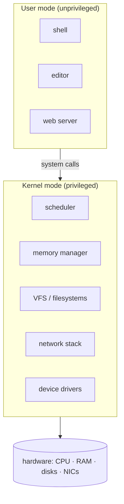

# The Linux Kernel

The kernel is the program that owns the hardware. Everything else — your shell, your editor,
the web server, the package manager — is **userspace**, and none of it touches memory,
disks, the network, or the CPU's privileged instructions directly. It asks the kernel to,
across a single narrow, guarded boundary. Understanding Linux is largely understanding this
division of labor and the line that separates the two worlds.

## Kernel space vs. userspace

The CPU runs in (at least) two privilege levels. The kernel runs in **kernel mode**, with
full access to hardware and the privileged instruction set. Applications run in **user
mode**, where those instructions and arbitrary memory are *forbidden* by the hardware itself
(see [computer-architecture](../computer-science/computer-architecture.md)). A user-mode
program that tries to touch hardware directly faults. This hardware-enforced wall is what
lets a buggy or malicious application crash *itself* without taking down the machine — the
foundational isolation guarantee of a modern [operating system](../computer-science/operating-systems.md).

## The system-call boundary

The only sanctioned way across the wall is a **system call**. When a program calls `read()`,
`open()`, `fork()`, or `mmap()`, it executes a special trap instruction that switches the CPU
into kernel mode at a fixed, kernel-controlled entry point. The kernel validates the request
and its arguments, does the privileged work on the caller's behalf, and returns to user mode
with a result. This is the entire contract between the two worlds — a few hundred calls,
documented as the ABI. Because that interface is *stable*, a binary compiled years ago still
runs: "don't break userspace" is the kernel's cardinal rule. The system-call surface is the
subject of [kerrisk-linux-programming-interface](kerrisk-linux-programming-interface.md), the
definitive reference. Libraries like the C standard library are thin wrappers that ultimately
issue these calls; the [shell and its pipes](the-shell-and-pipes.md) are userspace programs
orchestrating them.

## Monolithic — with loadable modules

Linux is a **monolithic kernel**: the scheduler, memory manager, filesystems, network stack,
and drivers all run together in the single kernel address space, calling each other as
ordinary function calls. (Contrast a *microkernel*, which pushes drivers and filesystems out
into separate userspace servers that message each other — cleaner isolation, more overhead.)
Linux keeps the monolithic performance but avoids a rigid, all-in-one binary through
**loadable kernel modules**: drivers and features that can be inserted into and removed from
the running kernel on demand. You get one fast address space *and* the flexibility to load
only the drivers a given machine needs — the pragmatic middle that made Linux both fast and
adaptable to everything from phones to supercomputers.

## What the kernel manages

The kernel is really a bundle of resource managers, each virtualizing one scarce hardware
resource so that many programs can share it as if each had its own:

- **Processes and scheduling** — creates, isolates, and time-slices
  [processes](processes-and-signals.md) across the CPUs, deciding who runs next so a handful
  of cores appear to run hundreds of programs at once.
- **Memory / virtual memory** — gives each process a private virtual address space, maps it
  to physical RAM on demand (paging), and swaps to disk under pressure. Each process believes
  it owns all of memory; the kernel maintains the illusion and the isolation.
- **Devices and drivers** — abstracts every disk, NIC, GPU, and USB gadget behind uniform
  interfaces, most of them surfaced as files (see
  [everything-is-a-file](everything-is-a-file.md)). Drivers are where the kernel meets the
  messy specificity of real hardware.
- **Filesystems** — via the VFS layer, presents many on-disk and network formats as one tree
  (see [the-filesystem-and-fhs](the-filesystem-and-fhs.md)).
- **Networking** — implements the TCP/IP stack, routing, firewalling, and sockets that
  [networking-on-linux](networking-on-linux.md) builds on.

## The shared foundation of every distro

There are hundreds of Linux distributions, but there is *one* Linux kernel lineage. Ubuntu,
Debian, Fedora, Arch, Android, and the OS on your router all run essentially the same kernel;
what differs is the userspace assembled around it — the C library, [init system](init-and-services.md),
[package manager](package-management-and-distributions.md), and default tools. "Linux," used
strictly, *is* the kernel. That single shared core is why a program built against the stable
syscall ABI runs across the whole ecosystem, and why kernel features like namespaces and
cgroups (the basis of [containers-and-namespaces](containers-and-namespaces.md)) instantly
became available everywhere.

## Why it matters

Almost every other Linux concept is a story about crossing or living inside this boundary.
Permissions are checks the kernel runs on system calls. Containers are the kernel lying to a
process about what it can see. Pipes are kernel buffers between processes. Hold the model —
*privileged kernel, unprivileged userspace, a narrow stable syscall bridge between them* —
and the rest of the system organizes itself around it. See
[ward-how-linux-works](ward-how-linux-works.md) for the end-to-end picture.

## References

- [kerrisk-linux-programming-interface](kerrisk-linux-programming-interface.md)
- [ward-how-linux-works](ward-how-linux-works.md)
- [processes-and-signals](processes-and-signals.md)
- [everything-is-a-file](everything-is-a-file.md)
- [the-filesystem-and-fhs](the-filesystem-and-fhs.md)
- [../computer-science/operating-systems.md](../computer-science/operating-systems.md)
- [../computer-science/computer-architecture.md](../computer-science/computer-architecture.md)
