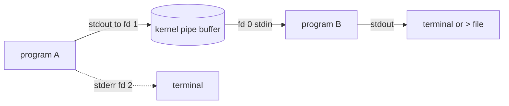

# The Shell and Pipes

The shell is Unix's **composition engine**: a small language whose primary job is
to launch programs and wire them together. Its genius is that it is *also* the
interactive prompt you type at — the same syntax that runs one command
interactively can string a dozen commands into a pipeline or save them as a
script. The shell is where the [Unix philosophy](unix-philosophy.md) stops being
a slogan and becomes a thing you do: it is the glue that turns small sharp tools
into large capabilities.

## The three standard streams

Every process starts with three open [file descriptors](everything-is-a-file.md),
by convention:

| fd | name | default | purpose |
|----|------|---------|---------|
| 0 | **stdin** | keyboard | where input comes from |
| 1 | **stdout** | terminal | normal output — the *data* |
| 2 | **stderr** | terminal | diagnostics — errors and logs |

The separation of stdout from stderr is not cosmetic: it is the **text-stream
contract**. Data goes to stdout so it can be piped onward; errors go to stderr so
they don't contaminate the data stream and can still reach the human even when
stdout is redirected. A well-behaved tool keeps them strictly separate — that
discipline is what makes pipelines trustworthy.

## Pipes and redirection

The shell's core trick is that these streams are *rewirable*. A program neither
knows nor cares where its descriptors point.

- **Pipe** `a | b` — connect `a`'s stdout to `b`'s stdin. The kernel creates an
  in-memory buffer between them; both run concurrently, with `b` consuming as `a`
  produces. This is McIlroy's pipe, and it is the whole game.
- **Redirection** `> file` (stdout to a file, overwrite), `>>` (append),
  `< file` (stdin from a file), `2>` (stderr to a file), `2>&1` (merge stderr
  into stdout).



The shell sets this plumbing up *before* the programs run, by `fork`ing and then
reassigning descriptors in each child (see
[processes and signals](processes-and-signals.md)). The programs are oblivious;
that obliviousness is exactly what makes them composable.

## Exit codes

Every program returns a small integer when it exits: **`0` means success**,
anything nonzero means failure (with conventional meanings per tool). This is the
machine-readable counterpart to stdout, and it is what makes control flow
possible without parsing output:

- `a && b` runs `b` only if `a` succeeded.
- `a || b` runs `b` only if `a` failed.
- `if cmd; then …` branches on the exit code.

Because the convention is universal, tools chain into logic as cleanly as they
chain into pipelines.

## Globbing and expansion

Before a command runs, the shell **expands** it — a step often confused with the
program's own behavior. `*.txt` is *glob* (filename) expansion done by the shell,
so `rm *.txt` hands `rm` a list of already-expanded filenames; `rm` never sees
the `*`. The shell also does variable expansion (`$HOME`), command substitution
(`$(date)`), and brace expansion (`{a,b,c}`). The key mental model: **the shell
rewrites your line, then executes the result.** Most quoting confusion (`"$var"`
vs `$var`, word splitting on spaces) comes from not knowing what the shell
rewrites versus what the program receives.

## Filters: the composable stages

A **filter** is a program that reads stdin, transforms it, and writes stdout —
the ideal pipeline stage. The classic sharp tools are filters:

- **`grep`** — keep lines matching a pattern (selection).
- **`sed`** — stream editor: substitute and transform line by line.
- **`awk`** — a small language for field-oriented records; the power tool for
  columnar text.
- **`sort`, `uniq`, `cut`, `tr`, `head`, `tail`, `wc`** — reorder, dedupe,
  project, translate, slice, count.

Each does one thing ([Unix philosophy](unix-philosophy.md)); capability *emerges*
from the arrangement:

```
grep ERROR app.log | cut -d' ' -f1 | sort | uniq -c | sort -rn
```

No tool "counts errors per date" — the pipeline does, by composing five that
each do one thing.

## Scripting idioms and pitfalls

A shell script is just a saved sequence of these commands, and it is the natural
home of *glue* logic. The idioms that keep scripts sane:

- **`set -euo pipefail`** — the defensive preamble. Exit on any error (`-e`),
  treat unset variables as errors (`-u`), and make a pipeline fail if *any* stage
  fails, not just the last (`pipefail`). Without these, a script marches happily
  past failures.
- **Always quote variables** — `"$var"`, not `$var` — to survive spaces and empty
  values. Unquoted expansion is the number-one source of shell bugs.
- **Prefer `$(…)` over backticks** for command substitution (nestable, clearer).
- **The shell is glue, not an application.** Its data model is untyped text and
  its error handling is crude. Once a script grows past simple orchestration —
  once it needs data structures, real error handling, or tests — that is the
  signal to reach for a proper language. Pushing the shell past its niche trades
  away the very simplicity that made it the right tool for the small job.

## Why it matters

The shell is the interface where the Unix philosophy is *operationalized*. It
turns a directory full of single-purpose programs into an open-ended toolkit,
composed on the fly, with no code to write for the vast majority of ad-hoc tasks.
Understanding streams, pipes, exit codes, and expansion is understanding how a
Unix system is actually driven — and why so much power comes from so little
ceremony.

## References

Anchored in [The UNIX Programming Environment](kernighan-pike-unix-programming-environment.md)
(Kernighan & Pike), the definitive account of the shell as a programming
environment, and [The Art of Unix Programming](art-of-unix-programming.md); see
[How Linux Works](ward-how-linux-works.md) (Ward) for modern shell mechanics.
