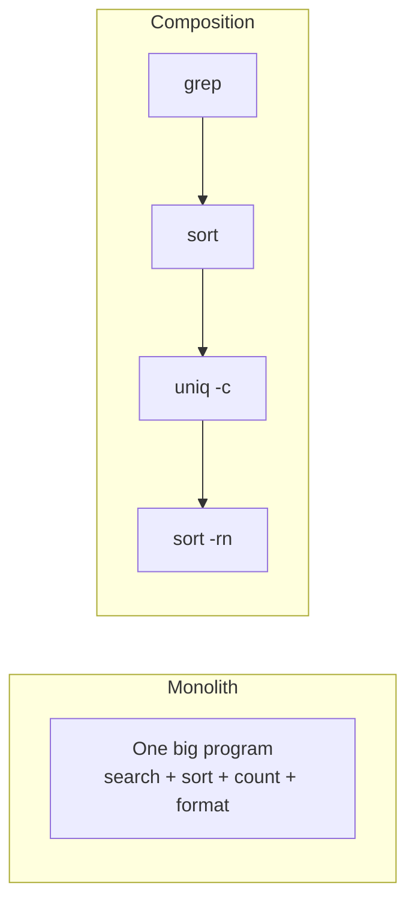

# The Unix Philosophy

The Unix philosophy is a set of design maxims — never a formal spec — that grew
out of building Unix at Bell Labs in the early 1970s under tight hardware
constraints. Its enduring claim is that **you build large capable systems not by
writing large programs, but by composing many small ones.** The philosophy is
less about Unix the operating system than about a style of engineering that
happens to have been discovered there, and it remains the clearest historical
statement of what [software simplicity](../software-engineering/simple-made-easy.md)
buys you.

## The maxims

Doug McIlroy's canonical summary (he invented the [pipe](the-shell-and-pipes.md)):

> Write programs that do one thing and do it well. Write programs to work
> together. Write programs to handle text streams, because that is a universal
> interface.

Three ideas, each doing real work:

- **Do one thing well.** A tool with a single, sharp responsibility is easy to
  understand, easy to test, and easy to reason about. `sort` sorts; it does not
  also filter, format, or fetch. The moment a tool tries to do everything, it
  becomes hard to change — the opposite of the goal.
- **Work together.** A tool is designed to be *one stage* in a larger pipeline,
  not a self-contained application. Its output is meant to feed another tool's
  input. This is composition, and it is where the system's real power comes from:
  the combinatorial space of pipelines vastly exceeds the number of tools.
- **Text as the universal interface.** If every tool reads and writes plain
  text lines, then *any* tool can be plugged into *any* other without a
  pre-arranged binary protocol. Text is the lingua franca that makes arbitrary
  composition possible — it is the interoperability layer.

## Composition over monoliths

The central architectural bet is **composition over monoliths**. Rather than one
program with a hundred features, you have a hundred programs with one feature
each, glued at runtime by the [shell and pipes](the-shell-and-pipes.md). This is
the same principle as building software out of small, single-responsibility
modules that connect through narrow interfaces — the pipeline is just an
unusually visible instance of it.



The classic demonstration is counting the most frequent words in a text:

```
tr -cs 'A-Za-z' '\n' < book.txt | tr 'A-Z' 'a-z' | sort | uniq -c | sort -rn | head
```

No single tool "counts word frequencies." The capability *emerges* from chaining
sharp tools that each do one thing. Writing a bespoke program for this would be
more code, less reusable, and harder to change.

## Small, sharp tools

A corollary: prefer **small, sharp tools** you can hold in your head over large
frameworks you must study. Small tools compose; large ones absorb. Because each
tool is small, it can be rewritten, replaced, or fixed independently — the system
is loosely coupled, so change stays cheap. This directly serves the goal of
[code simplicity](../software-engineering/code-simplicity.md): the smaller the
unit, the smaller the surface where complexity can hide.

Related rules that fall out of this: prefer **clarity over cleverness**; make
programs **silent on success** (no news is good news, so output stays composable);
and design for the **rule of least surprise**.

## Mechanism, not policy

A deeper principle governs interface design: **separate mechanism from policy.**
A tool should provide the *mechanism* — the raw capability — and leave *policy* —
the decisions about how it's used — to the caller. The kernel provides the
mechanism of scheduling and memory; it does not dictate which programs you run.
The X Window System famously separates the mechanism of drawing pixels from the
policy of what a desktop looks like. Baking policy into mechanism is what makes
software rigid: it hardcodes today's decision into tomorrow's constraint. Keeping
them apart is what keeps the system flexible and its parts reusable — the tool
outlives any particular use of it.

## The through-line to modern software

The Unix philosophy is the ancestor of ideas that now go by other names:

- **Microservices** are the Unix pipeline scaled to the network — small services,
  one responsibility each, composed over a universal wire format.
- **The single-responsibility principle** and modular decomposition are "do one
  thing well" in object-oriented dress.
- **Pipelines and streams** in data engineering are McIlroy's pipes, generalized.
- **Composability** as a design value — the belief that you should build systems
  from parts that snap together — is the Unix bet, restated.

The reason it endured is that it is really a philosophy of **managing complexity
by partitioning it**: keep each part simple enough to understand completely, and
let capability come from combination rather than from any part's internal
sophistication. That is the same argument made, decades later, in
[Simple Made Easy](../software-engineering/simple-made-easy.md).

## Why it matters

Systems built this way age well. Because the parts are small and loosely coupled,
they can be understood, tested, replaced, and recombined without a rewrite —
exactly the property that makes code easy to change. A monolith, by contrast,
grows a web of internal coupling that makes every change risky. The Unix
philosophy is, at bottom, a durable answer to the question of how to build
something large that stays maintainable: don't build something large.

## References

Anchored in [The Art of Unix Programming](art-of-unix-programming.md) (Eric S.
Raymond), which codifies the philosophy; see also
[The UNIX Programming Environment](kernighan-pike-unix-programming-environment.md)
(Kernighan & Pike) for the original working style, and
[Simple Made Easy](../software-engineering/simple-made-easy.md) and
[code simplicity](../software-engineering/code-simplicity.md) for the modern
restatement.
