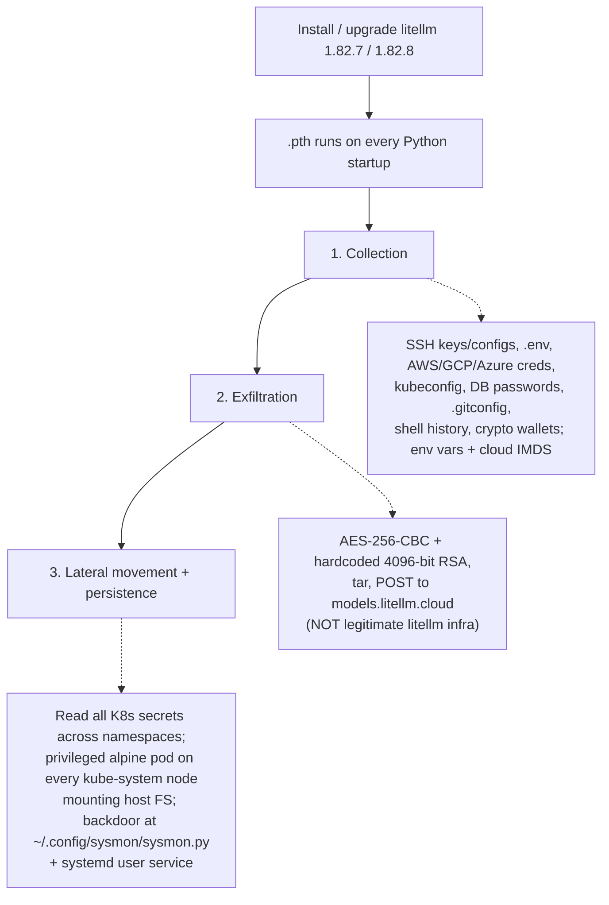

# litellm PyPI Supply-Chain Attack (March 2026)

On **2026-03-24 at 10:52 UTC**, `litellm` **1.82.8** (and shortly after, **1.82.7**)
was published to PyPI carrying a malicious payload. **FutureSearch discovered and
first reported it** — not through a scan, but because the poisoned package was
pulled in as a **transitive dependency by an MCP plugin running inside Cursor.**
This is the same incident summarized in [AI code security](ai-code-security.md);
this note is the full anatomy.

The compromised versions were later yanked and the PyPI quarantine lifted. No
corresponding git tag or GitHub release existed — the package was **uploaded
directly to PyPI, bypassing the normal release process**, indicating the
maintainer's publishing credentials were very likely fully compromised.

## The delivery mechanism: a `.pth` file

The release shipped a malicious `litellm_init.pth` (`litellm_init.pth`). Python
executes `.pth` files **automatically on every interpreter startup** whenever
`litellm` is installed — so the payload ran without ever being imported. The
launcher spawned a child Python process via `subprocess.Popen`; because the `.pth`
re-triggers on every startup, the child re-triggered the same `.pth`, creating an
**exponential fork bomb that crashed the machine** — an accidental bug in the
malware, and what made it noisy enough to catch.

## Three-stage payload

1. **Collection** — harvests SSH private keys and configs, `.env` files,
   AWS/GCP/Azure credentials, Kubernetes configs, database passwords, `.gitconfig`,
   shell history, crypto wallet files, and anything matching common secret patterns;
   dumps environment variables and queries cloud metadata endpoints (IMDS, container
   creds).
2. **Exfiltration** — encrypts the loot with AES-256-CBC under a random session key,
   wraps that key with a hardcoded 4096-bit RSA public key, tars it, and POSTs to
   `https://models.litellm.cloud/` — a domain that is **not** legitimate litellm
   infrastructure.
3. **Lateral movement & persistence** — if a Kubernetes service-account token is
   present, reads **all cluster secrets across all namespaces** and tries to create a
   privileged `alpine:latest` pod on **every node in kube-system**, each mounting the
   host filesystem and installing a backdoor at `/root/.config/sysmon/sysmon.py` with
   a systemd user service. On the local machine it attempts the same persistence via
   `~/.config/sysmon/sysmon.py`.

## Response if affected

Check for version 1.82.8/1.82.7 (`pip show litellm`; `find ~/.cache/uv -name
"litellm_init.pth"`; check CI/CD virtualenvs). Remove it and **purge caches**
(`rm -rf ~/.cache/uv` or `pip cache purge`) so it isn't reinstalled from a cached
wheel. Check persistence (`~/.config/sysmon/sysmon.py`,
`~/.config/systemd/user/sysmon.service`; in Kubernetes, audit `kube-system` for
`node-setup-*` pods). **Rotate every credential** that was present on the machine.

## Why it matters for agentic development

Agents install packages eagerly, so a poisoned transitive dependency is a **routine
path onto the developer machine** — exactly the [AI code security](ai-code-security.md)
supply-chain point. It underscores dependency/supply-chain scanning, sandboxing what
the agent can reach, and [agent observability](agent-observability.md) to notice
anomalous behavior (here, a crash from the fork-bomb bug is what surfaced it).

## Related

- [AI code security](ai-code-security.md) — supply chain as a first-class threat surface.
- [Agent observability](agent-observability.md) — detecting anomalous agent/dependency behavior.
- [Code provenance is non-negotiable in the age of AI](code-provenance-non-negotiable.md) — verifying what enters the repo.

## References
- [litellm 1.82.8 Supply Chain Attack on PyPI (March 2026) — FutureSearch](https://futuresearch.ai/blog/litellm-pypi-supply-chain-attack/)
