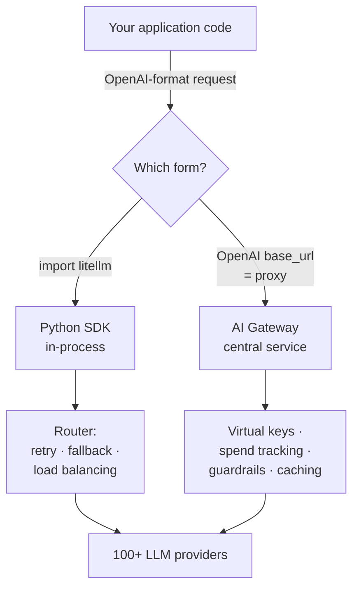

# LiteLLM (AI Gateway & SDK)

An open-source project that gives you **one interface — the OpenAI format — to
call 100+ LLM APIs** (Bedrock, Azure, OpenAI, Vertex AI, Cohere, Anthropic,
SageMaker, HuggingFace, vLLM, NVIDIA NIM, and more). It's the concrete tooling
behind the [model router](model-router.md) idea: swap providers without
rewriting call sites, because every model speaks the same request/response shape.

LiteLLM ships in two forms that share the same unified interface:



## Python SDK — for developers in code

Call it as a library. The **Router** adds retry/fallback logic across multiple
deployments (e.g. failover Azure ↔ OpenAI), application-level load balancing and
cost tracking, OpenAI-compatible exception handling, and observability callbacks
(Langfuse, MLflow, Lunary, etc.). This is the routing/fallback machinery a
[model router](model-router.md) needs.

## AI Gateway (Proxy Server) — for platform teams

Run it as a **central service** that every team calls. It's OpenAI-compatible —
point any OpenAI client's `base_url` at the proxy and you're done:

```shell
uv tool install 'litellm[proxy]'
litellm --model gpt-4o
```

The gateway adds **authentication/authorization, multi-tenant cost tracking and
spend management per project/user, per-project logging/guardrails/caching,
virtual keys for scoped access, and an admin dashboard.** It also exposes broad
endpoints — `/chat/completions`, `/responses`, `/embeddings`, `/images`,
`/audio`, `/batches`, `/rerank`, `/a2a`, `/messages` — and can front A2A agents
and MCP servers.

## Where it fits

LiteLLM is the **operational spine** for multi-model apps: it makes provider
choice, [cost management](cost-management.md), and observability a configuration
concern rather than app code. Conceptually it's an *LLM* gateway; for the
*agent/MCP* gateway pattern — auth, access control, and observability in front of
tools rather than models — see [Gateways Are All You Need](gateways-are-all-you-need.md).

## References
- [BerriAI/litellm — GitHub](https://github.com/BerriAI/litellm)
