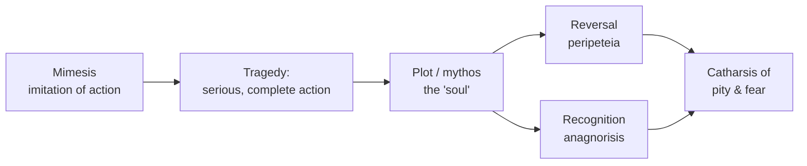

# Aristotle — Poetics

Aristotle's *Poetics* (c. 335 BCE) is the founding treatise of literary theory in the
Western tradition: the earliest surviving systematic attempt to analyze what poetry *is*,
how it works, and by what standards it succeeds or fails. Though it survives only as a
fragmentary lecture-text (the discussion of comedy is lost), it fixed the vocabulary and
the questions that criticism has argued over ever since. It is a work of applied
[literary theory and criticism](literary-theory-and-criticism.md) and, at the same time, a
work of [aesthetics](../philosophy/aesthetics.md) — a philosophy of what art does.

## Mimesis: art as imitation

Aristotle's starting premise is that all poetry is a form of **mimesis** — *imitation* or
*representation* of human action. Poetic kinds differ along three axes: the *medium* they
imitate in (rhythm, language, harmony), the *objects* they imitate (people better than us,
worse than us, or like us), and the *manner* of imitation (pure narration, mixed, or fully
dramatic enactment). This taxonomy is an early theory of
[literary genres and forms](literary-genres-and-forms.md): epic, tragedy, and comedy are
distinguished not by subject matter alone but by these formal coordinates. Against Plato,
who in the *Republic* distrusted mimetic art as a copy of a copy that inflames the
passions, Aristotle treats imitation as natural, cognitively valuable (we learn and take
pleasure from recognizing likenesses), and worthy of rigorous study.

## Tragedy and the six parts

The bulk of the surviving text analyzes **tragedy**, which Aristotle famously defines as
"an imitation of an action that is serious, complete, and of a certain magnitude," in
heightened language, performed rather than narrated, and effecting through pity and fear
the *catharsis* of such emotions. He decomposes tragedy into six parts, ranked by
importance: **plot (mythos), character (ethos), thought (dianoia), diction (lexis), song
(melos), and spectacle (opsis)**.

## Plot (mythos) as the soul of tragedy

Plot is "the first principle, and, as it were, the soul of tragedy" — Aristotle privileges
*what happens* over *who it happens to*, a stance that makes the *Poetics* an ancestor of
[narrative and narratology](narrative-and-narratology.md). A well-made plot is a
**unified whole** with a beginning, middle, and end, arranged by causal necessity or
probability rather than mere chronological sequence; episodes must follow from one another,
not simply after one another. Its emotional power comes from **reversal (peripeteia)** and
**recognition (anagnorisis)**, ideally occurring together, turning fortune from good to
bad through a **hamartia** — an error or "tragic flaw" — in a protagonist who is neither
wholly virtuous nor villainous. Aristotle prefers a complex, well-motivated action over
spectacle, which he regards as the least artistic element.

## Catharsis and the unities

**Catharsis** — the "purgation" or "clarification" of pity and fear — is the most debated
term in the treatise; Aristotle asserts the effect but never fully defines the mechanism,
leaving centuries of readings (medical purge, moral clarification, emotional refinement).
Later criticism, especially French and Italian Renaissance theorists, extracted the
so-called **three unities** (action, time, and place) from the text. Only the unity of
action is genuinely Aristotle's central demand; the unities of time and place are largely
neo-classical elaborations attributed to him, a reminder that the *Poetics* has often been
read through the priorities of its interpreters.

## Significance and critique

The *Poetics* set the agenda for prescriptive criticism through the Renaissance and
neo-classical periods and still underwrites much practical dramaturgy and screenwriting
craft (the "three-act structure" is a distant descendant). Its limits are equally
instructive: it is narrow (drawn almost entirely from Greek tragedy and epic), formalist,
and normative in ways that later theory has resisted. Romantic and modern movements
elevated lyric and the novel — forms Aristotle barely treats — and twentieth-century
[literary theory](literary-theory-and-criticism.md) (from Russian Formalism to
structuralist narratology to deconstruction) both built on and pushed against his
plot-centered, unity-seeking model. Even so, its core moves — treating literature as a
describable system, distinguishing genres by formal features, and locating a work's power
in its structure — remain foundational.

## References

- [Aristotle, *Poetics* (Project Gutenberg, S. H. Butcher translation)](https://www.gutenberg.org/ebooks/1974)
