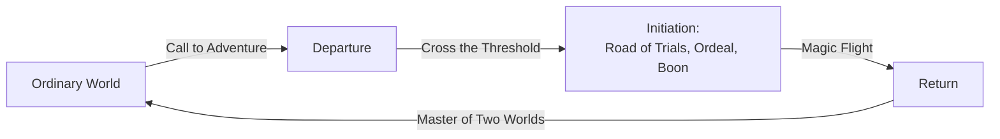

# Joseph Campbell — The Hero with a Thousand Faces

*The Hero with a Thousand Faces* (1949) by the American mythologist Joseph Campbell is the
work that named and popularized the **monomyth** — the claim that hero narratives from
across the world's cultures share a single underlying structure, the "hero's journey."
Drawing on comparative mythology, [myth, archetype, and the hero's journey](myth-archetype-and-the-heros-journey.md),
Jungian psychology, and world religion, it is one of the most influential books on
[narrative and narratology](narrative-and-narratology.md) ever written — its reach extends
well beyond scholarship into screenwriting, novel-craft, and popular culture.

## The monomyth

Campbell's central thesis, borrowing the word "monomyth" from James Joyce, is that beneath
the surface variety of the world's myths lies one recurring pattern. His often-quoted
summary: *a hero ventures forth from the world of common day into a region of supernatural
wonder; fabulous forces are there encountered and a decisive victory is won; the hero comes
back from this mysterious adventure with the power to bestow boons on his fellow man.* He
organizes this into three great phases:

- **Departure (Separation)** — the *call to adventure*, the *refusal of the call*,
  *supernatural aid* (a mentor figure), *crossing the first threshold*, and entry into the
  "belly of the whale."
- **Initiation** — the *road of trials*, meetings with archetypal figures (the goddess,
  the temptress, atonement with the father), the *apotheosis*, and the winning of the
  *ultimate boon*.
- **Return** — the *refusal of the return*, the *magic flight*, *rescue from without*,
  *crossing the return threshold*, becoming "master of two worlds," and gaining "freedom
  to live."

Campbell illustrates each stage with examples ranging across Greek, Egyptian, Norse,
Hindu, Buddhist, Judeo-Christian, and Indigenous traditions, treating myths as variations
on a shared human template.

## Intellectual sources: Jung, ritual, and the psyche

The book is deeply indebted to **Carl Jung's** theory of archetypes and the collective
unconscious: Campbell reads recurring mythic figures (the mentor, the shadow, the mother)
as projections of universal psychological structures. He also draws on the myth-and-ritual
school — the sense that myths encode initiation rites and rites of passage — connecting
directly to [myth, ritual, and symbol](../religion/myth-ritual-and-symbol.md). For
Campbell, the hero's journey is ultimately an inward, spiritual process of individuation:
myth is a public dream, and dream a private myth.

## Significance and critique

*The Hero with a Thousand Faces* reshaped how storytellers think about structure. Its most
famous downstream effect is on cinema: George Lucas cited it as a direct influence on
*Star Wars*, and Christopher Vogler's *The Writer's Journey* turned the monomyth into a
Hollywood screenwriting template. It also fed decades of interest in comparative myth and
personal mythology.

The critiques are substantial. Scholars of religion and folklore argue that Campbell
achieves universality by **selective abstraction** — smoothing away the specific cultural,
historical, and religious meanings of individual myths to fit a preconceived pattern, so
the monomyth risks being unfalsifiable. Feminist critics note that the schema is built
around a male hero, with female figures cast as goddess, temptress, or prize. Others charge
it with a romantic, essentialist psychology inherited uncritically from Jung. As
description of many quest narratives it is illuminating; as a claim about *all* myth
everywhere it overreaches — a tension worth keeping in view when the pattern is applied.

## References

- [Joseph Campbell, *The Hero with a Thousand Faces* (HarperCollins)](https://www.harpercollins.com/products/the-hero-with-a-thousand-faces-joseph-campbell)
