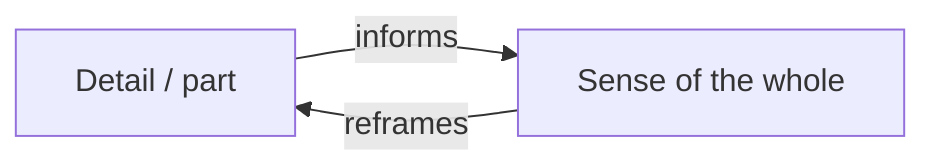

# Close Reading and Interpretation

**Close reading** is the core practice of literary study: the slow, attentive analysis
of a passage's language — word choice, syntax, rhythm, image, ambiguity, structure — to
show how its form produces its meaning. **Interpretation** is the larger act it serves:
building a defensible account of what a text means and how it means it. If
[literary devices](literary-devices-and-figurative-language.md) are the vocabulary and
[literary theory](literary-theory-and-criticism.md) supplies the lenses, close reading is
where a reader actually does the work.

## The method

Close reading came into its own with the New Critics and I. A. Richards' *practical
criticism*, who insisted that meaning is found by attending to "the words on the page"
rather than to biography or paraphrase. In practice it means:

1. **Read the surface exactly** — what does the passage literally say?
2. **Notice the texture** — diction, syntax, sound, meter, figuration, patterning,
   anything marked or strange.
3. **Ask why** — how does each choice shape response and meaning? What would be lost if
   it were phrased otherwise?
4. **Build a claim** — assemble the observations into an interpretation, and hold it
   against counter-evidence in the text.

Paraphrase is the enemy: a poem that could be losslessly restated in plainer words would
not need to exist. The "heresy of paraphrase" (Cleanth Brooks) is the New-Critical name
for that error.

## Hermeneutics and the interpretive circle

**Hermeneutics** — the theory of interpretation, originally of scripture and law — gives
the practice its philosophical spine. Its central figure is the **hermeneutic circle**:
you can only understand the parts through the whole, and the whole through the parts, so
interpretation is a spiral of revision rather than a straight line. Each pass through the
text refines the reading, which reframes the next pass.

This is a distinctively literary form of knowing, and it sits squarely in
[epistemology](../philosophy/epistemology.md): interpretive knowledge is justified
differently from empirical fact. You do not *prove* a reading the way you prove a
theorem; you *argue* it, marshalling textual evidence, exactly as in
[critical thinking and informal logic](../philosophy/critical-thinking-and-informal-logic.md).
A reading is warranted by how much of the text it accounts for, how economically, and how
resistant it is to counter-examples.

## Two famous cautions: the fallacies

Wimsatt and Beardsley named two errors that still frame the debate over where meaning
lives:

- **The intentional fallacy** — judging a work's meaning by appeal to the author's stated
  or presumed intention. The text, they argued, is public; the private intention is both
  unavailable and irrelevant. (Barthes' "death of the author" pushed the same move
  further.)
- **The affective fallacy** — reducing a work's meaning to the emotional effect it
  happens to have on a reader. (Reader-response criticism later challenged this,
  relocating meaning precisely in the reading experience.)

Both fallacies are contested, not settled law — they mark a live argument about the
sources of meaning, which is why different [theoretical lenses](literary-theory-and-criticism.md)
accept or reject them.

## Ambiguity, and "the meaning" vs. "a reading"

William Empson's *Seven Types of Ambiguity* made the case that ambiguity is not a defect
to be resolved but often the very richness of literary language — a word or line that
sustains several meanings at once. This reframes the goal of interpretation. The naive
question "what is *the* meaning?" assumes a single hidden answer to be extracted. The
disciplined question is "what is *a* reading, and how well can it be defended?" Good
interpretations compete on richness and rigor; a text can support several strong readings
without collapsing into "anything goes." The constraint is the text itself: a reading
must be answerable to the words on the page.

## Why it matters

Close reading is the transferable skill at the heart of a literary education —
disciplined attention to how language works, and the habit of grounding every claim in
evidence. It trains a reader to slow down, to distrust the first paraphrase, and to argue
from the text rather than from impression. Those habits carry far beyond literature into
any domain where meaning must be inferred and defended.

## References

- Cross-field: [Epistemology](../philosophy/epistemology.md),
  [Critical Thinking and Informal Logic](../philosophy/critical-thinking-and-informal-logic.md)
- Related: [Literary Theory and Criticism](literary-theory-and-criticism.md),
  [Literary Devices and Figurative Language](literary-devices-and-figurative-language.md)
