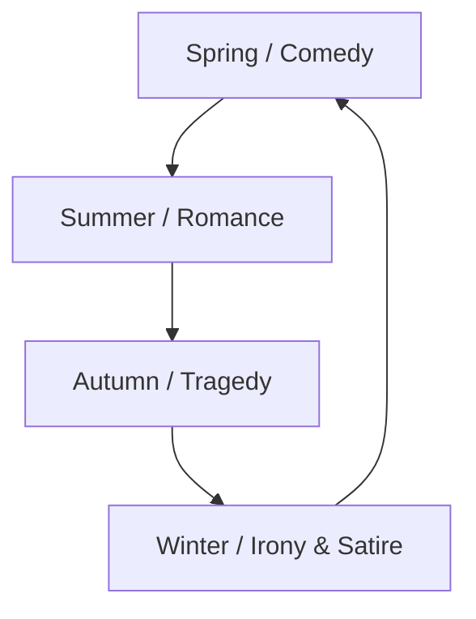

# Northrop Frye — Anatomy of Criticism

*Anatomy of Criticism: Four Essays* (1957) by the Canadian critic Northrop Frye is the
most ambitious twentieth-century attempt to make [literary criticism](literary-theory-and-criticism.md)
into a self-contained, systematic discipline — a science of literature derived
*exclusively from literature itself* rather than from history, biography, or evaluation.
Frye deliberately excludes practical criticism of individual works and value judgments,
which he dismisses as the "history of taste," and instead offers what he calls "an
interconnected group of suggestions": a total map of the categories, patterns, and
structural principles that organize all imaginative writing.

## The polemical program

In the "Polemical Introduction" Frye argues that criticism lacks a coherent conceptual
framework and drifts into subjective appreciation or ideological special pleading. His
remedy is a taxonomy modeled on the natural sciences — hence *anatomy*. Literature, he
holds, is an autonomous verbal universe whose forms recur and rearrange across all periods
and cultures; the critic's job is to chart that universe, not to rank its contents. This
places him alongside structuralism (though he wrote independently of the French school) as
a systematizing counter to biographical and historical reading.

## The four essays

The book's core is four theories, framed between the introduction and a "Tentative
Conclusion":

- **Historical Criticism: Theory of Modes.** Frye classifies fiction by the hero's power
  of action relative to us and to the environment, yielding five modes — *myth* (hero is a
  divine being), *romance* (superior in degree), *high mimetic* (a leader, as in epic and
  tragedy), *low mimetic* (one of us, as in most realism and comedy), and *ironic* (hero
  inferior in power or freedom). Western literature, he argues, has drifted historically
  down this ladder from myth toward irony — and, at the ironic extreme, loops back toward
  myth.
- **Ethical Criticism: Theory of Symbols.** A theory of how meaning works, arranging
  symbolic reading into "phases" — literal, descriptive, formal, mythical (archetypal),
  and anagogic — from the sign on the page up to literature as a single total imaginative
  order.
- **Archetypal Criticism: Theory of Myths.** The most influential essay. Frye takes myth
  as the structural core of all literature and organizes the great "pregeneric" narrative
  patterns (*mythoi*) around the cycle of the seasons — **comedy** (spring), **romance**
  (summer), **tragedy** (autumn), and **irony/satire** (winter). This connects directly to
  [myth, archetype, and the hero's journey](myth-archetype-and-the-heros-journey.md): like
  Jung and unlike Freud, Frye treats archetypes as recurring communicable literary
  conventions rather than private psychological contents.
- **Rhetorical Criticism: Theory of Genres.** A theory of the radical *presentation* of a
  work — spoken (epos), acted (drama), sung (lyric), written for the page (fiction) —
  cutting across the historical genre labels of [literary genres and forms](literary-genres-and-forms.md).

## Significance and critique

For roughly two decades the *Anatomy* was among the most cited works of Anglo-American
criticism, and it did much to legitimize the serious study of romance, myth, and popular
narrative structure — anticipating later interest in genre and in comparative
[myth](myth-archetype-and-the-heros-journey.md). Its reputation cooled as
deconstruction, feminism, New Historicism, and other historically and politically engaged
schools rose in the 1980s: critics charged that Frye's closed, ahistorical, evaluation-free
system floated free of ideology, power, and material context, and that its universalizing
archetypes flattened cultural difference. Frye's own later work turned toward the Bible and
cultural criticism. The book endures as the high-water mark of archetypal and
systematic criticism, and as a still-usable atlas of literary form.

## References

- [Northrop Frye, *Anatomy of Criticism: Four Essays* (Princeton University Press)](https://press.princeton.edu/books/paperback/9780691202563/anatomy-of-criticism)
