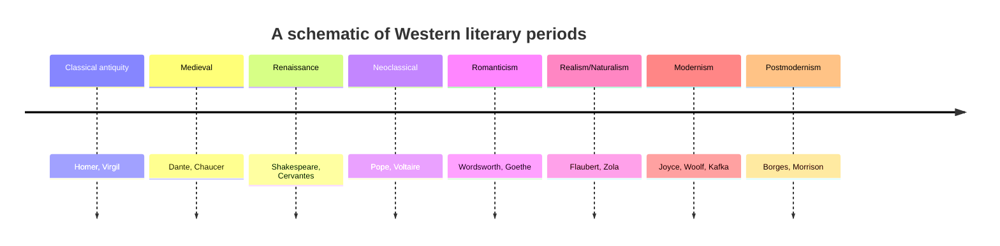

# Literary Periods and Movements

Literary history is conventionally divided into **periods** (broad spans defined by shared
style, sensibility, and circumstance — the Renaissance, Romanticism, Modernism) and
**movements** (more self-conscious groupings, often with manifestos and named members —
Symbolism, Imagism, Surrealism, the Beats). This note maps the standard sequence of the
Western tradition, samples non-Western developments, and then examines periodization itself
as a scholarly tool: indispensable for orientation, but a construction that can distort as
much as it clarifies.

## The standard Western sequence

The familiar map runs roughly as follows. It is a scaffold, not a law; the boundaries are
fuzzy and the labels were mostly applied after the fact.

| Period | Rough span | Keynote | Representative figures |
|---|---|---|---|
| Classical antiquity | c. 8th c. BCE–5th c. CE | epic, tragedy, rhetoric; imitation of nature | Homer, Sappho, Virgil, Ovid |
| Medieval | c. 500–1500 | allegory, romance, religious and oral forms | Dante, Chaucer, the *Beowulf* poet |
| Renaissance / Early Modern | c. 1500–1660 | humanism, revival of the classics, the sonnet, drama | Shakespeare, Petrarch, Cervantes, Milton |
| Neoclassical / Enlightenment | c. 1660–1785 | order, reason, wit, satire, decorum | Pope, Swift, Voltaire, Johnson |
| Romanticism | c. 1785–1832 | emotion, nature, imagination, the individual | Wordsworth, Coleridge, Goethe, Keats |
| Realism / Naturalism | c. 1830–1900 | ordinary life, social detail, determinism | Balzac, Eliot, Flaubert, Zola |
| Modernism | c. 1900–1945 | formal experiment, fragmentation, interiority | Joyce, Woolf, Eliot, Kafka |
| Postmodernism | c. 1945–2000 | irony, pastiche, metafiction, skepticism | Borges, Pynchon, Calvino, Morrison |

Two hinges deserve emphasis because they show how literary change tracks broader history.
The turn from Neoclassicism to **Romanticism** coincides with the political and economic
upheavals of the late eighteenth century — the age of
[revolutions, Enlightenment, and industry](../history/revolutions-enlightenment-and-industrial.md).
Romanticism's exaltation of feeling, nature, the sublime, and the creative genius reads in
part as a response to Enlightenment rationalism and to industrialization's assault on the
rural and the organic. Later, the turn from Realism to **Modernism** answers a different
shock: the collapse of nineteenth-century confidence under the pressure of new physics, new
psychology (the unconscious), mass society, and above all the First World War, which made
the old narrative wholeness feel like a lie. Modernism responds with fragmentation, stream
of consciousness, and the deliberate difficulty catalogued in
[literary-devices-and-figurative-language](literary-devices-and-figurative-language.md).

## Realism as a long arc — Auerbach

The deepest single study of one of these currents is Erich Auerbach's *Mimesis*, which
traces the **representation of reality** in Western literature across three millennia, from
Homer and the Hebrew Bible to Virginia Woolf. Auerbach's argument reframes the period map:
rather than a sudden nineteenth-century invention, realism is a slow, uneven expansion of
which people, registers, and everyday details literature is willing to take seriously —
the gradual dignifying of ordinary and even lowly life as a fit subject for serious
treatment. Reading periods through Auerbach turns the sequence from a list of styles into a
single evolving problem: how, and how faithfully, does writing render the world? See
[auerbach-mimesis](auerbach-mimesis.md).

## Beyond the West

The Western scaffold does not fit other traditions, which have their own long and largely
independent developments — a reason the whole periodizing enterprise looks parochial from
a global vantage (see [the-canon-and-world-literature](the-canon-and-world-literature.md)).
A few illustrations:

- **Classical Chinese** literature is periodized by dynasty and form — the Tang as the
  golden age of *shi* poetry (Li Bai, Du Fu), the Song for *ci* lyric, the Ming and Qing
  for the great vernacular novels.
- **Classical Japanese** literature turns on the Heian court (the *Tale of Genji*, often
  called the first psychological novel, c. 1000), later the compressed *haiku* of Bashō in
  the Edo period.
- **Classical Arabic and Persian** traditions center the *qasida* ode, the ghazal, and
  Sufi poetry (Rumi, Hafez), on a chronology keyed to Islamic dynasties rather than
  European ones.
- **Sanskrit** literature has its own poetics (the *kavya* tradition, the *rasa* theory of
  aesthetic emotion) with no European counterpart in timing.

Twentieth-century movements have themselves gone global — Latin American **magical
realism** (García Márquez), postcolonial anglophone and francophone writing, and
Négritude — so that "the map" is increasingly a mesh of interacting regional histories
rather than one line running through Europe.

## Periodization as tool and as trap

Periodization is a **heuristic**: it makes an unmanageable mass of texts teachable,
lets critics generalize, and captures real family resemblances among works of a time. But
it carries hazards the mature scholar keeps in view:

- **It is retrospective and imposed.** Almost no writer thought of themselves as "a
  Romantic" or "a Modernist" in the tidy way the textbook implies; the labels are later
  abstractions, and many were originally terms of abuse ("Gothic," "Baroque,"
  "Impressionist").
- **It smooths over dissent and overlap.** Every period contains countercurrents, holdovers,
  and precursors; realism and modernism coexisted for decades. Boundaries are zones, not
  lines.
- **It privileges the center.** A single timeline flatters whichever tradition sits at its
  center (usually Western Europe) and marginalizes everything that runs on a different clock.
- **It can become circular.** Critics select texts that fit the period, then cite those
  texts as proof the period is coherent.

The working compromise: use periods as a first orientation, then read particular works
closely enough to feel where they exceed or resist their labels. Period concepts belong
alongside the frameworks of
[literary-theory-and-criticism](literary-theory-and-criticism.md), which supply the
competing lenses through which any period can be reinterpreted.

## Why it matters

Knowing the periods lets a reader place a text, hear its conversation with predecessors and
successors, and recognize when a work is following its era's conventions or breaking them.
Knowing the *limits* of periodization keeps that knowledge honest: the goal is to use the
map to reach the territory, not to mistake the map for the terrain. Literary history, done
well, is less a filing system than a running argument about how and why writing changes.

## References

- [Mimesis](auerbach-mimesis.md) — Auerbach's long-arc history of realism that reframes
  the period sequence.
- [Revolutions: Enlightenment and Industrial](../history/revolutions-enlightenment-and-industrial.md)
  — the upheavals behind the Neoclassical-to-Romantic turn.
- [Literary Theory and Criticism](literary-theory-and-criticism.md) — the lenses that
  reinterpret any period.
- [The Canon and World Literature](the-canon-and-world-literature.md) — why the Western
  period map looks parochial globally.
- [Literary Devices and Figurative Language](literary-devices-and-figurative-language.md)
  — the formal techniques whose fashions define successive styles.
