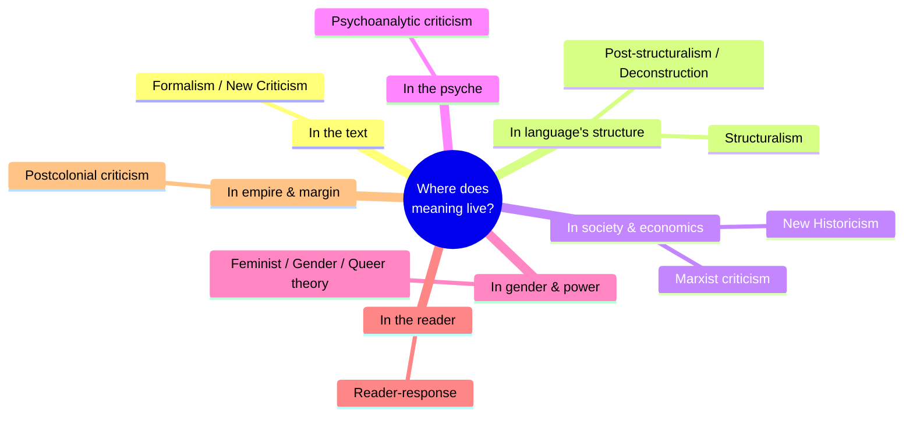

# Literary Theory and Criticism

**Literary criticism** is the reasoned discussion, analysis, and evaluation of
literature. **Literary theory** is the set of underlying assumptions about *what
literature is and how meaning is produced* that any act of criticism relies on — usually
tacitly, until theory makes them explicit. Terry Eagleton's
[Literary Theory: An Introduction](eagleton-literary-theory.md) makes the sharp point
that there is no innocent, theory-free reading: everyone who reads is applying a theory,
and the only question is whether they know it. Theory, on this view, is not a jargon
overlay but the surfacing of the choices already built into how we
[read](close-reading-and-interpretation.md).

The productive way to hold the field is as **competing lenses**. Each school foregrounds
a different source of meaning — the text itself, its structure, the author's psyche, the
economic base, the reader, the empire, the archive — and each yields a different, often
incompatible, reading of the same work. No lens is neutral; each buys insight into some
features at the cost of blindness to others.

## The major lenses

- **Formalism & New Criticism.** Meaning is *in the text*, in its verbal structure —
  irony, paradox, ambiguity, image. The New Critics (Ransom, Brooks, Wimsatt) demanded
  attention to "the words on the page," bracketed author and context, and gave us
  [close reading](close-reading-and-interpretation.md) as a disciplined method. Their
  polemics named the [intentional and affective fallacies](close-reading-and-interpretation.md).
- **Structuralism.** Building on Saussure's linguistics, meaning comes not from a text in
  isolation but from its place in a system of differences and conventions — the deep
  grammar underlying all stories (see [narratology](narrative-and-narratology.md)). This
  is where literary study leans hardest on
  [the philosophy of language](../philosophy/philosophy-of-language.md).
- **Post-structuralism & deconstruction.** Derrida turned structuralism against itself:
  if meaning is only difference, it never fully arrives — it is endlessly deferred
  (*différance*). Deconstruction reads a text for the points where it undermines its own
  apparent claims, denying that any text has a single stable meaning.
- **Marxist criticism.** Literature is shaped by, and reveals, the material and class
  conditions of its production; form and content carry ideology. This lens ties directly
  to [literature and society](literature-and-society.md).
- **Psychoanalytic criticism.** Reads the text (or its author, or its reader) through
  Freudian or Lacanian frames — desire, repression, the unconscious surfacing in imagery
  and symbol.
- **Feminist & gender theory.** Asks how texts construct, enforce, or contest gender;
  recovers neglected women writers and critiques the male-centered
  [canon](the-canon-and-world-literature.md). Extends into queer theory's analysis of
  sexuality and normativity.
- **Reader-response.** Meaning is *made in the act of reading*; the text is a set of cues
  a reader completes, so different readers (and interpretive communities, per Stanley
  Fish) legitimately produce different readings.
- **Postcolonial criticism.** Reads literature in the light of empire, colonization, and
  their aftermath — how texts represent the colonized (Edward Said's *Orientalism*) and
  how writers from formerly colonized nations write back.
- **New Historicism.** Reinserts the work into its historical moment, reading literary
  and non-literary documents side by side as equally part of a culture's discourse, with
  no clean line between text and context.

## Theory as argument, not decoding

Because the lenses conflict, criticism is fundamentally **argumentative**: a critic
advances a claim about a text and defends it with textual evidence, exactly the structure
studied in [critical thinking and informal logic](../philosophy/critical-thinking-and-informal-logic.md).
A reading is stronger or weaker, more or less illuminating — not simply "right." That is
the epistemic character of literary knowledge, examined further in
[close reading and interpretation](close-reading-and-interpretation.md).

## Why it matters

Naming your lens makes your reading accountable — it exposes what you are assuming and
what you are choosing not to see. Fluency across lenses is what lets a reader move from
"I liked it" to a defensible interpretation, and it reveals that literature is never just
aesthetic: it is entangled with power, history, mind, and language. Frye's
[Anatomy of Criticism](frye-anatomy-of-criticism.md) attempted something ambitious
against this pluralism — a unified, systematic *science* of criticism — and its partial
failure is itself a lesson in why the lenses stay plural.

## References

- Anchor works: [Literary Theory: An Introduction](eagleton-literary-theory.md),
  [Anatomy of Criticism](frye-anatomy-of-criticism.md)
- Cross-field: [Philosophy of Language](../philosophy/philosophy-of-language.md),
  [Critical Thinking and Informal Logic](../philosophy/critical-thinking-and-informal-logic.md)
