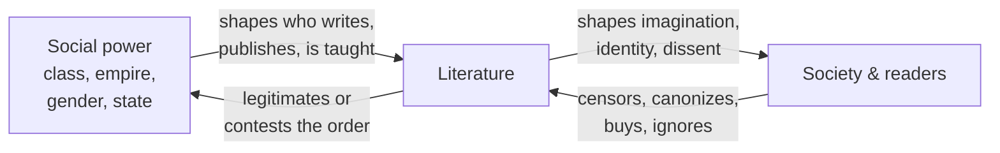

# Literature and Society

Literature is not produced in a vacuum. It is written by people embedded in a time, a class,
a language, and a set of institutions; it is published, sold, taught, praised, banned, and
read within a society that shapes what can be said and heard. This note takes literature as a
**social phenomenon** — a cultural artifact that both mirrors its world and acts on it. It
surveys literature as reflection and as force, the machinery of censorship, the politics of
identity and representation, the entanglement of writing with power, the shifting role of the
author, and the discipline that studies all of this: the sociology of literature. It draws
on [sociology](../sociology/index.md) throughout and connects to the interpretive frameworks
of [literary-theory-and-criticism](literary-theory-and-criticism.md).

## Literature as mirror — and as more than a mirror

The oldest social claim for literature is that it **reflects** its society: a novel preserves
the texture of a period's manners, moral assumptions, and material life more vividly than any
statistic. Realist fiction in particular (Balzac, Eliot, Tolstoy) was read by contemporaries
as a kind of documentary of the social order. But "mirror" understates the case. Literature
also **refracts** — it selects, distorts, idealizes, and satirizes — and it **acts**:
*Uncle Tom's Cabin* mobilized abolitionist sentiment, *The Jungle* prompted food-safety law,
and countless works have shaped how a generation imagines itself. Marxist critics push the
point furthest, treating literature as bound up with **ideology**: a text can naturalize the
existing order (making the contingent look inevitable) or expose it, and often does both at
once. Raymond Williams and the tradition of cultural materialism insisted that literature be
read as a *social practice*, produced and consumed under specific historical conditions,
rather than as a timeless object floating above society.

## Censorship and banned books

If literature had no social power, no one would bother to suppress it — and suppression is
constant across history. **Censorship** is the state, church, or institutional control of
what may be written, printed, or read, and its targets reveal what a society fears. The
Catholic Church's *Index Librorum Prohibitorum* (in force from 1560 to 1966) listed
forbidden books; states from the Soviet Union to apartheid South Africa maintained elaborate
apparatuses of literary control; and challenges to school and library holdings remain a
live political battleground. Recurring grounds for banning:

- **Political** — dissent, satire of rulers, forbidden ideologies (*Nineteen Eighty-Four* in
  authoritarian states; *samizdat* underground publishing as the response).
- **Religious** — blasphemy or heresy (the fatwa against Salman Rushdie's *The Satanic
  Verses*).
- **Moral / sexual** — "obscenity," famously litigated over *Ulysses*, *Lady Chatterley's
  Lover*, and *Lolita*.
- **Racial and social** — books challenged for their handling of race, from *Huckleberry
  Finn* to *Beloved*.

Censorship is the sharp edge of a broader truth: what a society permits to circulate is a
choice, and that choice is entangled with the formation of the [canon](the-canon-and-world-literature.md).
Books can be silenced not only by banning but by never being published, translated, or taught.

## Identity, representation, and the politics of voice

Who gets to write, about whom, and how they are portrayed are central social questions.
**Representation** concerns which groups appear in literature and in what light — whether as
full subjects with interior lives or as flat stereotypes, and whether they are written *by*
members of the group or *about* them by outsiders. Postcolonial criticism (Edward Said's
*Orientalism*) showed how Western literature constructed the "Orient" as an exotic, inferior
other, a literary image that served empire. Feminist criticism traced how women were long
written *about* far more than they were allowed to write, and recovered a suppressed female
tradition. These concerns feed directly into debates over
[race, gender, and identity](../sociology/index.md) and raise hard questions about
**appropriation** (who may tell whose story) and **authenticity** (whether lived experience
grants a special authority to write). The mature discussion resists both the claim that only
insiders may write a group and the claim that origins are irrelevant — holding instead that
representation carries responsibility and that access to authorship has never been evenly
distributed.

## Literature and power

Literature and power run in **both directions**. Power shapes literature: patronage, the
publishing market, state education, and prestige all determine which voices reach an
audience. And literature acts on power: it can serve as propaganda and national myth-making,
or as resistance — the protest poem, the prison memoir, the *samizdat* novel, the
consciousness-raising testimony. Antonio Gramsci's concept of **cultural hegemony** helps
explain the tie: dominant groups rule not only by force but by shaping the culture's common
sense, and literature is one arena where that common sense is manufactured — and challenged.

## The role of the author

The author's place in this system has itself been contested. Romanticism enthroned the
author as a solitary creative **genius**, the origin and guarantor of a work's meaning.
Twentieth-century theory dethroned that figure: Roland Barthes' "The Death of the Author"
argued that meaning is made by readers, not dictated by an author's intentions, and Michel
Foucault's "What Is an Author?" reframed the author as an **author-function** — a social
and legal category (tied to copyright, censorship, and the assignment of responsibility)
rather than a simple person. These moves matter socially: they shift authority from the
writer to the reader and to the institutions of reception, and they explain why the "author"
means something different in an age of print, of anonymous digital text, and of collective
or AI-assisted authorship. See [literary-theory-and-criticism](literary-theory-and-criticism.md)
for the theoretical debate.

## The sociology of literature

The **sociology of literature** studies writing as a social institution rather than as a set
of masterpieces. Its questions are empirical and structural: How is the literary field
organized? Who becomes a writer, and how? How do publishers, prizes, reviewers, and schools
confer value? Pierre Bourdieu's account of the **literary field** is central here: he
analyzed literature as a space of positions and struggles over "symbolic capital" (prestige),
in which claims to pure, disinterested art are themselves moves in a competition for status.
Bourdieu's concepts of *habitus*, *field*, and *cultural capital* let scholars trace how
literary taste both reflects and reproduces social class. This approach — see
[sociology](../sociology/index.md) — deliberately brackets the question of aesthetic value to
ask instead how value gets *produced and distributed*, complementing rather than replacing
the close reader's attention to the text itself.

## Why it matters

Reading literature socially guards against two errors: the naive view that a text is a pure
aesthetic object untouched by the world, and the reductive view that it is *nothing but* its
social conditions. The truth is dialectical — literature is shaped by society and reshapes it
in turn. Understanding that circuit clarifies why certain books get banned and others
canonized, why representation is fought over, and why the freedom to write and read is treated,
everywhere, as a political matter. It connects the intimate act of reading to the largest
questions of power, identity, and collective memory.

## References

- [Sociology (index)](../sociology/index.md) — the discipline that studies literature as a
  social institution; Bourdieu, Gramsci, and the analysis of fields and power.
- [Literary Theory and Criticism](literary-theory-and-criticism.md) — Marxist, feminist,
  postcolonial, and reader-response frameworks behind these debates.
- [The Canon and World Literature](the-canon-and-world-literature.md) — how the power to
  select and circulate texts forms the canon.
