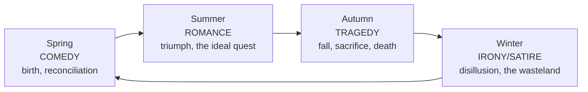

# Myth, Archetype, and the Hero's Journey

Beneath the surface variety of the world's stories, critics have long suspected **deep
recurring patterns** — the same figures, situations, and narrative arcs surfacing across
cultures that never met. This note surveys three of the most influential attempts to name
those patterns: Carl Jung's **archetypes**, Northrop Frye's system of literary **modes and
myths**, and Joseph Campbell's **monomyth** or hero's journey. Each is powerful and each
has been sharply criticized; together they form the standard vocabulary for talking about
the mythic substratum of narrative. This material sits at the crossroads of
[narrative-and-narratology](narrative-and-narratology.md) (which analyzes story structure
formally), the study of [myth, ritual, and symbol](../religion/myth-ritual-and-symbol.md)
in religion, and depth [psychology](../psychology/personality.md).

## Archetype: the recurring figure and image

An **archetype** (Greek: "original pattern") is a character type, image, or situation that
recurs so widely it seems to belong to storytelling as such: the wise old mentor, the
trickster, the shadow, the great mother, the descent into the underworld, the flood, the
sacred marriage. In literary study the term is used in two related senses.

The **Jungian** sense is psychological. Carl Jung proposed that the human psyche carries a
**collective unconscious** — a layer of inherited, universal predispositions shared across
humanity — whose contents are archetypes: primordial images that shape dreams, myths, and
art alike. On this view a recurring figure like the *shadow* (the disowned, dark side of the
self) or the *anima/animus* appears everywhere in literature because it answers to a
structure of the mind itself. Jung's archetypes are developed in the psychology of
[personality](../psychology/personality.md); their attraction for critics is that they
seem to explain *why* certain images move readers so reliably. Their weakness is that the
collective unconscious is unfalsifiable and empirically contested.

The **literary** sense, refined by Northrop Frye, brackets the psychological claim and
treats archetypes simply as **conventional units of literature** — recurring symbols and
narrative shapes that writers inherit and readers recognize, whatever their ultimate origin.
This more modest usage lets criticism catalog patterns without committing to a theory of
mind.

## Frye's anatomy: modes, symbols, and the mythos of the seasons

Northrop Frye's *Anatomy of Criticism* (1957) is the most ambitious attempt to make
archetypal criticism systematic. Frye argued that literature is a self-contained order of
words that reworks a limited stock of conventions, and he classified fiction by the hero's
**power of action** relative to us and the world — a spectrum from *myth* (hero superior in
kind: a god) down through *romance*, *high mimetic* (epic/tragedy), *low mimetic*
(realism), to *irony* (hero inferior or trapped). Western literary history, he suggested,
has drifted steadily down this ladder from myth toward irony.

Most memorably, Frye mapped the four great **narrative categories** (*mythoi*) onto the
cycle of the seasons, linking genre to a mythic pattern of death and rebirth:

Frye's scheme is prized for its scope and its insistence that genres are not arbitrary but
variations on deep, cyclic patterns; it is faulted for imposing a rigid grid that can flatten
the individuality of works and for treating "literature" as a closed system apart from
history and society.

## Campbell's monomyth: the hero's journey

Joseph Campbell's *The Hero with a Thousand Faces* argues that the world's hero myths are
local variants of a single deep story — the **monomyth**, a term he took from Joyce. The
hero leaves the ordinary world, crosses into a region of supernatural wonder, wins a decisive
victory through trial, and returns transformed with a boon for the community. Campbell fused
Jung's archetypes with comparative mythology and Arnold van Gennep's three-phase rite of
passage (separation–initiation–return; see
[myth, ritual, and symbol](../religion/myth-ritual-and-symbol.md)), and organized the
journey into recurring stages. The canonical arc:

The full treatment is in [campbell-hero-with-a-thousand-faces](campbell-hero-with-a-thousand-faces.md).

### Influence on modern storytelling

Campbell's pattern escaped academia and became a **working template** for popular narrative.
George Lucas credited it as a direct influence on *Star Wars*; the Hollywood development
executive Christopher Vogler distilled it into *The Writer's Journey*, a screenwriting manual
that made the "hero's journey" a fixture of studio story development, video-game design, and
brand storytelling. This is a rare case of a critical theory looping back to *shape* the
very object it described — a feedback effect that later stories then confirm.

### The critics

The monomyth's very success invites suspicion, and the scholarly objections are serious:

- **Selection bias.** Campbell arguably chose myths that fit the pattern and downplayed those
  that did not; comparative folklorists find plenty of stories the arc does not describe.
- **Overgeneralization.** Flattening thousands of culturally specific myths into one shape
  erases the differences that make them meaningful — a charge that also lands on Frye and Jung.
- **Androcentrism.** The template is built around a male hero; feminist critics (e.g., the
  "heroine's journey" of Maureen Murdock) argue women's mythic narratives follow different
  contours.
- **Circularity and prescription.** Because the journey is now taught to writers, its later
  ubiquity is partly self-fulfilling; it risks becoming a formula that homogenizes new stories
  rather than a neutral description of old ones.

The balanced view: the hero's journey is a genuinely useful lens that captures a real and
widespread pattern, but it is one pattern among many, not the skeleton key to all narrative.

## How the three relate

Jung supplies the **psychological engine** (why images recur), Frye supplies the **literary
system** (how conventions and genres organize the recurring material), and Campbell supplies
the **narrative arc** (one privileged shape the material often takes). All three make the same
wager — that stories are not infinitely various but ring changes on a finite set of deep
forms — and all three face the same core objection: that the search for the universal can
blind the reader to the particular. Held critically, they enrich the reading of both ancient
myth and modern fiction; held dogmatically, they become a cookie-cutter.

## References

- [The Hero with a Thousand Faces](campbell-hero-with-a-thousand-faces.md) — Campbell's
  formulation of the monomyth.
- [Narrative and Narratology](narrative-and-narratology.md) — the formal analysis of story
  structure the mythic patterns overlay.
- [Myth, Ritual, and Symbol](../religion/myth-ritual-and-symbol.md) — rites of passage and
  the sacred narratives Campbell drew on.
- [Personality](../psychology/personality.md) — Jung's collective unconscious and archetypes.
- [Literary Periods and Movements](literary-periods-and-movements.md) — Frye's downward drift
  from myth to irony across literary history.
