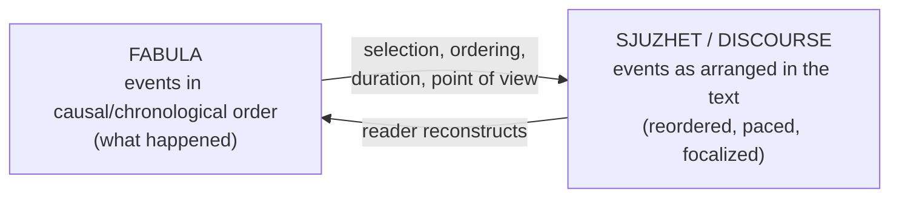

# Narrative and Narratology

**Narrative** is the representation of events in time — one thing happening, then
another, with some connection between them. **Narratology** is the systematic study of
how narratives are built: the attempt, following structuralist linguistics, to
describe the *grammar* of storytelling common to a novel, a film, a joke, and a myth.
Its central insight is that the same events can be told in radically different ways,
so we must separate *what is told* from *how it is told*.

## Story vs discourse (fabula / sjuzhet)

The foundational distinction, from the Russian Formalists, comes in two names:

- **Fabula** (story): the events in their chronological, causal order — the raw
  material, "what happened."
- **Sjuzhet** (discourse / plot): the events *as arranged and presented* in the text —
  reordered, compressed, delayed, repeated.

A mystery has a simple fabula (a murder, then an investigation) but a complex sjuzhet
(we learn the murder last). Gérard Genette split "how it is told" further into
**story** (events), **narrative** (the text itself), and **narration** (the act of
telling). This story/discourse split is the engine of narrative art: suspense,
surprise, and irony all live in the *gap* between what happened and how we are told it.

## Plot and structure

Aristotle's *Poetics* ([aristotle-poetics.md](aristotle-poetics.md)) is the origin of
plot theory. His term **mythos** (plot) is, he insists, the *soul* of tragedy — more
important than character. A well-formed plot has a **beginning, middle, and end**, a
**unity of action** (nothing detachable without damage), and turns on **peripeteia**
(a reversal of fortune) and **anagnorisis** (recognition), producing **catharsis** in
the audience. Later schematics — Freytag's pyramid (exposition, rising action, climax,
falling action, dénouement) — formalize this arc. The archetypal deep-structure of
plot connects to [myth-archetype-and-the-heros-journey.md](myth-archetype-and-the-heros-journey.md)
and to Frye's mythic modes in [frye-anatomy-of-criticism.md](frye-anatomy-of-criticism.md).

## Narration and point of view

*Who tells the story* and *from where* shapes everything. Point of view is usually
sorted by **person** and **knowledge**:

| | Description |
|---|---|
| **First person** | A character narrates ("I"); limited to what they know; may be *unreliable* |
| **Third person limited** | External narrator tied to one character's perspective |
| **Third person omniscient** | Narrator knows all minds and events |
| **Second person** | "You" — rare, estranging |

Genette insists on a crucial refinement: distinguish **who speaks** (the narrator,
"voice") from **who sees** (the perspective, "**focalization**"). A story can be
narrated by an adult but *focalized* through the child he once was. Focalization can be
**zero** (unrestricted / omniscient), **internal** (through a character's eyes), or
**external** (observing behavior only, no access to minds). The **unreliable narrator**
(Wayne Booth's term) exploits the gap between the narrator's account and what the text
lets us infer.

## Character

Aristotle subordinated character to plot; the modern novel reversed the priority.
E. M. Forster's distinction between **flat** characters (built on a single trait,
unchanging) and **round** characters (complex, capable of surprising us) remains a
working tool. Structuralists went the other way, dissolving character into *function*:
Vladimir **Propp**, analyzing Russian folktales, found that beneath surface variety lay
a fixed set of ~31 recurring **narrative functions** (villainy, the quest, the
donor's gift, the return) and a small cast of **character roles** (hero, villain,
donor, helper, princess). A. J. Greimas generalized this into the **actantial model**:
subject/object, sender/receiver, helper/opponent. Propp's functions are the direct
ancestor of the monomyth in [myth-archetype-and-the-heros-journey.md](myth-archetype-and-the-heros-journey.md).

## Time

Genette's analysis of narrative time is narratology's most exportable toolkit:

- **Order** — the relation between story-order and text-order: *analepsis* (flashback),
  *prolepsis* (flash-forward).
- **Duration** — the relation between story-time and telling-time: *summary* (fast),
  *scene* (real-time dialogue), *ellipsis* (skipped), *pause* (description), *stretch*.
- **Frequency** — how many times an event is told versus how often it happens
  (once/once, once for many, many for one).

## Why it matters

Narratology gives interpretation a precise vocabulary, so claims about "how a story
works" can be grounded in describable features rather than impressions — the analytic
backbone of [close-reading-and-interpretation.md](close-reading-and-interpretation.md)
and a bridge to [literary-devices-and-figurative-language.md](literary-devices-and-figurative-language.md)
(irony, in particular, is a narrative effect). The same formal grammar now underwrites
computational work: **large language models** ([../ai/large-language-models.md](../ai/large-language-models.md))
generate and analyze narrative by learning statistical regularities that echo the
structural patterns Propp and Genette described by hand — story arcs, roles, and
event ordering recovered as distributional regularities rather than hand-built rules.

## References

- Aristotle, *Poetics* — [aristotle-poetics.md](aristotle-poetics.md)
- Northrop Frye, *Anatomy of Criticism* — [frye-anatomy-of-criticism.md](frye-anatomy-of-criticism.md)
- Gérard Genette, *Narrative Discourse*
- Vladimir Propp, *Morphology of the Folktale*
- Wayne C. Booth, *The Rhetoric of Fiction*; E. M. Forster, *Aspects of the Novel*
