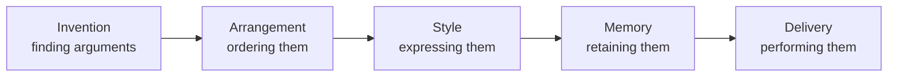

# Rhetoric and Style

**Rhetoric** is the art of persuasion — Aristotle's classic definition: "the faculty of
observing in any given case the available means of persuasion." **Style** is the
characteristic *manner* of a piece of writing: the choices of diction, syntax, tone, and
rhythm that make one voice distinct from another. The two are inseparable in practice,
because *how* something is said is a large part of *how* it persuades. Both draw on the
same [figurative toolkit](literary-devices-and-figurative-language.md) as literature
proper, but bend it toward an effect on an audience.

## The classical appeals

Aristotle identified three modes of persuasion, and they remain the durable core of the
subject:

| Appeal | Persuades through | Risk when misused |
| --- | --- | --- |
| **Ethos** | The speaker's credibility and character | Borrowed or false authority |
| **Pathos** | The audience's emotions | Manipulation over reason |
| **Logos** | Reasoning and evidence | Valid-looking but fallacious argument |

The dark side of each is the territory of
[informal logic and argumentation](../logic/informal-logic-and-argumentation.md): an
appeal to pity, an appeal to authority, or a superficially logical structure can each
tip into a **fallacy**. Rhetoric and logic are complementary — rhetoric studies what
actually moves an audience, logic studies what *should*, and a careful writer wants both.

## The five canons

Classical rhetoric organized the whole process of composing a persuasive work into five
stages:

For written work the live canons are **invention** (what to say), **arrangement** (in
what order), and **style** (in what words); memory and delivery belonged to the oral
world of the classical orator.

## The rhetorical figures

Beyond the tropes (metaphor, metonymy — covered under
[figurative language](literary-devices-and-figurative-language.md)), rhetoric catalogs
**schemes**: patterned arrangements of words for effect.

- **Anaphora** — repeating an opening phrase across clauses ("We shall fight on the
  beaches, we shall fight...").
- **Antithesis** — balancing contrasting ideas in parallel form ("Ask not what your
  country can do for you...").
- **Chiasmus** — reversing the order of a repeated structure (the Kennedy line above is
  also this).
- **Parallelism** — matching grammatical structure across parts, the backbone of most
  memorable prose.
- **Tricolon** — a series of three ("of the people, by the people, for the people").

These are not ornaments; they encode emphasis and relationship into the shape of the
sentence itself.

## Style, diction, voice, tone

- **Diction** — word choice, and its register: formal vs. colloquial, abstract vs.
  concrete, Latinate vs. Anglo-Saxon. Diction sets the whole temperature of a text.
- **Voice** — the distinctive persona a writer projects; the sense of a specific human
  presence behind the words.
- **Tone** — the attitude the writing takes toward its subject and audience (ironic,
  earnest, wry, urgent). Tone is where style and [irony](literary-devices-and-figurative-language.md)
  meet.
- **Syntax & rhythm** — sentence length and cadence. Short sentences hit. Long ones,
  built of subordinate clauses that accumulate and qualify and turn, can carry the reader
  through a complex thought without letting go.

## The craft of effective prose

The modern, plain-style tradition (Strunk & White, and more rigorously Joseph Williams'
*Style: Toward Clarity and Grace*) distills usable principles: prefer the concrete,
put the actor in the subject and the action in the verb, cut what does not work, and vary
sentence rhythm so the prose does not drone. Good style is not decoration added at the
end — it is thinking made legible. Clarity is itself persuasive: a reader who can follow
you easily is more likely to be moved. These same principles govern effective
professional and technical communication — see
[personal development](../personal-development/index.md) for the applied side of writing
and argument as a working skill.

## Why it matters

Rhetoric is the hinge between literature and action: it is language aimed at changing
minds. Understanding it makes you a sharper reader of speeches, ads, and arguments — you
can see the machinery working — and a more deliberate writer, choosing appeals and
figures on purpose rather than by accident. And because the persuasive figures can serve
truth or deception equally well, rhetorical literacy is a defense as much as a skill.

## References

- Cross-field: [Informal Logic and Argumentation](../logic/informal-logic-and-argumentation.md),
  [Personal Development](../personal-development/index.md)
- Related: [Literary Devices and Figurative Language](literary-devices-and-figurative-language.md)
