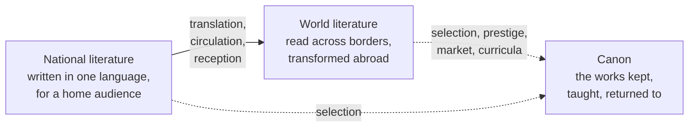

# The Canon and World Literature

The **literary canon** is the body of works a culture treats as central: the texts
taught in schools, anthologized, edited and re-edited, and returned to as touchstones of
value. "Canon" is borrowed from theology, where it names the authoritative books of
scripture; applied to secular literature it carries the same charge of authority and
exclusion — to be *in* the canon is to be judged worth preserving and transmitting. This
note surveys how canons form, who decides, the twentieth-century argument over their
composition, and the countervailing ideal of a single **world literature** that would
cut across national and linguistic borders.

## How a canon forms

No committee writes the canon. It accretes through the choices of many actors over long
stretches of time: critics who praise, teachers who assign, publishers who keep books in
print, editors who anthologize, scholars who annotate, and readers who keep buying. A
work survives when successive generations find it repays re-reading — but also when
institutions have an interest in continuing to circulate it. The canon is therefore both
an aesthetic judgment and a social fact, which is why questions about
[literature-and-society](literature-and-society.md) are inseparable from it.

Several forces select for canonicity:

- **Perceived intrinsic merit** — density of meaning, formal mastery, the capacity to
  sustain [close reading](close-reading-and-interpretation.md) across eras.
- **Influence** — works that later writers imitate, answer, or rebel against become
  reference points regardless of taste (Homer, Dante, Shakespeare).
- **Institutional transmission** — curricula, prizes, the publishing backlist, and
  scholarly editions physically keep a text available; what goes out of print tends to
  fall out of memory.
- **Fit with prevailing values** — a work legible to a period's concerns is more likely
  to be read; canons shift as those concerns shift.

Harold Bloom's *The Western Canon* is the strongest modern defense of an aesthetic,
merit-based account of this process, centering it on Shakespeare and arguing that great
writers earn their place through **influence** and originality rather than politics; see
[bloom-western-canon](bloom-western-canon.md). His account is deliberately combative
against the sociological view that follows.

## The canon wars

From roughly the 1970s onward, the composition of the canon became a public argument —
the **canon wars**, fought most visibly over undergraduate curricula in the United States.
The critique, drawing on feminist, postcolonial, and Marxist criticism (see
[literary-theory-and-criticism](literary-theory-and-criticism.md)), ran as follows: the
inherited canon was overwhelmingly male, European, and white not because those writers
alone produced great work but because the institutions doing the selecting reflected the
power of particular groups. "Greatness," on this view, is partly *manufactured* by who
holds the pen, the press, and the professorship. The remedy was to widen the canon —
recovering neglected women writers, enslaved and formerly colonized authors, and
non-European traditions — and to teach the canon *critically*, asking whose experience it
centers and whose it silences.

Defenders answered on two fronts. Some (Bloom among them) held that aesthetic value is
real and largely independent of the author's identity, and that replacing quality with
representation as the criterion of inclusion would hollow out the very idea of a canon.
Others accepted the sociological point but argued the canon had always been open and
self-correcting, absorbing once-marginal figures (Melville, Dickinson, Kafka were all
belatedly canonized) without abandoning judgment. The mature position most scholars now
hold treats the two accounts as partly compatible: canons encode genuine achievement
**and** the interests of those who compiled them, and a healthy canon is one that stays
open to revision without collapsing into pure quota.

## Weltliteratur: the idea of world literature

Against the nation-bound canon stands the ideal of **world literature**. The term
(*Weltliteratur*) was popularized by Goethe in conversations recorded around 1827: he
foresaw an age in which national literatures would matter less than a shared circulation
of works across borders — a cosmopolitan republic of letters in which a German might read
Chinese and Persian poetry and find kinship there. Marx and Engels seized the phrase in
*The Communist Manifesto*, tying it to the world market: as capitalism globalized
production, they argued, "from the numerous national and local literatures, there arises a
world literature." The concept is thus bound up with the history of
[globalization and cross-cultural exchange](../history/index.md).

In contemporary criticism, world literature names both an object and a method. As an
object it is the corpus of works that circulate *beyond their culture of origin* —
Franco Moretti and David Damrosch have argued that a text becomes "world literature" not
by belonging to a nation but by being read, translated, and transformed elsewhere.
Damrosch's formulation is influential: world literature is "writing that gains in
translation," literature as a **mode of circulation and reading** rather than a fixed
list. As a method it presses critics to read comparatively and at scale — Moretti's
provocative "distant reading" proposes surveying thousands of texts statistically rather
than closely reading a canonical few, precisely because no scholar can master every
tradition in the original.

## Translation and its politics

World literature depends almost entirely on **translation**, and translation is never
neutral. Most readers meet most of the world's literature in a language not its own, which
means translators, and the publishers who commission them, quietly shape the global canon:
what gets translated, from which languages into which, and how well, determines what can be
read at all. The flow is unequal — far more is translated *out of* dominant languages
(especially English) than *into* them, so anglophone readers encounter a thin, curated
slice of the non-English world while the reverse traffic is heavy. Lawrence Venuti has
influentially distinguished **domesticating** translation, which smooths a foreign text
into fluent target-language idiom (and can erase its strangeness), from **foreignizing**
translation, which preserves difference at the cost of ease. Emily Apter has gone further,
stressing the **untranslatable** — concepts and effects that resist any clean transfer —
as a caution against assuming world literature is frictionlessly portable. The politics of
translation is therefore continuous with the politics of the canon: both are questions
about whose voices reach whom, and on whose terms.

## Why it matters

The canon and world literature name the two poles between which literary value is
negotiated: the **vertical** authority of a tradition that ranks and preserves, and the
**horizontal** spread of texts across the globe that unsettles any single tradition's
claim to centrality. Taking both seriously lets a reader honor genuine achievement without
mistaking the accidents of power for the whole story of merit, and lets a curriculum be
both rigorous and genuinely global. The debate also clarifies what
[a canon is doing](what-is-literature.md) in the first place: not fixing eternal verdicts
but managing, imperfectly and revisably, a culture's collective memory of what is worth
reading.

## References

- [The Western Canon](bloom-western-canon.md) — Bloom's aesthetic, influence-centered
  defense of a merit-based canon.
- [What Is Literature](what-is-literature.md) — the prior question of what qualifies a
  text for canonization at all.
- [Literature and Society](literature-and-society.md) — the sociological account of how
  power shapes which works survive.
- [Literary Theory and Criticism](literary-theory-and-criticism.md) — feminist,
  postcolonial, and Marxist critiques that drove the canon wars.
- [History (index)](../history/index.md) — globalization and cross-cultural exchange, the
  backdrop to Weltliteratur.
