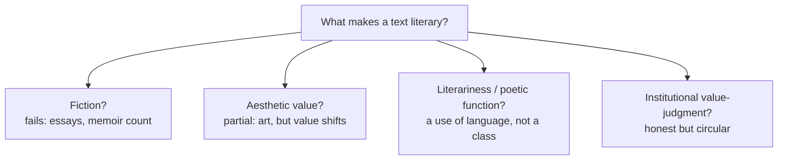

# What Is Literature?

"Literature" names something everyone recognizes and no one can define cleanly.
The trouble is that no property is present in all the texts we call literary and
absent from all the texts we don't. Every proposed criterion leaks. Studying
literature therefore begins with an honest admission: the object of the discipline
is contested, and that contest is itself part of the subject matter.

## Candidate definitions and why each leaks

**Fiction / imaginative writing.** Literature is invented rather than factual.
But history, philosophy, essays, and memoir are studied as literature, and plenty
of fiction (a shopping-list novel, ad copy) is not. The fiction/non-fiction line
does not track the literary/non-literary line.

**The aesthetic (writing valued as art).** Literature is language used for its own
sake — for beauty, form, pleasure — rather than merely to inform or instruct. This
overlaps with [../philosophy/aesthetics.md](../philosophy/aesthetics.md): the
literary work is an aesthetic object, judged by how it is made, not only by what it
reports. But "valued as art" is a judgment, and judgments change; texts move in and
out of the category (see [the-canon-and-world-literature.md](the-canon-and-world-literature.md)).

**Literariness (the formalist move).** The Russian Formalists (Roman Jakobson,
Viktor Shklovsky) argued that the question isn't *what* literature is but what makes
language *literary*. Their answer: **defamiliarization** (*ostranenie*) — literary
language makes the familiar strange, slows perception, and draws attention to its own
form. Jakobson called this the **poetic function**: language oriented toward "the
message for its own sake." This shifts the definition from a class of texts to a
*use* of language — a feature that can appear anywhere, in a slogan as much as a sonnet.

**The functional / institutional definition.** Literature is whatever a community
treats as literature — what is taught, anthologized, reviewed, and reread. On this
view (developed by later theory, e.g. Terry Eagleton), "literature" is not a stable
essence but a **value-judgment** that institutions confer and revoke. This is honest
about the category's instability but risks circularity: literature is what we call
literature.

## Literary vs ordinary language

A useful working distinction, not a boundary. **Ordinary language** is transparent:
we look *through* it to the meaning and forget the words. **Literary language** is
often *opaque* — sound, rhythm, ambiguity, and figuration make us look *at* the words,
so that form carries meaning rather than merely conveying it. This is why paraphrase
loses something in a poem but not in a memo. The mechanics of that opacity are the
subject of [poetry-and-poetics.md](poetry-and-poetics.md) and
[literary-devices-and-figurative-language.md](literary-devices-and-figurative-language.md).
It connects to how meaning is built ([../linguistics/semantics.md](../linguistics/semantics.md))
and to how context and implication shape uptake ([../linguistics/pragmatics.md](../linguistics/pragmatics.md)):
literary meaning is heavily pragmatic and inferential, not just semantic.

## High vs popular

The line between "high" (canonical, serious) and "popular" (genre, mass-market)
literature is one the discipline has largely stopped treating as natural. Detective
fiction, science fiction, comics, and song lyrics are now studied seriously; the
hierarchy is recognized as a product of taste, class, and institutions rather than of
intrinsic textual merit. This is continuous with the canon debate in
[the-canon-and-world-literature.md](the-canon-and-world-literature.md) and with the
sociological view in [literature-and-society.md](literature-and-society.md).

## Literary studies as a discipline

Because the object is contested, the discipline is defined less by its object than by
its practices: close, attentive reading ([close-reading-and-interpretation.md](close-reading-and-interpretation.md));
the systematic analysis of form, genre, and technique
([literary-genres-and-forms.md](literary-genres-and-forms.md),
[narrative-and-narratology.md](narrative-and-narratology.md),
[rhetoric-and-style.md](rhetoric-and-style.md)); the framing of interpretation within
explicit theoretical commitments ([literary-theory-and-criticism.md](literary-theory-and-criticism.md));
and attention to literature's history and social life
([literary-periods-and-movements.md](literary-periods-and-movements.md),
[literature-and-society.md](literature-and-society.md)). Its founding Western texts —
Aristotle's *Poetics* ([aristotle-poetics.md](aristotle-poetics.md)) on tragedy and
mimesis, Auerbach's *Mimesis* ([auerbach-mimesis.md](auerbach-mimesis.md)) on the
representation of reality, Frye's *Anatomy of Criticism* ([frye-anatomy-of-criticism.md](frye-anatomy-of-criticism.md))
on the systematic study of genre and myth — all take the *how* of literary
representation, not a fixed definition of literature, as their starting point.

## Why it matters

The refusal of a single definition is not a weakness. It keeps the category open, so
that new forms and previously excluded voices can enter, and it keeps critics honest
about the values they bring to any judgment. To ask "what is literature?" well is
already to be doing literary studies.

## References

- Aristotle, *Poetics* — [aristotle-poetics.md](aristotle-poetics.md)
- Erich Auerbach, *Mimesis* — [auerbach-mimesis.md](auerbach-mimesis.md)
- Northrop Frye, *Anatomy of Criticism* — [frye-anatomy-of-criticism.md](frye-anatomy-of-criticism.md)
- Terry Eagleton, *Literary Theory: An Introduction* (on the institutional definition)
- Roman Jakobson, "Linguistics and Poetics"; Viktor Shklovsky, "Art as Technique" (defamiliarization)
