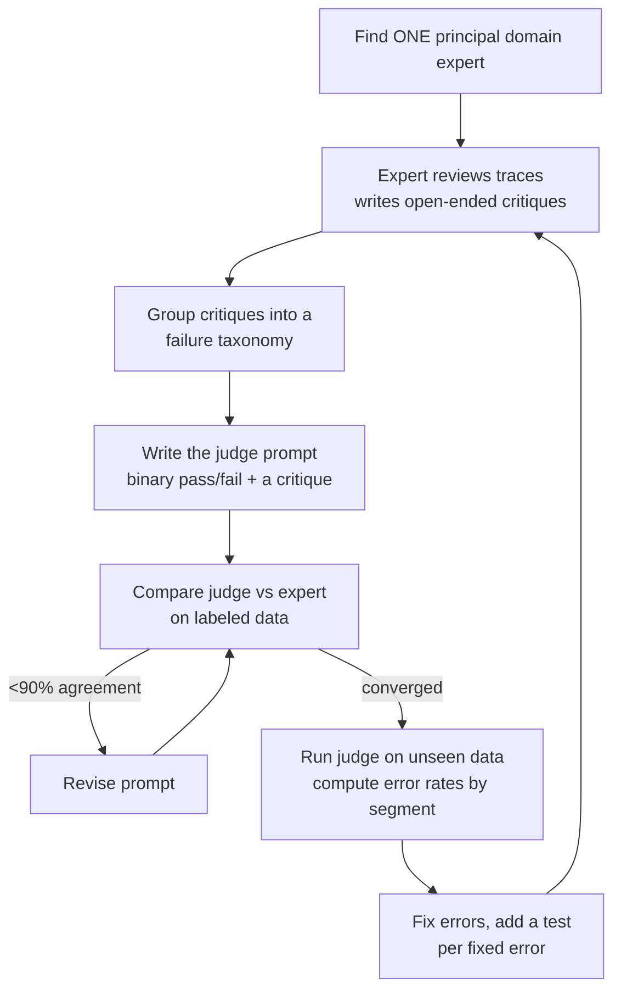

# LLM-as-a-Judge — A Complete Guide (Critique Shadowing)

Hamel Husain's step-by-step method for building an LLM judge you can actually
trust. The complement to [evals & LLM-as-a-judge](evals-llm-as-a-judge.md): that
note frames *why* independent verification matters; this one is the *how*.

## The failure mode it fixes

Teams drown in evals because they: track **too many metrics**, use **arbitrary
1–5 scales** (nobody agrees what separates a 3 from a 4), **ignore domain
experts**, and ship **unvalidated metrics** nobody trusts. The dashboard fills
with numbers and progress stalls. The cure Hamel calls **Critique Shadowing**.

## The process

1. **One principal domain expert** — the "benevolent dictator." Not a committee.
2. The expert reads traces and writes **critiques in prose**, noting the *first*
   failure in each. Criteria only become clear *by* grading — "criteria drift"
   (Shankar et al.): you cannot fully specify the rubric before you've judged
   real outputs.
3. The judge outputs a **binary verdict plus a written critique** — the critique
   is where the power is; force the model to reason before it labels.
4. **Iterate the prompt to convergence** with the expert. Hamel reached >90%
   agreement in three iterations on an NL-to-query task by trading a spreadsheet
   (query, critique, pass/fail) with the expert.

## Measuring alignment honestly

Raw agreement is fine only when classes are balanced (~50% failures). When they
are imbalanced it misleads — measure **precision and recall** (or Cohen's Kappa
for multiple annotators) instead. The judge is only as good as its measured
alignment with the human.

## After the judge works

Run it on **unseen** data and compute **error rates by segment** (feature ×
scenario × persona) to find where the product actually breaks. Every error you
fix gets a **new test** — a code assertion where possible, or a narrower
specialized judge otherwise. This is the same discipline as
[automated QA](automated-qa.md) and [automated review & verification](automated-review-verification.md),
and the independent-grader rule at the heart of [loop engineering](loop-engineering.md).

## References
- [Using LLM-as-a-Judge For Evaluation: A Complete Guide — Hamel Husain](https://hamel.dev/blog/posts/llm-judge/)
