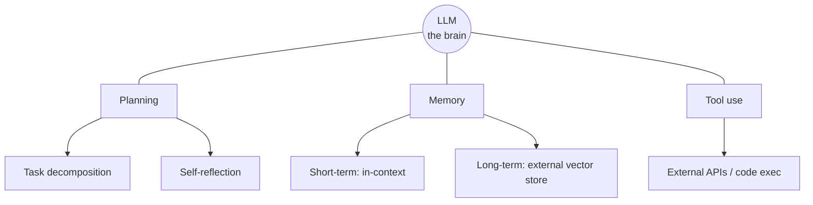

# LLM Powered Autonomous Agents

Lilian Weng's survey (Lil'Log, 2023) is a foundational map of what it takes to
build an autonomous agent on top of an LLM. Its core claim: the **LLM is the
agent's brain**, but a working agent needs three surrounding components —
**planning, memory, and tool use**. This decomposition became a common vocabulary
for the field.

## Component one: Planning

Planning splits into two capabilities.

**Task decomposition** — breaking a large task into smaller, manageable
subgoals. Techniques include Chain of Thought ("think step by step"), Tree of
Thoughts (exploring multiple reasoning branches per step), and LLM+P (offloading
to an external classical planner via PDDL).

**Self-reflection** — the ability to critique past actions, learn from mistakes,
and refine future steps. This is essential for real-world tasks where trial and
error is unavoidable. Key frameworks:

- **ReAct** interleaves *reasoning* and *acting* by extending the action space
  to include natural-language thoughts alongside real actions, cycling through
  `Thought → Action → Observation`. The explicit thought step measurably beats
  an act-only baseline.
- **Reflexion** gives the agent dynamic memory plus self-reflection over an RL
  loop, storing reflective text on failures to steer subsequent attempts.
- **Chain of Hindsight** improves outputs by conditioning on sequences of past
  feedback.

## Component two: Memory

Weng maps human memory onto agent design:

- **Short-term memory** — everything the model does via in-context learning; it
  is bounded by the finite context window (finite attention span).
- **Long-term memory** — effectively unlimited recall via an **external vector
  store**. Information is embedded and retrieved with **Maximum Inner Product
  Search (MIPS)**, made fast in practice by approximate nearest neighbor (ANN)
  algorithms such as LSH, ANNOY, and HNSW. This trades a little accuracy for a
  large speedup. See [architecting agent memory](architecting-agent-memory.md)
  and [agent memory systems](agent-memory-systems-knowledge-graphs.md).

## Component three: Tool use

Because model weights are fixed after training and can't hold everything, the
agent learns to call **external APIs** — for current information, code
execution, and access to proprietary sources. Representative work: MRKL
(routing to expert modules/tools), TALM and Toolformer (teaching models to call
tools), HuggingGPT (an LLM planner orchestrating specialist HF models), and
API-Bank (benchmarking tool-use). This is the intellectual ancestry of today's
tool calling and the [Model Context Protocol](model-context-protocol.md).

## Case studies and limits

The post walks through agent demos (scientific-discovery agents, the
Generative Agents sandbox simulation, autonomous-agent projects) and closes on
the hard constraints that still bite: finite context length, unreliable
long-horizon planning, and the brittleness of natural-language interfaces to
tools. Those limits are exactly what modern harnesses and frameworks —
[LangGraph](langgraph.md), [AutoGen](autogen.md), [CrewAI](crewai.md) — try to
engineer around, and what Anthropic's
[building effective agents](building-effective-agents.md) advises keeping simple.

## References

- [LLM Powered Autonomous Agents — Lilian Weng](https://lilianweng.github.io/posts/2023-06-23-agent/)
