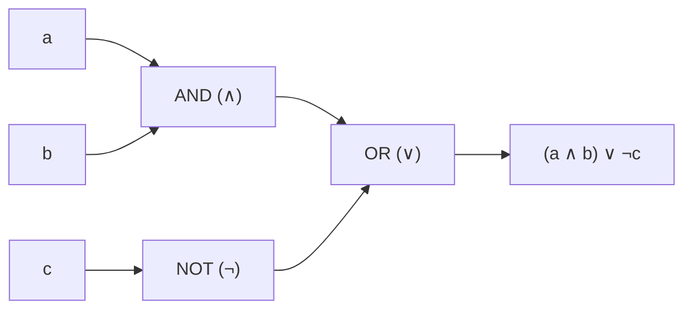

# Boolean Algebra

**Boolean algebra** is the algebraic structure that captures the laws of
[propositional logic](propositional-logic.md) as *equations* rather than truth tables. It
is the formal extension that turns "true/false and the connectives" into a computable
algebra — the same structure that governs sets, propositions, and the switching circuits
inside every digital computer. George Boole's insight in *The Laws of Thought* (1854) was
that reasoning could be done by calculation: treat logic as arithmetic on the values 0 and
1.

## The structure

A **Boolean algebra** is a set `B` with two binary operations `∧` (meet / AND / product),
`∨` (join / OR / sum), one unary operation `¬` (complement / NOT), and two distinguished
elements `0` and `1`, satisfying a fixed set of axioms. The smallest and most important
instance is the **two-element algebra** `𝔹 = {0, 1}`, where `∧` is multiplication, `∨` is
"max," and `¬` flips the bit. Interpreting `1` as *true* and `0` as *false* makes Boolean
algebra and propositional logic two faces of one object.

## Identities (the axioms and their consequences)

For all `a, b, c ∈ B`:

| Law | Form (∧) | Form (∨) |
|-----|----------|----------|
| Commutativity | `a ∧ b = b ∧ a` | `a ∨ b = b ∨ a` |
| Associativity | `a ∧ (b ∧ c) = (a ∧ b) ∧ c` | `a ∨ (b ∨ c) = (a ∨ b) ∨ c` |
| Distributivity | `a ∧ (b ∨ c) = (a∧b) ∨ (a∧c)` | `a ∨ (b ∧ c) = (a∨b) ∧ (a∨c)` |
| Identity | `a ∧ 1 = a` | `a ∨ 0 = a` |
| Complement | `a ∧ ¬a = 0` | `a ∨ ¬a = 1` |
| Idempotence | `a ∧ a = a` | `a ∨ a = a` |
| Absorption | `a ∧ (a ∨ b) = a` | `a ∨ (a ∧ b) = a` |
| Annihilator | `a ∧ 0 = 0` | `a ∨ 1 = 1` |

Note the crucial break from ordinary arithmetic: `∨` distributes over `∧` (the right
column), which has no numeric analogue, and every element is idempotent.

**De Morgan's laws** connect the operations through complement:

```
¬(a ∧ b) = ¬a ∨ ¬b        ¬(a ∨ b) = ¬a ∧ ¬b
```

## Duality

Every Boolean identity has a **dual**, obtained by swapping `∧ ↔ ∨` and `0 ↔ 1`
simultaneously. The dual of a theorem is always a theorem. This **principle of duality**
halves the work of proving laws and reflects a deep symmetry — it is the same symmetry as
De Morgan's laws and the `∀/∃` duality of [predicate logic](predicate-logic.md). Structures
with this axiom set are studied abstractly in
[abstract algebra](../math/abstract-algebra.md) as **complemented distributive lattices**,
and Stone's representation theorem shows every Boolean algebra is (isomorphic to) an algebra
of sets — tying the abstraction back to [set theory](../math/set-theory.md).

## Boolean functions

A **Boolean function** `f : 𝔹ⁿ → 𝔹` maps `n` bits to one bit. There are `2^(2ⁿ)` such
functions of `n` variables. Every Boolean function can be written as an algebraic
expression — its **sum-of-products** (DNF) or **product-of-sums** (CNF) form (see the normal
forms in [propositional-logic](propositional-logic.md)) — and **minimized** to reduce the
number of operations (Karnaugh maps, the Quine–McCluskey algorithm). Minimization is exactly
the practical link between logic and cost: fewer terms means fewer gates.

`{∧, ∨, ¬}` is a **functionally complete** set — every Boolean function is expressible with
them. Even more strikingly, NAND alone (or NOR alone) is complete, which is why a single
gate type can build any circuit.

## From logic to hardware

A **logic gate** is the physical realization of a Boolean operation, and a **digital
circuit** is a Boolean expression made of wires and gates. This is Boolean algebra's most
consequential application: Shannon's 1937 thesis showed that switching circuits obey exactly
the two-element Boolean algebra, so circuit design *is* algebraic simplification.



Adders, multiplexers, memory, and ultimately the CPU are all towers of Boolean functions.
The connection to computation runs deeper still: circuit complexity measures problems by the
smallest Boolean circuit that solves them, a central topic tied to
[computability-and-decidability](computability-and-decidability.md).

## Why it matters (CS and AI)

Boolean algebra is the bridge from abstract logic to running machines. It gives the
algebraic laws behind SQL `WHERE` clauses, bitmask manipulation, search-engine query
expansion, and access-control rules. In AI it appears as the semantics of propositional
[knowledge representation and reasoning](../ai/knowledge-representation-and-reasoning.md),
in binary decision diagrams (BDDs) used for model checking, and — via the differentiable
relaxations of Boolean operations — in the logic layers of some neuro-symbolic systems.
Understanding it is understanding why the same set of laws describes a proof, a set
operation, and a chip. For the surrounding field see the
[computer science index](../computer-science/index.md).

## References

- [Boole, *The Laws of Thought*](boole-laws-of-thought.md) — the founding work that
  recast logic as algebra.
- [Hurley, *A Concise Introduction to Logic*](hurley-concise-introduction-to-logic.md) —
  connects propositional logic to its algebraic laws.
- Related structure in [abstract algebra](../math/abstract-algebra.md) (lattices, rings)
  and [set theory](../math/set-theory.md) (the algebra of sets).
