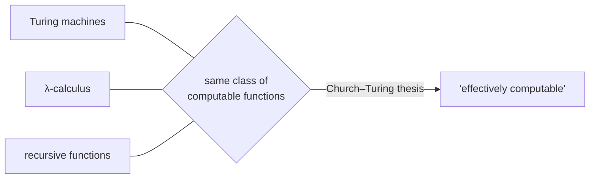

# Computability and Decidability

Computability theory is the boundary where logic becomes computer science: it asks not
*whether a statement is true* but *whether a mechanical procedure can settle it*, and
discovers that some perfectly precise questions have **no algorithm at all**. This is the
root from which computer science grows — the field began, in the 1930s, as a branch of
mathematical logic trying to pin down what "effectively calculable" means, and only later
acquired hardware.

## Decidability

A **decision problem** is a yes/no question over infinitely many inputs (e.g. "is this
number prime?", "does this program terminate?"). It is **decidable** if some algorithm
always halts with the correct yes/no answer. It is **semi-decidable** (recognizable) if an
algorithm halts-and-says-yes on every yes-instance but may run forever on no-instances. The
gap between these two is where the interesting phenomena live: a set can be recognizable
while its complement is not, which is exactly what makes some problems *un*decidable.

This connects directly to [model theory](model-theory.md) and
[formal systems and proof theory](formal-systems-and-proof-theory.md): a formal theory is
decidable if there is an algorithm deciding which sentences are theorems. First-order
*validity* is only semi-decidable, not decidable — provable formulas can be enumerated, but
no algorithm certifies unprovability. This is **Church's theorem** (the *Entscheidungsproblem*
has no solution).

## The Church–Turing thesis

Multiple independent 1930s definitions of "computable" — Turing machines, Church's
λ-calculus, Gödel's recursive functions — all turned out to define the *exact same* class
of functions. The **Church–Turing thesis** is the claim (not a theorem — it identifies an
informal notion with a formal one) that this robust class *is* what "effectively
computable" means. Every physically realizable model of computation proposed since,
including modern computers, is Turing-equivalent: no more powerful, in the sense of
computing more functions.

## The halting problem

Turing's flagship result: there is **no algorithm** that, given an arbitrary program *P*
and input *x*, decides whether *P(x)* halts. The proof is a
[diagonal argument](../math/set-theory.md), the same technique Cantor used to show ℝ is
uncountable. Suppose a decider *H(P, x)* existed. Build *D(P)* that runs *H(P, P)* and does
the opposite — loops if *H* says "halts", halts if *H* says "loops". Now ask what *D(D)*
does: if it halts, *H* said it loops (contradiction); if it loops, *H* said it halts
(contradiction). So *H* cannot exist. The halting problem is semi-decidable but not
decidable, and it is the archetypal undecidable problem — most other undecidability results
proceed by *reduction* to it. This self-referential twist is a canonical
[strange loop](../systems-thinking/self-reference-and-strange-loops.md).

## Gödel's incompleteness as undecidability

Gödel's **first incompleteness theorem** — any consistent, effectively axiomatized theory
strong enough to express arithmetic contains true statements it cannot prove — is, at heart,
an undecidability result. By arithmetizing syntax ("Gödel numbering"), Gödel encoded the
sentence *G* = "*G* is not provable in this theory". If the theory proved *G* it would be
inconsistent; if it disproved *G* it would prove a falsehood — so *G* is true but
unprovable. This is the same self-reference as the halting proof: in fact, the
unsolvability of the halting problem gives a quick modern route to incompleteness (a
complete, consistent, decidable axiomatization of arithmetic would decide halting, which is
impossible). Note the sharp contrast with the *completeness* theorem of
[model theory](model-theory.md): completeness says the *logic's* proof rules capture all
logical consequences; incompleteness says no *fixed theory* of arithmetic captures all
arithmetical truths.

## Beyond computable: how hard, not just whether

Computability asks *whether* a problem is solvable at all; **complexity theory** asks how
*expensively*. The famous open question **P vs NP** lives here: P is the class of problems
solvable in polynomial time, NP the class whose solutions are *checkable* in polynomial
time. Whether P = NP — whether every efficiently-checkable problem is efficiently
*solvable* — is the central unsolved problem of theoretical
[computer science](../computer-science/index.md), and the study of efficient
[algorithms](../computer-science/introduction-to-algorithms.md) is the practical face of
this hierarchy. Undecidable ⊃ intractable ⊃ tractable: three nested walls, and logic
discovered the outermost one first.

## Why it matters (including AI/CS)

These results are not academic curiosities; they are hard limits on tooling. No general
program can decide whether arbitrary code terminates, is free of a given bug, or is
equivalent to another program — **Rice's theorem** generalizes the halting result to say
that *every* non-trivial semantic property of programs is undecidable. That is why static
analyzers, type checkers, and verifiers are necessarily *conservative* (they approximate,
reject safe programs, or may not terminate). For AI, it bounds what any reasoning system —
symbolic or learned — can guarantee: an agent cannot in general decide the halting or
consistency of the systems it reasons about. Computability marks the permanent edge of the
mechanizable, and it was logic, not engineering, that found it.

## References

- [Enderton, *A Mathematical Introduction to Logic*](enderton-mathematical-introduction-to-logic.md)
  — decidability of theories, Church's theorem, and incompleteness.
- [Introduction to Algorithms](../computer-science/introduction-to-algorithms.md) — the
  complexity classes (P, NP) that extend computability into efficiency.
