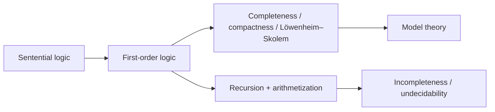

# A Mathematical Introduction to Logic (Enderton)

Herbert B. Enderton's *A Mathematical Introduction to Logic* (Academic Press, 1972; 2nd
ed. 2001) is a standard first course in mathematical logic for advanced undergraduates
and beginning graduate students in mathematics. Where an informal text like
[Hurley](hurley-concise-introduction-to-logic.md) treats logic as a tool for evaluating
arguments, Enderton treats logic itself as a mathematical object — languages, structures,
and proof systems are defined precisely and then their properties are proved as theorems.
The book is the classic bridge from "doing mathematics" to "studying the deductive
apparatus of mathematics from the outside."

## Scope and approach

The text builds up the two central systems of classical logic and then turns the tools of
mathematics back onto them.

- **Sentential (propositional) logic.** It opens with truth-functional logic as a warm-up:
  the syntax of formulas, truth assignments, tautological implication, and a first
  compactness theorem. This introduces the method the whole book uses — separate a formal
  *syntax* from a *semantics*, then relate the two. See
  [propositional-logic.md](propositional-logic.md).

- **First-order (predicate) logic.** The core of the book. Enderton defines first-order
  languages, structures, satisfaction (Tarski's truth definition), and a deductive
  calculus, giving a rigorous account of [predicate logic](predicate-logic.md). The
  centerpiece is a full proof of **Gödel's completeness theorem** — every logically valid
  first-order sentence is provable, and every consistent set of sentences has a model —
  together with the **compactness** and **Löwenheim–Skolem** theorems that flow from it.
  These are the founding results of [model theory](model-theory.md): they connect what is
  *derivable* in a [formal system](formal-systems-and-proof-theory.md) with what is *true*
  in all structures.

- **Incompleteness and undecidability.** The later chapters develop enough of number
  theory and recursion theory to prove **Gödel's first and second incompleteness
  theorems** — any consistent, sufficiently strong, effectively axiomatized theory cannot
  prove all truths of arithmetic and cannot prove its own consistency — and the
  **undecidability** of first-order validity (Church's theorem). This is where logic meets
  [computability and decidability](computability-and-decidability.md): representability of
  recursive functions, the arithmetization of syntax, and the limits of the axiomatic
  method.

- **Second-order logic.** A closing chapter contrasts first- and second-order logic,
  showing what expressive power buys and what it costs (loss of completeness and
  compactness).

## The arc of the book

## Why it matters

Enderton is the canonical entry point to the "big three" metatheorems — completeness,
incompleteness, undecidability — presented with mathematical rigor but without excessive
prerequisites. For HAL it anchors the mathematical core of the logic folder and ties it to
[../math/mathematical-proof-and-logic.md](../math/mathematical-proof-and-logic.md) and,
through the incompleteness/undecidability results, to the theory side of
[../computer-science/index.md](../computer-science/index.md).

## References

- [A Mathematical Introduction to Logic (Enderton) — Internet Archive](https://archive.org/details/mathematicalintr00ende)
