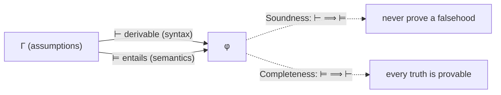

# Formal Systems and Proof Theory

A **formal system** is a purely mechanical apparatus for producing theorems: a fixed
alphabet, a grammar of well-formed formulas, a set of **axioms**, and a set of **inference
rules**. **Proof theory** is the branch of logic that studies these systems as
mathematical objects in their own right — treating proofs as finite combinatorial
structures and asking what a system *can* and *cannot* derive, and whether its derivations
are trustworthy. It is the syntactic half of the syntax/semantics split introduced in
[predicate logic](predicate-logic.md).

## The machinery

A formal system has four ingredients:

1. **Alphabet & grammar** — which symbol strings count as well-formed formulas.
2. **Axioms** — formulas accepted without proof (either a fixed list or *schemas* that
   generate infinitely many instances).
3. **Inference rules** — patterns that take premises to a conclusion. The archetype is
   **modus ponens**: from `φ` and `φ → ψ`, infer `ψ`.
4. **Proofs** — a proof of `φ` is a finite sequence of formulas ending in `φ`, each of
   which is an axiom or follows from earlier lines by a rule.

We write `Γ ⊢ φ` for "`φ` is **derivable** from assumptions `Γ`" — **syntactic
consequence**. Crucially, `⊢` is defined by symbol-shuffling alone; it never mentions truth.
The families of such systems include **Hilbert systems** (many axioms, one rule), **natural
deduction** (few axioms, intro/elim rules — see
[propositional-logic](propositional-logic.md)), and **sequent calculus** (Gentzen's system,
where Cut-elimination is the central theorem).

## Two notions of consequence

The whole subject turns on relating the syntactic `⊢` to the semantic `⊨` (truth in all
models, from [predicate logic](predicate-logic.md) and [model theory](model-theory.md)):

- **Soundness**: if `Γ ⊢ φ` then `Γ ⊨ φ`. The rules never derive something false from true
  premises — the system is *safe*.
- **Completeness**: if `Γ ⊨ φ` then `Γ ⊢ φ`. Every semantic truth is capturable by a
  proof — the system is *adequate*.

For first-order logic, both hold (Gödel's **completeness** theorem): `⊢` and `⊨` coincide,
so proof search is in principle enough to establish every valid consequence. This is the
theoretical license for automated theorem proving and is echoed in the correctness of
program-logic calculi (see
[predicate-calculus-and-program-semantics](predicate-calculus-and-program-semantics.md)).

## Consistency

A system is **consistent** if it cannot derive both `φ` and `¬φ` for any `φ`. Consistency is
non-negotiable: in classical logic, a single contradiction lets you prove *everything*
(**ex falso quodlibet**, `⊥ ⊢ φ`), so an inconsistent system is worthless — it "proves" all
formulas indiscriminately. Rejecting explosion is one motivation for
[non-classical-logic](non-classical-logic.md) (paraconsistent logics). A key proof-theoretic
goal, launched by Hilbert's program, was to prove the consistency of mathematics by
**finitary** means. Gödel showed why that goal, as stated, is unreachable.

## Gödel's incompleteness theorems

Kurt Gödel's 1931 theorems are the deepest results in proof theory, and they draw a hard
boundary around the whole enterprise. Let `T` be any consistent, effectively axiomatized
formal system strong enough to encode elementary arithmetic.

- **First incompleteness theorem**: `T` is **incomplete** — there is a sentence `G` such
  that neither `G` nor `¬G` is provable in `T`, yet `G` is true (of the natural numbers).
  Some truths are unreachable by *any* fixed proof system.
- **Second incompleteness theorem**: `T` cannot prove its own consistency. The statement
  "`T` is consistent" is exactly such an unprovable-in-`T` truth (assuming `T` is
  consistent).

The engine of the proof is **arithmetization** (Gödel numbering): formulas and proofs are
coded as numbers, so `T` can talk about its own provability. Gödel then builds a sentence
that, decoded, asserts *"this sentence is not provable in `T`"* — a formalized liar. This
**self-reference** is the same loop analyzed in
[self-reference and strange loops](../systems-thinking/self-reference-and-strange-loops.md),
and the diagonal construction is a cousin of Turing's halting argument in
[computability-and-decidability](computability-and-decidability.md).

## Reach and limits of incompleteness

The theorems' scope is precise, and misreading it is common:

- They apply only to systems **strong enough for arithmetic**; propositional logic and
  weaker theories (e.g. Presburger arithmetic, real-closed fields) are complete and even
  decidable.
- They require the system to be **effectively axiomatizable** (its axioms recognizable by
  algorithm) and **consistent**.
- They do **not** say "some truths are forever unknowable" — `G` is provable in a stronger
  system; they say *no single mechanical system captures all arithmetic truth*.

The practical residue for computing: there is no complete, mechanical, consistent theory of
everything provable; verification systems have intrinsic limits; and provability is
genuinely a hierarchy, not a ceiling.

## Why it matters (CS and AI)

Proof theory is the mathematics of *mechanized reasoning*, so it is directly the theory of
what a machine can prove. Type checking is proof checking (Curry–Howard; see
[categorical-logic-and-type-theory](categorical-logic-and-type-theory.md)), so a
type-correct program *is* a formal derivation. Proof assistants (Coq, Lean, Isabelle) are
formal systems whose kernels are trusted precisely because they are sound. Program logics
(Hoare logic, separation logic) are formal systems for reasoning about code — the subject of
[predicate-calculus-and-program-semantics](predicate-calculus-and-program-semantics.md). And
the incompleteness/undecidability results set the outer limits of automated verification and
of any AI system that reasons formally over
[knowledge representation and reasoning](../ai/knowledge-representation-and-reasoning.md).
For the surrounding field see the
[computer science index](../computer-science/index.md), and for the foundational debate the
[philosophy index](../philosophy/index.md).

## References

- [Enderton, *A Mathematical Introduction to Logic*](enderton-mathematical-introduction-to-logic.md)
  — rigorous treatment of formal systems, completeness, and the incompleteness theorems.
- [Predicate Calculus and Program Semantics](predicate-calculus-and-program-semantics.md) —
  formal systems applied to reasoning about programs.
- Connects to [mathematical proof and logic](../math/mathematical-proof-and-logic.md) (how
  proofs are actually written) and
  [self-reference and strange loops](../systems-thinking/self-reference-and-strange-loops.md)
  (the diagonal/self-reference at incompleteness's core).
