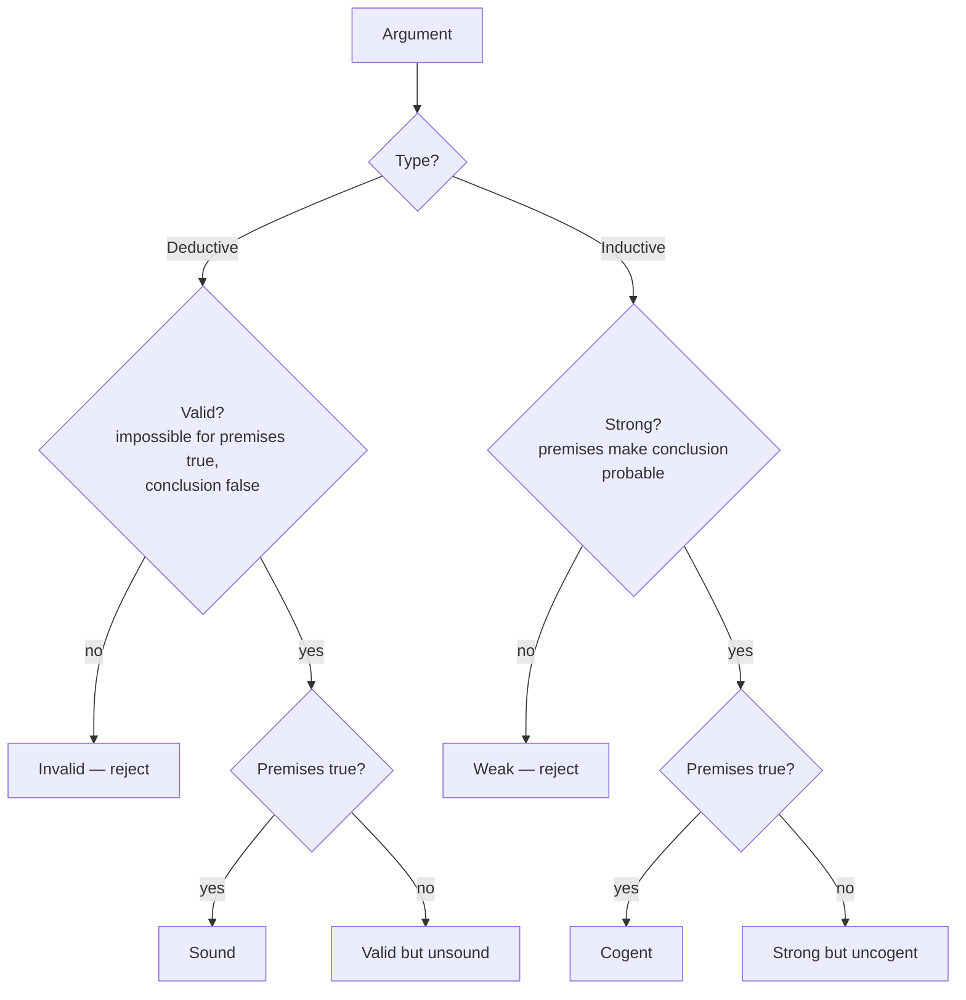
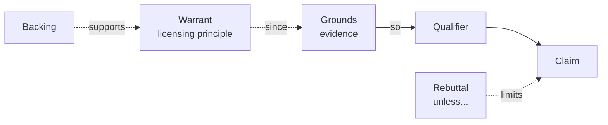

# Informal Logic and Argumentation

Informal logic is the study of reasoning as it actually occurs in ordinary language —
newspaper op-eds, courtroom pleadings, scientific discussion, everyday persuasion — rather
than in the sanitized symbolic notation of [propositional logic](propositional-logic.md)
and [predicate logic](predicate-logic.md). Its central object is the **argument**: not a
quarrel, but a structured attempt to give reasons (**premises**) that support a conclusion.
Where formal logic asks *what patterns of inference are valid in the abstract*, informal
logic asks *how do we identify, reconstruct, and evaluate the messy arguments people
actually make?*

This note concerns the mechanics of argument. The deeper philosophical and epistemological
questions — what justification is, how knowledge relates to truth, what makes a belief
rational — belong to the [philosophy](../philosophy/index.md) field. The social dimension
of how communities of arguers reach agreement is treated under
[sociology](../sociology/index.md).

## What an argument is

An argument is a set of statements in which some (the premises) are offered as grounds for
another (the conclusion). The load-bearing skill is spotting the direction of support.
Indicator words help: *because*, *since*, *for*, *given that* introduce premises;
*therefore*, *thus*, *hence*, *so*, *it follows that* introduce conclusions. But indicators
are unreliable, and much everyday argument leaves premises implicit (an **enthymeme** is an
argument with a suppressed premise — "Socrates is mortal, since he is a man" hides the
premise that all men are mortal). Reconstructing the full argument, including its unstated
assumptions, is the first analytical task.

## Deductive, inductive, abductive

Arguments come in three broad kinds, distinguished by the *kind* of support the premises
give the conclusion.

| Kind | Claim of the argument | If the premises are true, the conclusion is… | Evaluated by |
|---|---|---|---|
| **Deductive** | Conclusion follows *necessarily* | guaranteed | validity + soundness |
| **Inductive** | Conclusion follows *probably* | made likely, never guaranteed | strength + cogency |
| **Abductive** | Conclusion is the *best explanation* | the most plausible account of the evidence | explanatory fit |

A **deductive** argument aims for airtight entailment: "All whales are mammals; Moby is a
whale; therefore Moby is a mammal." An **inductive** argument generalizes or projects from
evidence: "Every swan observed so far is white, so the next swan will be white" — support
that can be strong yet still be overturned by a black swan. **Abductive** reasoning, or
inference to the best explanation, moves from a body of facts to the hypothesis that would
best account for them: the detective's inference, and much of how scientific theories and
medical diagnoses are actually chosen. Confusing the standards — demanding deductive
certainty from an inductive argument, or excusing a deductive gap as "probable" — is a
common source of bad evaluation.

## Validity, soundness, cogency

For deductive arguments, two properties matter and are routinely conflated:

- **Validity** is purely structural: an argument is valid when it is *impossible* for the
  premises to be true and the conclusion false. Validity says nothing about whether the
  premises *are* true. "All cats are reptiles; Felix is a cat; therefore Felix is a
  reptile" is perfectly valid and obviously wrong.
- **Soundness** adds truth: a sound argument is a valid one whose premises are in fact all
  true. Soundness is what we ultimately want, but it decomposes into a logical question
  (validity, which logic settles) and a factual question (are the premises true, which the
  world settles).

For inductive arguments the parallel notions are **strength** (the premises make the
conclusion probable) and **cogency** (a strong argument with true premises).

## Diagramming argument structure

Real arguments chain and branch. Diagramming makes the structure explicit by numbering each
statement and drawing the support relations:

- **Linear / serial** — a premise supports an intermediate conclusion, which in turn
  supports the final one (A → B → C).
- **Convergent** — several *independent* premises each support the conclusion on their own;
  knock one out and the others still stand.
- **Linked** — premises that must work *together*; neither supports the conclusion alone
  (a syllogism's two premises are linked).
- **Divergent** — one premise supports several conclusions.

Distinguishing convergent from linked structure matters for rebuttal: refuting one premise
of a linked argument collapses it, but refuting one convergent premise leaves the rest.

## The Toulmin model

Stephen Toulmin argued that the premise/conclusion picture is too thin for practical
argument and proposed a richer anatomy. Its core three parts:

- **Claim** — the conclusion being argued for.
- **Grounds** (data) — the facts or evidence offered in support.
- **Warrant** — the (often implicit) principle that licenses the *move* from grounds to
  claim: the bridge, not another brick.

Three further parts handle real-world defeasibility: the **backing** justifies the warrant
itself; the **qualifier** hedges the claim's force (*presumably*, *in most cases*); and the
**rebuttal** names the conditions under which the claim would fail. Toulmin's insight is
that everyday reasoning is rarely a clean deduction — it is a defeasible move from grounds to
claim, licensed by a warrant that could be challenged and that admits exceptions. This maps
far better onto legal, ethical, and scientific argument than the syllogism does.

## Principles of fair evaluation

Two norms govern honest argumentation:

- **The principle of charity** — reconstruct the other side's argument in its *strongest*
  reasonable form before criticizing it. Attacking a weak paraphrase is the
  [straw man](fallacies.md) fallacy; the disciplined opposite is *steelmanning*. Charity is
  not politeness for its own sake — it is what makes a critique land, because defeating the
  best version of a position actually settles something.
- **The burden of proof** — the obligation to supply support falls on whoever asserts a
  claim, especially one that departs from the default or the status quo. Someone who
  demands that *others* disprove an unsupported claim, rather than supporting it themselves,
  is shirking the burden (and often committing the appeal to ignorance). Who bears the
  burden is itself frequently contested, and settling it is often half the argument.

These norms turn argument from a contest of persuasion into a cooperative search for what is
actually true — the practical spirit behind
[Crucial Conversations](../personal-development/crucial-conversations.md) and the
tactical empathy of [Never Split the Difference](../personal-development/never-split-the-difference.md),
both of which apply argumentation under emotional and adversarial pressure.

## Why it matters

Informal logic is the everyday, high-leverage half of reasoning: most of the arguments a
person encounters are natural-language, defeasible, and full of implicit premises, not
formal proofs. It is also newly urgent for evaluating machine-generated text. A
[large language model](../ai/large-language-models.md) produces fluent, well-structured
prose whose *form* mimics good argument while its *content* may rest on fabricated premises
(hallucination) or invalid inference — the tell that formal validity and factual soundness
are separate checks becomes a practical safeguard. Reading such output well means doing
exactly what informal logic teaches: separate the claim from its grounds, surface the
warrant, test whether the premises are actually true, and refuse to let fluency stand in for
support. The catalogue of recurring failure modes is treated in [fallacies](fallacies.md),
and the discipline of applying these habits deliberately is
[critical thinking in the age of AI](../ai-org/critical-thinking-during-the-age-of-ai.md).

## References

- [Hurley, *A Concise Introduction to Logic*](hurley-concise-introduction-to-logic.md) —
  the anchoring text for both formal and informal reasoning.
