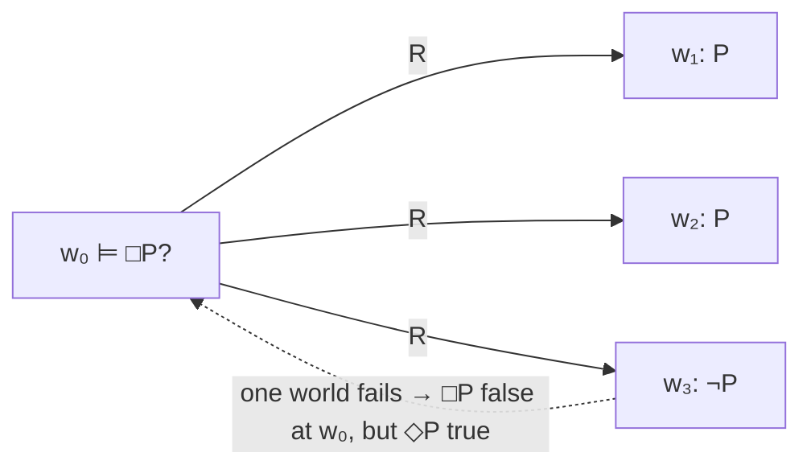

# Modal Logic

Modal logic extends ordinary [predicate logic](predicate-logic.md) with operators that
qualify *how* a proposition holds — not just whether P is true, but whether P is
**necessary**, **possible**, **known**, **obligatory**, or **eventually** true. Classical
logic has one mode of truth; modal logic adds a dimension. Two dual operators do the work:

- **□P** ("box P") — P is *necessary* / holds in all relevant alternatives,
- **◇P** ("diamond P") — P is *possible* / holds in some alternative.

They are interdefinable by duality, exactly as ∀ and ∃ are: **◇P ≡ ¬□¬P** ("possible" =
"not necessarily not"). This mirrors the quantifier duality of predicate logic, and it is
no accident — the possible-worlds semantics below turns □ and ◇ into disguised quantifiers.

## Possible-worlds (Kripke) semantics

Kripke's insight was to interpret modality over a **frame**: a set *W* of **possible
worlds** together with an **accessibility relation** *R ⊆ W × W*. A **model** adds a
valuation saying which atomic propositions hold at each world. Truth becomes *relative to a
world w*:

- **w ⊨ □P** iff P is true at *every* world *v* with *w R v* (every world accessible from w),
- **w ⊨ ◇P** iff P is true at *some* accessible world.

So □ quantifies universally and ◇ existentially — over the worlds *R* lets you reach. This
is the model-theoretic core, in the spirit of [model theory](model-theory.md) but with an
extra relational parameter.

The power of the framework is that **properties of *R* correspond to modal axioms**. Each
constraint on accessibility validates a schema, giving a lattice of named systems:

| Frame condition on R | Axiom | Reads as |
|---|---|---|
| (none) | K: □(P→Q)→(□P→□Q) | necessity distributes over → |
| reflexive | T: □P→P | necessary ⇒ true |
| transitive | 4: □P→□□P | necessary ⇒ necessarily necessary |
| symmetric + reflexive + transitive | S5 | modality is "absolute" |

**K** is the minimal normal modal logic; **S5** (equivalence-relation frames) is the
strongest of the common systems. Choosing a system means choosing what your "alternatives"
are like.

## Families of modality

The same □/◇ machinery is reused across interpretations — the accessibility relation just
means something different in each:

- **Alethic** — necessity/possibility of truth itself (the classical reading; □ = "in all
  possible worlds").
- **Temporal** — □ = "at all future times", ◇ = "at some future time"; specialized
  operators G/F (globally/finally), X (next), U (until). Time is the accessibility
  relation.
- **Epistemic** — □ = "the agent *knows* that", ◇ = "it is consistent with what the agent
  knows". Worlds are epistemic alternatives the agent cannot rule out.
- **Doxastic** — □ = "the agent *believes*" (like epistemic but without T: belief need not
  be true).
- **Deontic** — □ = "it is *obligatory* that", ◇ = "it is *permitted*". Here T fails
  deliberately: obligations can be violated, so □P → P must not hold.

## Why it matters (including AI/CS)

Modal logic is one of logic's biggest exports to computing.

- **Temporal logic and model checking**: LTL and CTL are temporal modal logics used to
  specify how a system behaves *over time* ("the door is never open while moving",
  "every request is eventually granted"). A **model checker** exhaustively verifies a
  finite-state system against such a formula — the accessibility relation is literally the
  program's state-transition graph, connecting to
  [algorithms](../computer-science/introduction-to-algorithms.md) and the reachability
  problems in [computer science](../computer-science/index.md). This is how hardware and
  concurrent protocols are formally verified.
- **AI knowledge and belief**: epistemic and doxastic logics formalize what agents *know*
  and *believe*, including multi-agent reasoning ("I know that you know…"), a backbone of
  [knowledge representation and reasoning](../ai/knowledge-representation-and-reasoning.md)
  and of reasoning about other agents.
- Deontic logic underlies formalized norms, permissions, and policy/compliance reasoning.

Modal logic is itself a [non-classical logic](non-classical-logic.md) in the broad sense —
it enriches the classical base rather than rejecting it — and Kripke frames also give the
standard semantics for intuitionistic logic covered there.

## References

- [Priest, *An Introduction to Non-Classical Logic*](priest-non-classical-logic.md) —
  Kripke semantics, normal modal systems, and the modal families.
- [Enderton, *A Mathematical Introduction to Logic*](enderton-mathematical-introduction-to-logic.md)
  — the first-order base that modal operators extend.
