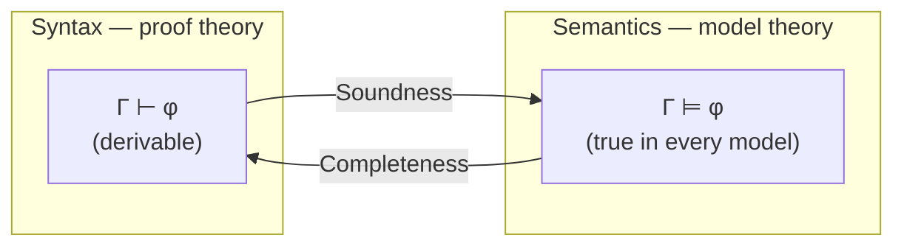

# Model Theory

Model theory is the **semantic** half of logic: where
[proof theory](formal-systems-and-proof-theory.md) studies what can be *derived* by
pushing symbols around under fixed rules, model theory studies what a set of sentences
*means* — the mathematical worlds in which they come out true. A logic has two faces, and
model theory is the one that asks "true where?" rather than "provable how?". Its central
achievement is showing that, for classical first-order logic, these two faces agree
exactly.

## Structures and interpretation

Fix a **signature** (or vocabulary): a set of constant, function, and relation symbols,
each with an arity. A **structure** (or **model**) 𝔐 for that signature supplies meaning:

- a nonempty **domain** (universe) *M* — the objects we quantify over,
- an element of *M* for each constant symbol,
- a concrete function *Mⁿ → M* for each *n*-ary function symbol,
- a concrete subset of *Mⁿ* for each *n*-ary relation symbol.

The signature is pure syntax; the structure is the [set](../math/set-theory.md)-theoretic
object that interprets it. The same sentence "∀x∀y (x·y = y·x)" is interpreted in the
structure of integers under multiplication (true) or the structure of 2×2 matrices under
multiplication (false). A structure plus a **variable assignment** (values for free
variables) is everything needed to evaluate any [predicate-logic](predicate-logic.md)
formula.

## Satisfaction and truth in a model

Truth is defined by **Tarski's recursion** on formula structure — the definition that made
"true" a rigorous mathematical notion rather than a philosophical one. Writing 𝔐 ⊨ φ[s]
for "𝔐 satisfies φ under assignment *s*":

- an atomic formula *R(t₁,…,tₙ)* holds iff the interpreted tuple lies in the interpreted
  relation;
- connectives compose truth values classically (¬, ∧, ∨, →);
- **∀x φ** holds iff φ holds for *every* re-assignment of *x* to a domain element;
  **∃x φ** iff for *some* one.

A **sentence** (no free variables) is either true or false in 𝔐 outright, independent of
assignment. When 𝔐 ⊨ φ we say 𝔐 is a **model of** φ, and 𝔐 ⊨ Γ when it models every
sentence in a set Γ.

## Logical consequence, semantically

Model theory defines entailment purely in terms of models. Γ **semantically entails** φ,
written **Γ ⊨ φ**, iff *every* structure that models all of Γ also models φ — there is no
counterexample structure. This is the semantic mirror of the syntactic **Γ ⊢ φ**
("φ is derivable from Γ") studied in
[formal systems and proof theory](formal-systems-and-proof-theory.md). A formula true in
*all* structures (⊨ φ) is **valid**; one true in *some* is **satisfiable**.

## The syntax↔semantics bridge

The two arrows above are the foundational metatheorems tying the halves together:

- **Soundness**: if Γ ⊢ φ then Γ ⊨ φ. The proof rules only ever produce genuine
  consequences — you can never derive falsehood from truth. This is what makes a proof
  *trustworthy*.
- **Completeness** (Gödel, 1929): if Γ ⊨ φ then Γ ⊢ φ. *Every* semantic truth is
  reachable by the proof calculus — nothing true is beyond derivation.

Together: **⊢ and ⊨ coincide** for first-order logic. Provability and truth-in-all-models
are the same relation seen from two sides. (This is the *completeness* theorem, and it
must not be confused with Gödel's later *incompleteness* theorems, which are about a fixed
theory's inability to prove all truths about arithmetic — see
[computability and decidability](computability-and-decidability.md).)

## Compactness and Löwenheim–Skolem

Two further theorems reveal how much — and how little — first-order sentences can pin down.

- **Compactness**: a set of sentences has a model iff every *finite* subset does.
  Infinitely many constraints are satisfiable exactly when no finite clump of them
  conflicts. A standard consequence: adding a constant *c* with axioms "c > 0, c > 1,
  c > 2, …" is finitely satisfiable, so it has a model — a **non-standard** model of
  arithmetic containing an "infinite" element. First-order logic cannot rule this out.
- **Löwenheim–Skolem**: if a countable theory has an infinite model, it has models of
  *every* infinite [cardinality](../math/set-theory.md), including a countable one. This
  yields **Skolem's paradox**: the axioms of set theory, which prove uncountable sets
  exist, themselves have a countable model. "Uncountable" is relative to a model's
  internal viewpoint.

The lesson is that first-order logic trades expressive precision for these good
metatheoretic properties (completeness, compactness) — it cannot categorically describe
the natural numbers or the reals up to isomorphism.

## Why it matters (including AI/CS)

Model theory is the theory of *interpretation*, so it underwrites anything where symbols
are given meaning by a world. **Database theory** is applied finite model theory: a
relational database *is* a finite structure, a query *is* a formula, and query answering
*is* the satisfaction relation 𝔐 ⊨ φ. In AI
[knowledge representation and reasoning](../ai/knowledge-representation-and-reasoning.md),
the "models" of a knowledge base are the possible worlds consistent with it, and
entailment is semantic consequence over those worlds. Compactness and the completeness
bridge justify the soundness of automated theorem provers and SAT/SMT solvers. The
model-theoretic view also connects to
[categorical logic and type theory](categorical-logic-and-type-theory.md), where models of
a theory become functors and satisfaction is recast structurally.

## References

- [Enderton, *A Mathematical Introduction to Logic*](enderton-mathematical-introduction-to-logic.md)
  — structures, satisfaction, soundness/completeness, compactness, Löwenheim–Skolem.
- [Categorical Logic and Type Theory](categorical-logic-and-type-theory.md) — the
  categorical reframing of models and interpretation.
