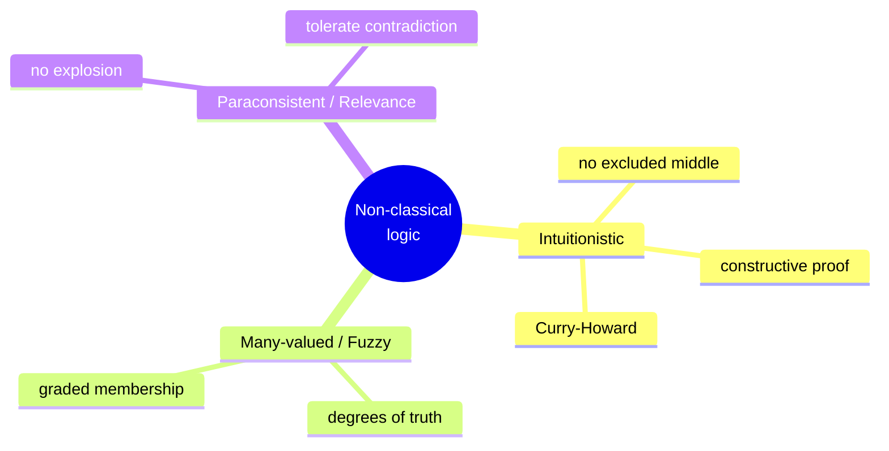

# Non-Classical Logic

Classical logic rests on assumptions so familiar they look inevitable: every proposition is
either true or false (**bivalence**), P ∨ ¬P always holds (**excluded middle**), a
contradiction entails everything (**explosion**, *ex falso quodlibet*), and ¬¬P equals P
(**double-negation elimination**). Non-classical logics are the systematic study of what
happens when you *drop one of these on purpose* — because a domain of reasoning demands it.
Each family below is defined by which classical law it declines and why.

## Intuitionistic logic (constructivism)

Intuitionistic logic rejects the law of the excluded middle and, with it,
double-negation elimination and non-constructive existence proofs. Its guiding idea
(the **BHK interpretation**) is that truth *means having a proof*, and a proof is a
construction:

- a proof of **A ∧ B** is a proof of A paired with a proof of B,
- a proof of **A ∨ B** is a proof of one disjunct *plus a label saying which*,
- a proof of **A → B** is a *method* transforming any proof of A into a proof of B,
- a proof of **∃x P(x)** is an actual witness *a* together with a proof of P(a).

So you cannot assert A ∨ ¬A in general, because that would claim to *decide* every
proposition. This is the logic of construction rather than of an external truth-value, and
its Kripke semantics (worlds as stages of growing knowledge) links it to
[modal logic](modal-logic.md).

The deep payoff is the **Curry–Howard correspondence**: intuitionistic proofs *are*
typed programs. A proposition is a type, a proof is a term inhabiting it, and A → B is a
function type. Proof normalization is program execution. This identification is the
foundation of [categorical logic and type theory](categorical-logic-and-type-theory.md)
and of proof assistants (Coq, Agda, Lean), where checking a proof and type-checking a
program are the same act.

## Many-valued and fuzzy logic

Many-valued logics abandon *bivalence*: propositions can take more than two truth values.
Łukasiewicz's three-valued logic adds "indeterminate" alongside true/false. **Fuzzy logic**
pushes this to a continuum — truth is a **degree** in the interval [0, 1] — to model
*vagueness*. "This water is hot" is not simply true or false; it is true to degree 0.8.
Connectives become numeric functions (a common choice: *A ∧ B* = min, *A ∨ B* = max,
*¬A* = 1 − A). This is distinct from probability: 0.8 is a degree of *truth* (how hot),
not a likelihood (how probable it is hot).

## Paraconsistent and relevance logics

These reject **explosion**: classically, from a contradiction P ∧ ¬P you may infer *any* Q
whatsoever, which makes an inconsistent theory useless (it proves everything). A
**paraconsistent** logic blocks that inference, so a system can *contain* a local
contradiction without every conclusion becoming derivable — valuable for reasoning over
inconsistent databases, conflicting sources, or belief revision. **Relevance (relevant)
logics** go further and demand a genuine connection between premises and conclusion,
rejecting the "paradoxes of material implication" (e.g. that a false statement implies
anything). Both restrict, rather than extend, classical entailment.

## When and why to drop a classical assumption

The unifying discipline: match the logic to the phenomenon.

| Phenomenon | Classical law to drop | Logic |
|---|---|---|
| Reasoning must be *constructive* / computational | excluded middle | intuitionistic |
| Truth comes in *degrees* (vagueness) | bivalence | fuzzy / many-valued |
| Sources are *contradictory* but usable | explosion | paraconsistent |
| Premises must be *relevant* to the conclusion | paradoxes of → | relevance |

Non-classical does not mean "wrong" — classical logic remains the right tool for most
mathematics. It means "tuned to a domain classical logic models badly."

## Why it matters (including AI/CS)

The Curry–Howard bridge makes intuitionistic logic the theoretical backbone of typed
functional programming and machine-checked proof, arguably logic's single most consequential
export to software. Fuzzy logic drives control systems and is a natural fit for the graded,
uncertain reasoning of [AI](../ai/index.md); paraconsistent logics matter wherever an AI
system must reason over inconsistent knowledge bases without collapsing into triviality —
a live concern in [knowledge representation and reasoning](../ai/knowledge-representation-and-reasoning.md).
More broadly, non-classical logic teaches that the "rules of thought" are *designable*: you
choose the entailment relation to fit the problem.

## References

- [Priest, *An Introduction to Non-Classical Logic*](priest-non-classical-logic.md) —
  the systematic survey of intuitionistic, many-valued, fuzzy, paraconsistent, and
  relevance logics.
- [Categorical Logic and Type Theory](categorical-logic-and-type-theory.md) —
  Curry–Howard and the proofs-as-programs correspondence.
