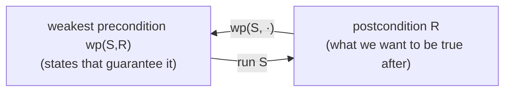

# Predicate Calculus and Program Semantics

Edsger Dijkstra and Carel Scholten's 1990 textbook gives a self-contained, algebraic treatment of predicate calculus and then uses it to define what a program *means*. The book's engine is the **weakest precondition** — a way to compute, mechanically, exactly the initial states from which a program is guaranteed to reach a desired final state. It is the mature, formalized version of the ideas Dijkstra introduced in *A Discipline of Programming* (1976), and it belongs here because it is the cleanest statement of **program correctness as calculation rather than testing** — the formal ancestor of every safeguard that verifies a change instead of merely running it.

## Predicates as sets of states

A program's state is an assignment of values to its variables; a **predicate** is a boolean condition on that state, equivalently the set of states where it holds. (This is the operational face of the set-theoretic view in [naive set theory](../math/naive-set-theory.md), where a predicate is the characteristic function of a subset, and of the categorical view in [categorical logic and type theory](categorical-logic-and-type-theory.md).) Dijkstra and Scholten first build the predicate calculus itself as an equational algebra — reasoning by chains of equalities and the "everywhere" operator — so that later program proofs are calculation, not informal argument.

## The weakest precondition transformer

The central definition: for a statement `S` and a postcondition `R`, the **weakest precondition** `wp(S, R)` is the predicate characterizing *every* initial state from which executing `S` is guaranteed to terminate in a state satisfying `R`. "Weakest" means it is the largest such set of states — the most permissive precondition that still guarantees `R`. A program `S` is correct with respect to a precondition `P` and postcondition `R` precisely when `P ⇒ wp(S, R)`.

`wp` is a **predicate transformer**: it maps postconditions to preconditions, computed structurally over the program's syntax.

The rules compose the whole language:

- **Assignment:** `wp(x := E, R)` is `R` with every free `x` replaced by `E`.
- **Sequence:** `wp(S1; S2, R) = wp(S1, wp(S2, R))` — transformers compose backward.
- **Conditional (`if`):** the guards must cover the reachable cases, and each branch must establish `R`.
- **Loops:** handled via a **loop invariant** plus a **variant** (a well-founded bound that strictly decreases), which together prove both partial correctness and termination.

Dijkstra and Scholten also insist `wp` distributes over conjunction and is monotonic — healthiness conditions that make the calculus well-behaved.

## Why it matters here

Weakest-precondition reasoning is the formal root of "verify the change, don't just observe it." It reframes correctness as a *calculable* relationship between what you assume and what you require — the same posture as a strong test suite or a contract, but proved rather than sampled. That connects directly to HAL's reliability stance: [test-driven development](../software-engineering/test-driven-development-by-example.md) approximates `wp` empirically (each test asserts a postcondition under a precondition), and the loop invariant is the disciplined analogue of "state the property, then make the code satisfy it." For AI-generated code the lesson is sharp: a specification you can check against is worth more than output you can only run, and `wp` is the purest form of a checkable specification.

## References

- [Predicate Calculus and Program Semantics — Edsger W. Dijkstra & Carel S. Scholten (Springer, 1990)](https://link.springer.com/book/10.1007/978-1-4612-3228-5)
