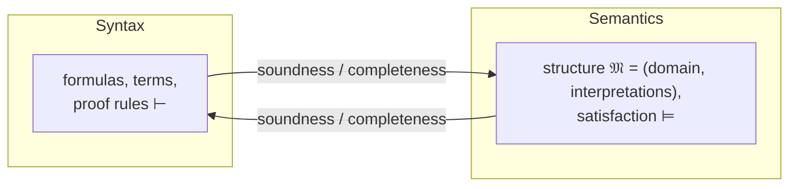

# Predicate Logic

**Predicate logic** — usually **first-order logic (FOL)** — extends
[propositional logic](propositional-logic.md) by looking *inside* propositions. Where
propositional logic treats "Socrates is mortal" as an indivisible atom `p`, predicate logic
analyzes it into a **predicate** applied to an **object**: `Mortal(socrates)`. This lets us
express generality with **quantifiers**, capturing the classical inference "all men are
mortal; Socrates is a man; therefore Socrates is mortal" — which propositional logic cannot
represent at all.

## The vocabulary

A first-order language is built from:

- **Constants** (`a, b, socrates`) — names for specific objects.
- **Variables** (`x, y, z`) — placeholders ranging over objects.
- **Functions** (`f, +, succ`) — map objects to objects; `f(x)` denotes an object.
- **Predicates / relations** (`P, Mortal, <, Loves`) — take objects and yield truth values;
  `Loves(x, y)` is a two-place relation.
- The connectives `¬ ∧ ∨ → ↔` inherited from propositional logic.
- The **quantifiers** `∀` (universal, "for all") and `∃` (existential, "there exists").

**Terms** are constants, variables, and functions applied to terms. **Atomic formulas** are
predicates applied to terms. Formulas are built up with connectives and quantifiers.

## Quantifiers, variables, scope

- `∀x P(x)` — "every object satisfies `P`."
- `∃x P(x)` — "at least one object satisfies `P`."

A quantifier **binds** the variable in its scope; an unbound variable is **free**. A
sentence with no free variables has a determinate truth value (relative to an
interpretation); a formula with free variables expresses a *condition*. The quantifiers are
De Morgan duals: `¬∀x P(x) ≡ ∃x ¬P(x)` and `¬∃x P(x) ≡ ∀x ¬P(x)` — negation flips the
quantifier and pushes inward. Order matters: `∀x ∃y Loves(x, y)` ("everyone loves someone")
is weaker than `∃y ∀x Loves(x, y)` ("someone is loved by everyone").

## Expressive power over propositional logic

Quantification plus relations is a genuine leap in expressiveness. Predicate logic can say:

- **Generalizations**: `∀x (Man(x) → Mortal(x))`.
- **Existence and uniqueness**: `∃x P(x)`, and with equality, "exactly one" `∃x (P(x) ∧
  ∀y (P(y) → y = x))`.
- **Relational structure**: transitivity `∀x∀y∀z ((R(x,y) ∧ R(y,z)) → R(x,z))`, the raw
  material of [set theory](../math/set-theory.md), order, and arithmetic.

Almost all of mathematics can be formalized in first-order logic over a suitable signature —
which is why it is the default language of
[mathematical proof and logic](../math/mathematical-proof-and-logic.md) and
[discrete mathematics](../math/discrete-mathematics.md).

## The syntax / semantics split

The central conceptual move in modern logic is separating *what strings we may write*
(syntax) from *what they mean* (semantics). Predicate logic makes this split sharp.



**Syntax** is the grammar of well-formed formulas and the purely formal rules for deriving
one from another — the province of
[formal-systems-and-proof-theory](formal-systems-and-proof-theory.md), where derivability
is written `⊢`.

**Semantics** assigns meaning. An **interpretation** (or **structure**) `𝔐` supplies:

- a nonempty **domain** `D` of objects the variables range over;
- an object in `D` for each constant;
- a function on `D` for each function symbol;
- a relation on `D` for each predicate symbol.

Together with a **variable assignment**, this fixes the truth of every formula through the
recursive **satisfaction relation** `𝔐 ⊨ φ` ("`𝔐` satisfies `φ`"). Satisfaction is defined
compositionally: `𝔐 ⊨ ∀x φ` iff `φ` holds for *every* object substituted for `x`, and
`𝔐 ⊨ ∃x φ` iff it holds for *some* object. The systematic study of which sentences hold in
which structures is [model theory](model-theory.md).

A sentence is **valid** if it is true in *every* structure (`⊨ φ`), **satisfiable** if true
in *some*. The link back to syntax is the crown result: FOL is **sound and complete**
(Gödel, 1929) — `Γ ⊢ φ` iff `Γ ⊨ φ`. Yet validity in FOL is only *semi-decidable*: valid
formulas can be enumerated, but there is no algorithm that always halts deciding validity
(Church–Turing), a boundary explored in
[computability-and-decidability](computability-and-decidability.md).

## Example

Formalizing "There is a barber who shaves exactly those who do not shave themselves":

```
∃b ∀x ( Shaves(b, x) ↔ ¬Shaves(x, x) )
```

Instantiating `x := b` yields `Shaves(b, b) ↔ ¬Shaves(b, b)` — a contradiction. The
sentence is unsatisfiable, which is the Barber/Russell paradox rendered in FOL and a taste
of self-reference (see
[self-reference and strange loops](../systems-thinking/self-reference-and-strange-loops.md)).

## Why it matters (CS and AI)

First-order logic is the lingua franca of formal reasoning in computing. It underpins
relational databases (a query is a first-order formula over the relations), formal
specification and program verification (see
[predicate-calculus-and-program-semantics](predicate-calculus-and-program-semantics.md)),
and type systems (see
[categorical-logic-and-type-theory](categorical-logic-and-type-theory.md)). In AI it is the
backbone of symbolic
[knowledge representation and reasoning](../ai/knowledge-representation-and-reasoning.md):
ontologies, logic programming, and automated theorem provers all reason over FOL or its
tractable fragments (Datalog, description logics). Its expressiveness *and* its
undecidability jointly shape what a symbolic AI system can promise. See the
[computer science index](../computer-science/index.md) for the surrounding field and the
[philosophy index](../philosophy/index.md) for its foundational stakes.

## References

- [Enderton, *A Mathematical Introduction to Logic*](enderton-mathematical-introduction-to-logic.md)
  — the anchoring text on FOL syntax, semantics, and the completeness theorem.
- [Hurley, *A Concise Introduction to Logic*](hurley-concise-introduction-to-logic.md) —
  accessible introduction to quantifiers and predicate arguments.
