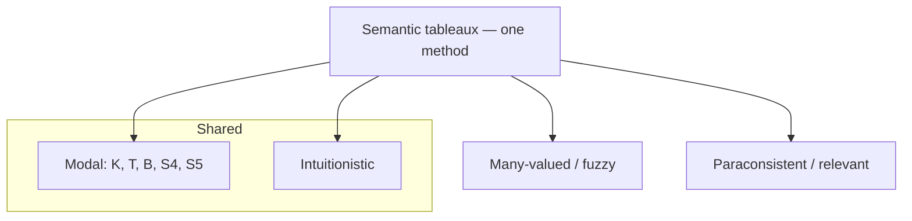

# An Introduction to Non-Classical Logic (Priest)

Graham Priest's *An Introduction to Non-Classical Logic: From If to Is* (Cambridge, 2nd
ed. 2008) is the standard survey of the logics that depart from classical two-valued
logic. Its distinctive pedagogical move is to present a whole zoo of rival systems using a
**single, uniform method** — semantic tableaux (truth trees) — so that a student can see
exactly how each system differs from classical logic and from the others by watching which
tableau rules change. The subtitle "From If to Is" flags the book's organizing question:
what is the right logic of the conditional ("if"), and how does answering it reshape the
logic of everything else? For the field overview see
[non-classical-logic.md](non-classical-logic.md).

## Scope and approach

The book comes in two parts, propositional and then quantified (first-order) versions of
each system, and it is doctrine-agnostic: each logic is presented on its own terms, with
its motivation, its formal semantics, and a tableau proof procedure, followed by
philosophical discussion of what it is good for.

- **Modal logics.** Necessity and possibility via possible-world semantics — the systems
  **K, T, B, S4, S5** — plus tense logic and, later, conditional logics for
  counterfactuals. This is the [modal logic](modal-logic.md) core, and Priest's world-based
  tableaux make the accessibility-relation constraints concrete.

- **Intuitionistic logic.** Logic without the law of excluded middle, motivated by
  constructive mathematics, with its Kripke (possible-world) semantics — the same
  world-machinery reused, showing intuitionistic logic as a close relative of modal logic.

- **Many-valued and fuzzy logics.** Systems with more than two truth values (three-valued
  Kleene and Łukasiewicz logics) and continuum-valued fuzzy logic, motivated by vagueness
  and truth-value gaps/gluts.

- **Paraconsistent and relevance logics.** Logics that tolerate contradiction without
  exploding into triviality (rejecting *ex contradictione quodlibet*) and logics that
  demand genuine relevance between premises and conclusion (First Degree Entailment, the
  relevant logic **R**). This material reflects Priest's own dialetheist program and is a
  major reason the book is cited.

- **The conditional throughout.** The connecting thread is the many candidate meanings of
  "if" — material, strict, relevant, counterfactual — with the failures of the material
  conditional (the "paradoxes of material implication") used to motivate each alternative.

## The uniform method

Because every system is a set of tableau rules over a shared framework, the reader learns
the *space* of logics, not just isolated systems — turning a "which logic?" question into
a comparison of rule sets and semantics.

## Why it matters

Priest's book is the accessible gateway to logics beyond the classical
[propositional](propositional-logic.md) and [predicate](predicate-logic.md) systems, and
the reference that most philosophers and many computer scientists first meet non-classical
logic through. For HAL it anchors [non-classical-logic.md](non-classical-logic.md) and
[modal-logic.md](modal-logic.md), and connects the proof-procedure side to
[formal-systems-and-proof-theory.md](formal-systems-and-proof-theory.md) and the broader
reasoning material in
[../math/mathematical-proof-and-logic.md](../math/mathematical-proof-and-logic.md).

## References

- [An Introduction to Non-Classical Logic (Priest, 2nd ed.) — Cambridge University Press](https://www.cambridge.org/9780521670265)
