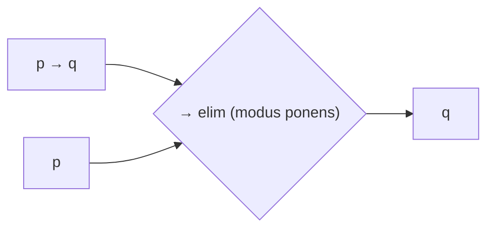

# Propositional Logic

**Propositional logic** (also *sentential* or *statement* logic) is the branch of formal
logic that treats whole declarative sentences — **propositions** — as atomic, and studies
how their truth values combine under logical **connectives**. It is the simplest complete
logical system: it captures reasoning about "and," "or," "not," "if…then," and "if and only
if," but it cannot look *inside* a proposition. That deeper analysis is the job of
[predicate logic](predicate-logic.md).

## Propositions and atoms

A **proposition** is a sentence that is either true or false (never both, never neither in
the classical setting). "The server is up," "7 is prime," and "it is raining" are
propositions; "close the door" and "what time is it?" are not. We denote atomic
propositions by letters `p, q, r, …`. Each atom carries no internal structure — it is just
a truth-bearer.

## Connectives

Compound propositions are built from atoms using five standard truth-functional
connectives. *Truth-functional* means the truth value of the compound depends only on the
truth values of its parts.

| Symbol | Name | English | Read as |
|--------|------|---------|---------|
| ¬ | negation | not | "not p" |
| ∧ | conjunction | and | "p and q" |
| ∨ | disjunction | (inclusive) or | "p or q" |
| → | conditional (material implication) | if…then | "if p then q" |
| ↔ | biconditional | if and only if | "p iff q" |

## Truth tables

The **truth table** is the defining semantics of each connective — it lists the output
truth value for every combination of input truth values (`T`/`F`).

| p | q | ¬p | p ∧ q | p ∨ q | p → q | p ↔ q |
|---|---|----|-------|-------|-------|-------|
| T | T | F  | T     | T     | T     | T     |
| T | F | F  | F     | T     | F     | F     |
| F | T | T  | F     | T     | T     | F     |
| F | F | T  | F     | F     | T     | T     |

Two rows deserve emphasis. Disjunction `∨` is **inclusive**: `p ∨ q` is true when *either
or both* hold. The conditional `p → q` is false in exactly one case — a true antecedent
with a false consequent — so "if false, then anything" comes out true. This *material
implication* often surprises newcomers; it is not causation, only a truth-functional
guarantee that we never pass from truth to falsehood.

## Tautology, contradiction, contingency

Classifying a formula by its full truth table:

- **Tautology** — true under *every* assignment (e.g. `p ∨ ¬p`, the law of excluded
  middle). Logically valid on its own.
- **Contradiction** — false under every assignment (e.g. `p ∧ ¬p`).
- **Contingency** — true under some assignments, false under others (e.g. `p → q`).

## Logical equivalence

Two formulas are **logically equivalent** (`≡`) when they have identical truth tables —
they agree on every assignment. Equivalence lets us rewrite formulas while preserving
meaning, which is the algebra beneath [boolean-algebra](boolean-algebra.md). Key
equivalences:

- **Double negation**: `¬¬p ≡ p`
- **De Morgan's laws**: `¬(p ∧ q) ≡ ¬p ∨ ¬q` and `¬(p ∨ q) ≡ ¬p ∧ ¬q`
- **Distribution**: `p ∧ (q ∨ r) ≡ (p ∧ q) ∨ (p ∧ r)`
- **Conditional as disjunction**: `p → q ≡ ¬p ∨ q`
- **Contrapositive**: `p → q ≡ ¬q → ¬p`

`p ≡ q` holds exactly when `p ↔ q` is a tautology — equivalence is the metalogical
counterpart of the biconditional connective.

## Validity and entailment

An **argument** is a set of premises and a conclusion. It is **valid** when the conclusion
is true in every assignment that makes all premises true — validity is about form, not the
actual facts. We write **entailment** as `Γ ⊨ φ`: the premise set `Γ` *semantically
entails* `φ`. Equivalently, `Γ ⊨ φ` iff the conjunction of `Γ` together with `¬φ` is
unsatisfiable. This semantic `⊨` pairs with the syntactic `⊢` of
[formal-systems-and-proof-theory](formal-systems-and-proof-theory.md); soundness and
completeness say the two coincide.

The workhorse valid forms:

- **Modus ponens**: from `p → q` and `p`, infer `q`.
- **Modus tollens**: from `p → q` and `¬q`, infer `¬p`.
- **Hypothetical syllogism**: from `p → q` and `q → r`, infer `p → r`.
- **Disjunctive syllogism**: from `p ∨ q` and `¬p`, infer `q`.

## Normal forms

Any propositional formula can be rewritten into standardized shapes, which matters greatly
for algorithms:

- **Conjunctive Normal Form (CNF)** — a conjunction of clauses, each clause a disjunction
  of literals: `(p ∨ ¬q) ∧ (q ∨ r)`. CNF is the input format for **SAT solvers** and for
  **resolution** theorem proving.
- **Disjunctive Normal Form (DNF)** — a disjunction of conjunctions of literals. DNF reads
  directly off the true rows of a truth table.

Deciding whether a CNF formula is satisfiable is **SAT**, the canonical NP-complete
problem — the historical anchor of the theory of
[computability-and-decidability](computability-and-decidability.md) and NP-completeness.

## Natural deduction (basics)

**Natural deduction** is a proof system that mirrors ordinary reasoning: each connective
gets an **introduction** rule (how to prove it) and an **elimination** rule (how to use
it). Rather than truth tables, you manipulate formulas syntactically.

A few rules, sketched:

- **∧-intro**: from `p` and `q`, derive `p ∧ q`. **∧-elim**: from `p ∧ q`, derive `p`.
- **→-intro** (conditional proof): *assume* `p`, derive `q`, then discharge the assumption
  to conclude `p → q`.
- **¬-intro** (reductio): assume `p`, derive a contradiction, conclude `¬p`.

Because it externalizes assumptions and their discharge, natural deduction is the model for
how [mathematical-proof-and-logic](../math/mathematical-proof-and-logic.md) is written by
hand, and it is the ancestor of proof assistants and typed lambda calculi (see
[categorical-logic-and-type-theory](categorical-logic-and-type-theory.md)).

## Why it matters (CS and AI)

Propositional logic is the substrate of digital computation. The connectives *are* logic
gates; a circuit is a formula (see [boolean-algebra](boolean-algebra.md)). Its decision
problem SAT underlies verification, planning, and constraint solving; SAT/SMT solvers now
discharge industrial-scale correctness proofs. In AI, propositional knowledge bases and
entailment power classical inference in
[knowledge representation and reasoning](../ai/knowledge-representation-and-reasoning.md),
and the tractable fragments (Horn clauses, 2-SAT) draw the practical line between what a
reasoner can and cannot do quickly. For the broader computing context see the
[computer science index](../computer-science/index.md); logic's philosophical footing is
surveyed in the [philosophy index](../philosophy/index.md).

## References

- [Hurley, *A Concise Introduction to Logic*](hurley-concise-introduction-to-logic.md) —
  standard undergraduate treatment of connectives, truth tables, and validity.
- [Enderton, *A Mathematical Introduction to Logic*](enderton-mathematical-introduction-to-logic.md)
  — rigorous semantics of sentential logic.
- [Boole, *The Laws of Thought*](boole-laws-of-thought.md) — origin of the algebra of
  propositions.
