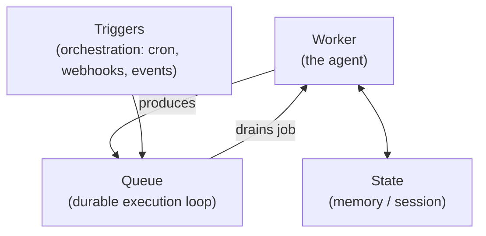

# Loop Engineering Is Just Software Engineering. We Have a Name for That.

**Mike Piccolo** responds to the wave of "loop engineering" writing — Addy Osmani's
[Loop Engineering (Addy Osmani)](loop-engineering-osmani.md) piece, Peter Steinberger's
"you should be designing loops that prompt your agents," and Boris Cherny's "I don't
prompt Claude anymore, I write loops" — and makes one sharp claim: loop engineering is
not a new discipline. **It is distributed systems engineering wearing a new label.**

## The argument

Piccolo grants the premise. The leverage in agent systems really has moved from the
individual prompt to the *system* around it — Steinberger and Cherny are right (see
[Engineer the Loop, Not the Prompt](engineer-the-loop.md) and
[Loop Engineering](loop-engineering.md)). His disagreement is only about the naming.
When you build a production agent loop, the problems you hit are the problems the
distributed-systems field solved decades ago:

- A **message queue** to make the loop durable — so a crash mid-turn does not lose work.
  (SQS shipped in 2006.)
- A **cron scheduler** so a parked turn never wedges forever.
- A **key-value store** to hold session state across restarts.
- **Distributed tracing** across every tool call and sub-agent spawn.
- A **middleware chain** for verification, approval gates, and result rewriting.
- **Scoped child sessions** for sub-agents that enforce permission boundaries.
- **Idempotent delivery** so a webhook trigger does not double-fire.

None of that is novel. It is the standard toolkit of anyone who has run services at scale.

## Three primitives

Piccolo's framing (illustrated with the `iii` platform, whose `harness` worker composes
this stack) is that an entire agent loop reduces to three distributed-systems primitives:

- The **agent is a Worker**.
- Its **memory is state** (a KV store).
- Its **orchestration is triggers** (cron, webhooks, events).
- Its **durable execution loop is a queue consumer** — every think–act iteration is a job
  enqueued and drained by a worker, so if the process dies the queue holds the step and
  another worker resumes it.

The `iii` harness worker's own dependency manifest makes the point literal: `iii-state`,
`iii-queue`, `iii-cron`, `iii-observability`, `iii-stream`, a session manager, and a
context manager. The harness does not *abstract over* these things — it **is** those
things, composed. "The infrastructure is not innovation. The insight is that all of it
uses the same three primitives as the rest of the system."

## Why it matters

The practical payoff of naming it correctly: you stop reinventing durability, scheduling,
and tracing ad hoc, and you inherit fifty years of distributed-systems discipline —
retries, idempotency, backpressure, observability. This dovetails with
[You Don't Need Sub-Agents](you-dont-need-sub-agents.md), which makes the same
"we already solved this" move about coordination cost, and with
[Building Effective Agents (Anthropic)](building-effective-agents.md)'s emphasis on the
simplest system that works.

## References

- [Loop Engineering Is Just Software Engineering. We Have a Name for That. — Mike Piccolo (LinkedIn)](https://www.linkedin.com/pulse/loop-engineering-just-software-we-have-name-mike-piccolo-yb73c)
