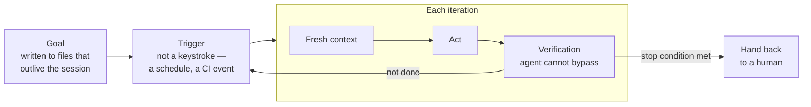

# Loop Engineering

**The layer above [harness engineering](harness-engineering.md).** Instead of
prompting an agent yourself — prompt, wait, read the diff, repeat — you build the
outer system that prompts it. Boris Cherny (creator of Claude Code): *"I don't
prompt Claude anymore. I have loops that are running… My job is to write loops."*

It stacks: a good **harness** makes a single agent run well, good
[**context**](context-engineering.md) keeps the right tokens in front of it, and
**loop engineering** takes that working agent, gives it a *clear goal*, and
iterates toward it after you walk away.

> Complements [Loop Engineering: The Anthropic Playbook](loop-engineering-playbook.md)
> (generator/evaluator, the 5 moves) — this is the Tessl framing: five loop
> ingredients + the Ralph pattern.

## Five things a production loop needs



1. **Goal** — written into files that outlive the session.
2. **Trigger** — something other than a keystroke (a schedule, a CI event).
3. **Fresh context** — on each iteration (the window is a cache that resets).
4. **Verification** — the agent cannot bypass it.
5. **Stop condition** — a defined point for handing back to a human.

Every coding agent already runs an **inner cycle** — gather context, act,
verify, repeat. Loop engineering wraps an **outer, goal-seeking loop** around
that inner one.

## The Ralph pattern

The canonical minimal example — Geoffrey Huntley's "Ralph":

```bash
while :; do cat PROMPT.md | claude-code; done
```

Goal in a file, looped, one task per pass. *"The technique is deterministically
bad in an undeterministic world"* — it works on **eventual consistency** and on
**tuning the loop when it drifts**. The loop, not the prompt, is what you
engineer — not any single run being right. (See
[agent patterns quick reference](agent-patterns-quick-reference.md) for the RALPH
loop among other patterns.)

## Why it matters

*"You don't prompt agents anymore, you design loops that prompt them."* The loop
itself is the **easy part** — *"the loop is six lines, and nobody competes on it;
every serious agent framework lands on the same tiny while-loop."* The
engineering is everything *around* it: the goal, the context fed each turn, the
verification.

Enabled by a measurable trend: the length of task a frontier model can complete
**unattended** has been doubling roughly every seven months (METR), moving
another class of work from supervised to autonomous with each step. Cursor let
GPT-5.2 agents loose to build a web browser from scratch — ran a full week with
no human intervention, millions of lines across thousands of files.

## Two constraints that decide whether a loop holds

- **State lives *outside* the model** — in files, a progress log, and git —
  because the context window is a **cache that resets, not a memory**. This is
  [context engineering](context-engineering.md) applied across iterations.
- **The loop cannot use the generating model as its own quality gate** —
  verification must be independent (sensors/simulators, an evaluator), or the
  agent grades its own homework. See [evals & LLM-as-a-judge](evals-llm-as-a-judge.md)
  and the [autonomy ladder](autonomy-ladder.md).

Pushed to its organizational end state, loop engineering becomes the
[dark factory](dark-factory.md) — many loops running with the lights off.

## References
- [Loop Engineering — Tessl Patterns](https://tessl.io/patterns/agentic-development-workflow/loop-engineering/)
