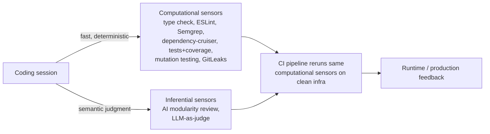

# Maintainability Sensors for Coding Agents (Birgitta Böckeler)

A Thoughtworks / martinfowler.com article (2026) applying the *harness engineering* model to
one concrete concern: keeping a codebase maintainable while an agent builds it. It builds on
[Harness Engineering for Coding Agent Users](harness-engineering.md), which frames a harness as
**guides** (feedforward — steer the agent *before* it acts) plus **sensors** (feedback —
observe *after* it acts so the agent can self-correct). This piece is about the sensor half,
specifically sensors that catch maintainability decay.

## Computational vs inferential sensors

The article's core distinction (from the parent harness-engineering piece):

- **Computational** — deterministic and fast, CPU-run: tests, linters, type checkers,
  structural analysis. Milliseconds to seconds; results are reliable. Cheap enough to run on
  *every* change alongside the agent.
- **Inferential** — semantic analysis, AI code review, "LLM as judge"; GPU/NPU-run. Slower,
  more expensive, non-deterministic — but able to give rich guidance and semantic judgment a
  linter cannot. Trust rises when paired with a strong, task-suitable model.

The two are complementary: feedback-only harnesses let the agent repeat the same mistakes;
feedforward-only harnesses encode rules but never learn whether they worked.

## Sensors across the path to production

Böckeler places sensors at four points: **during the coding session** (continuous, fast
feedback), **in the CI pipeline** (same computational sensors rerun on clean infrastructure
to confirm the in-session result), **on a schedule**, and **in production** (runtime
feedback). Her in-session computational set: type checker, ESLint, Semgrep/SAST,
dependency-cruiser, test suite + coverage, incremental mutation testing, and GitLeaks in the
pre-commit hook. A key harness trick: expand tool error messages with self-correction
*instructions* optimised for LLM consumption — "a positive kind of prompt injection" so the
sensor tells the agent not just *what* broke but *how to fix it*.

## Crossing file and module boundaries

Basic linting stays within a file or function; maintainability decay is usually about
structure *across* boundaries — historically the most underused analysis. She explores three
levels:

- **Dependency rules (computational)** — she co-designed a layered module structure with the
  agent and wrote `dependency-cruiser` rules to enforce it (e.g. `clients` must never import
  from `services`). Effective as a live sensor for basic folder structure and dependency
  direction, "but they can only go so far."
- **Coupling analysis** — deterministic and inferential.
- **AI modularity review (inferential)** — the standout. Run after most of the codebase was
  built, it surfaced "concerning and very valid" findings that would have raised future risk.
  It worked well with powerful prompts; grounding it in actual coupling data made little
  difference. She likens it to *garbage collection* for design debt.

## Main takeaway

Codebase design and modularity is a concern where **computational sensors alone cannot carry
you** — AI is needed to add semantic interpretation and weigh trade-offs. Without human
review *and* these AI reviews, the agent was quietly compounding inadvertent technical debt.
This complements the feedforward (skills) argument in
[Skills Are Claude Code's Secret Weapon](skills-are-claude-codes-secret-weapon.md), answers
the demand named in [Feedback Is the New Bottleneck](feedback-is-the-new-bottleneck.md), and
sits alongside HAL's [AI Coding Sensors](ai-coding-sensors.md),
[Automated Review & Verification](automated-review-verification.md),
[Comprehension Debt](comprehension-debt.md), and Code Health-style
[maturity](ai-codebase-maturity-model.md) tooling.

## References

- [Maintainability sensors for coding agents — Birgitta Böckeler, martinfowler.com](https://martinfowler.com/articles/sensors-for-coding-agents.html)
