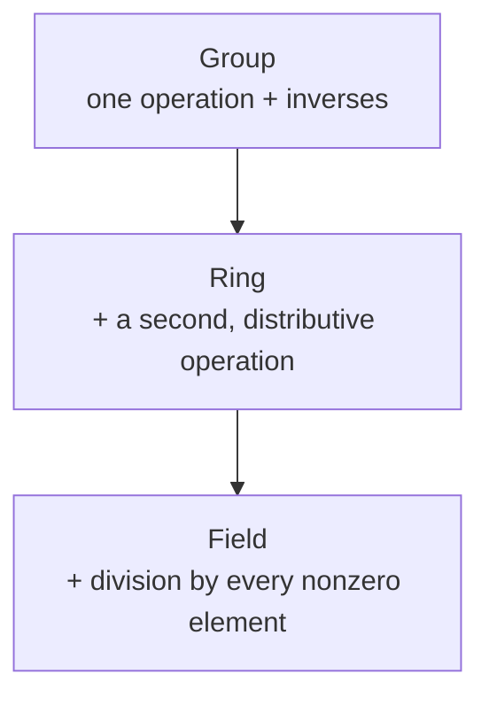

# Abstract Algebra

Abstract algebra studies *structure* rather than particular numbers. It takes the
operations you know — addition, multiplication, composition — strips them down to their
essential rules (axioms), and asks what follows from those rules alone. The payoff is
enormous reuse: a theorem proved about "any group" applies at once to integers under
addition, symmetries of a cube, invertible matrices, and permutations of a deck of cards.
This is the same abstraction discipline that [set theory](set-theory.md) provides for
collections, applied to operations.

## Groups: the mathematics of symmetry

A **group** is a set $G$ with one operation $\cdot$ satisfying four axioms:

1. **Closure** — $a \cdot b \in G$.
2. **Associativity** — $(a\cdot b)\cdot c = a\cdot(b\cdot c)$.
3. **Identity** — there is an $e$ with $e\cdot a = a\cdot e = a$.
4. **Inverses** — every $a$ has a $b$ with $a\cdot b = e$.

That is all. Yet groups precisely capture *symmetry*: the set of transformations that leave
an object unchanged always forms a group. The symmetries of an equilateral triangle form the
group $D_3$ of six elements; the ways to rearrange $n$ objects form the symmetric group
$S_n$; the integers under addition form an infinite group. **Lagrange's theorem** — the size
of any subgroup divides the size of the group — is a first taste of how much the axioms alone
constrain.

## Rings and fields: two operations

Add a second operation and you climb the hierarchy:

- A **ring** has addition (forming a group) *and* multiplication that distributes over it.
  The integers $\mathbb{Z}$ are the archetype: you can add, subtract, and multiply, but not
  always divide.
- A **field** is a ring where every nonzero element also has a multiplicative inverse — you
  *can* divide. The rationals $\mathbb{Q}$, reals $\mathbb{R}$, complex numbers
  $\mathbb{C}$, and the finite fields $\mathbb{F}_p$ (arithmetic mod a prime, from
  [number theory](number-theory.md)) are all fields.

Fields are exactly the setting where [linear algebra](linear-algebra.md) lives — a vector
space is defined over a field of scalars.

## Homomorphisms: structure-preserving maps

The morphisms tie the theory together. A **homomorphism** is a function $\varphi$ between two
algebraic structures that respects the operation: $\varphi(a\cdot b) = \varphi(a)\cdot
\varphi(b)$. It carries structure from one object to another. An **isomorphism** is a
bijective homomorphism — the two structures are then "the same" up to renaming. The
**isomorphism theorems** formalize how a homomorphism's *kernel* (what collapses to the
identity) measures exactly how much information it loses, and this is the mechanism behind
quotient constructions like modular arithmetic.

## A worked example

Consider $\mathbb{Z}/12\mathbb{Z}$, the integers mod 12 — clock arithmetic. Under addition it
is a group of order 12. The map $\mathbb{Z} \to \mathbb{Z}/12\mathbb{Z}$ sending each integer
to its remainder is a homomorphism whose kernel is the multiples of 12. Lagrange's theorem
tells us instantly that any subgroup has order dividing 12: the possible sizes are exactly the
divisors $1,2,3,4,6,12$. Structure decided before we compute a single example.

## Why it matters

Abstract algebra is the backbone of modern applied mathematics. **Cryptography** rests on it:
RSA is arithmetic in the multiplicative group of $\mathbb{Z}/n\mathbb{Z}$, and elliptic-curve
cryptography is literally a group law on a curve (see [number theory](number-theory.md) and
[../security/index.md](../security/index.md)). **Coding theory** builds error-correcting codes
over finite fields. Symmetry groups organize physics and chemistry, and the structural view of
[linear algebra](linear-algebra.md) — vector spaces over a field, linear maps as
homomorphisms — is algebra all the way down.

## References

- [Linear Algebra Done Right](axler-linear-algebra-done-right.md) — Sheldon Axler, for the field/vector-space structural view
- [Discrete Mathematics and Its Applications](rosen-discrete-mathematics.md) — Kenneth Rosen, for groups and modular structures in an applied setting
