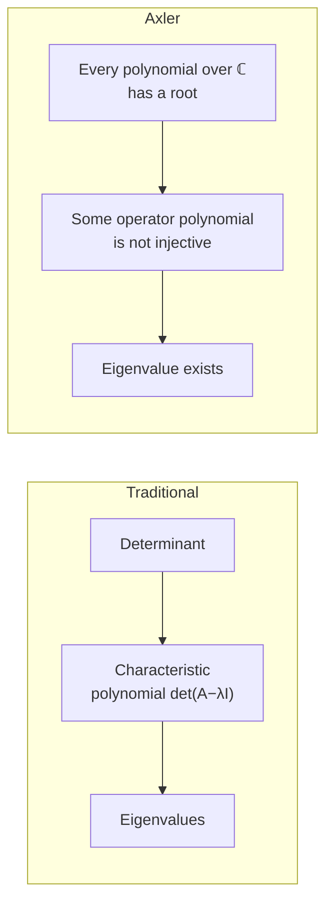

# Linear Algebra Done Right (Sheldon Axler)

Sheldon Axler's *Linear Algebra Done Right* (now in its 4th edition, released as an
open-access book under a Creative Commons license) is the standard proof-based,
**abstract, operator-centric** treatment of linear algebra. Its polemical premise —
laid out in Axler's essay "Down with Determinants!" — is that the determinant is
usually introduced far too early and used as a crutch, obscuring the real
structure. Axler defers determinants to the very end and derives the central
results, especially the theory of eigenvalues, **without them**.

## Scope and approach

Where [strang-linear-algebra.md](strang-linear-algebra.md) starts from matrices
and `Ax = b` with a computational, applications-first bent, Axler starts from
**abstract vector spaces** and studies **linear maps (operators)** as the primary
objects. Matrices appear only as coordinate representations of operators once a
basis is chosen; they are a tool, not the subject. The book confines itself to
finite-dimensional spaces, which lets it be complete and self-contained. The arc:

- **Vector spaces** — defined axiomatically over a field; subspaces, sums, direct
  sums.
- **Finite-dimensional vector spaces** — linear independence, spanning, bases,
  dimension.
- **Linear maps** — the fundamental theorem of linear maps (rank–nullity),
  injectivity/surjectivity, and matrices as representations.
- **Eigenvalues and eigenvectors** — proved to exist on complex vector spaces
  *without determinants*, using the algebraic fact that polynomials over ℂ have
  roots; invariant subspaces.
- **Inner-product spaces** — orthonormal bases, Gram–Schmidt, orthogonal
  projections, adjoints.
- **Operators on inner-product spaces** — the spectral theorem for self-adjoint and
  normal operators, positive operators, isometries, the polar and singular-value
  decompositions.
- **Nilpotent operators, generalized eigenvectors, Jordan form** — the structure of
  an operator characterized fully.
- **Determinants and trace** — introduced last, defined in terms of the eigenvalue
  structure already developed, so their meaning is clear rather than magical.

The result is a book whose proofs are notably clean and conceptual. It is ideally a
**second course** (or a first course for strong, proof-ready students): it pays off
most for someone who has already computed with matrices and now wants to understand
*why* the theorems are true.

## Two routes to eigenvalues

## Related notes

- [linear-algebra.md](linear-algebra.md) — the field concept this book anchors abstractly.
- [strang-linear-algebra.md](strang-linear-algebra.md) — the computational,
  applications-first counterpart; the two together give both intuition and rigor.
- [mathematical-proof-and-logic.md](mathematical-proof-and-logic.md) — the proof
  style Axler is built around.

## References

- [Linear Algebra Done Right, 4th ed. — Sheldon Axler (open access)](https://linear.axler.net/)
