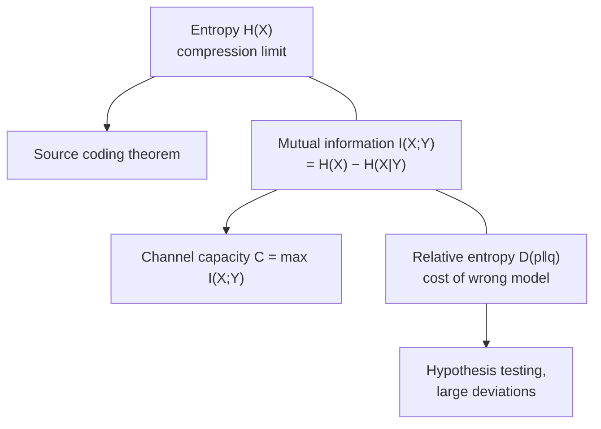

# Elements of Information Theory (Thomas Cover & Joy Thomas)

*Elements of Information Theory* by Thomas M. Cover and Joy A. Thomas (2nd
edition) is the standard graduate textbook for the field Claude Shannon founded.
It develops information theory from its probabilistic foundations through source
coding, channel coding, and rate–distortion theory, and it is notable for
consistently connecting these ideas to statistics, gambling, and — increasingly
relevant — machine learning.

## Scope and approach

The book is organized around a small set of quantities that measure information and
their operational meanings — that is, what each quantity is *the answer to* in a
concrete coding or estimation problem. The core measures:

- **Entropy** `H(X)` — the average uncertainty in a random variable, and the
  fundamental limit on lossless compression.
- **Mutual information** `I(X;Y)` — how much observing one variable reduces
  uncertainty about another; the quantity governing what a channel can carry.
- **Relative entropy (KL divergence)** `D(p‖q)` — the "distance" from one
  distribution to another, and the penalty for coding with the wrong model.

The theory then unfolds as a sequence of coding theorems that give these
quantities operational teeth:

- **Asymptotic equipartition property (AEP)** — the law-of-large-numbers backbone
  that makes "typical sequences" the right object to compress and transmit.
- **Data compression** — Kraft inequality, Huffman codes, arithmetic coding, and
  the source coding theorem (`H` is the compression limit).
- **Channel capacity** — the noisy-channel coding theorem: reliable communication
  is possible at any rate below capacity `C = max I(X;Y)`, and impossible above it.
- **Differential entropy and the Gaussian channel** — the continuous analogues,
  including the famous capacity of the bandlimited Gaussian channel.
- **Rate–distortion theory** — the theory of lossy compression: the minimum rate
  needed to reproduce a source within a given distortion.
- **Connections** — chapters tying information theory to statistics (hypothesis
  testing, Fisher information), to portfolio theory and gambling (the doubling
  rate as a mirror of entropy), and to Kolmogorov complexity.

The treatment is rigorous but stays close to intuition, and each result is framed
by its operational question rather than presented as bare theorem-proof.

## The three core quantities

## Why it matters for AI

The measures Cover & Thomas formalize are load-bearing in modern machine learning:
cross-entropy loss (the workhorse objective for classifiers and language models) is
exactly relative entropy plus a constant; the KL divergence drives variational
inference, VAEs, and policy-optimization regularizers; and mutual information
underlies feature selection and representation-learning objectives. Understanding
"why cross-entropy" means understanding this book. See
[information-theory.md](information-theory.md) for the concept and
[machine-learning](../ai/machine-learning.md) for where these losses live.

## Related notes

- [information-theory.md](information-theory.md) — the field concept this book anchors.
- [probability.md](../statistics/probability.md) — the probabilistic foundation entropy is built on.
- [machine-learning](../ai/machine-learning.md) — cross-entropy, KL divergence, and
  mutual information in practice.

## References

- [Elements of Information Theory, 2nd ed. — Cover & Thomas (Wiley)](https://www.wiley.com/en-us/Elements+of+Information+Theory%2C+2nd+Edition-p-9780471241959)
