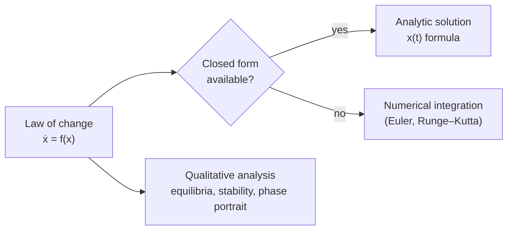

# Differential Equations

A **differential equation** relates a function to its own derivatives. Because the
[calculus.md](calculus.md) derivative measures rate of change, a differential equation is a
statement about *how a system evolves* — and solving it means recovering the trajectory from the
law of change. This is how physics, biology, economics, and engineering turn "what changes" into
"what happens", which makes it a core tool for [../systems-thinking/index.md](../systems-thinking/index.md).

## ODEs and PDEs

Two broad families:

- **Ordinary differential equations (ODEs)** involve a function of a *single* variable
  (usually time) and its derivatives, e.g. $\frac{dy}{dt} = ky$, whose solution
  $y(t) = y_0 e^{kt}$ is exponential growth or decay. ODEs describe things evolving in time:
  populations, circuits, chemical concentrations, a cooling cup of coffee.
- **Partial differential equations (PDEs)** involve functions of *several* variables and their
  partial derivatives (see [multivariable-calculus.md](multivariable-calculus.md)), e.g. the heat
  equation $\frac{\partial u}{\partial t} = \alpha \nabla^2 u$ or the wave equation. PDEs describe
  fields varying across both space and time — heat, fluids, electromagnetism, option prices.

An equation's **order** is the highest derivative it contains; whether it is **linear** decides
much of how tractable it is. Many important systems are *coupled* sets of equations, which is
where [linear-algebra.md](linear-algebra.md) enters: a linear system $\dot{\mathbf{x}} = A\mathbf{x}$
is solved through the eigenvalues and eigenvectors of $A$, and the sign of those eigenvalues
decides whether the system grows, decays, or oscillates.

## Analytic vs. numerical solutions

A lucky few equations have **closed-form (analytic)** solutions — clean formulas obtained by
integration, separation of variables, or transform methods. Most realistic models do not. For
those we solve **numerically**: discretize time into small steps and march the solution forward.
The simplest scheme, **Euler's method**, is the linear approximation from
[calculus.md](calculus.md) applied repeatedly:

$$ y_{n+1} = y_n + h \, f(t_n, y_n), $$

with more accurate schemes (Runge–Kutta, implicit methods) trading computation for stability and
precision. Numerical solution turns differential equations into an algorithm, which is why they
run on computers rather than blackboards.

## The dynamical-systems view

Rather than chasing an explicit solution formula, the **dynamical systems** perspective studies
the *qualitative* behavior of $\dot{\mathbf{x}} = f(\mathbf{x})$: where are the equilibria (points
where $f = 0$), are they stable or unstable, are there cycles, and can tiny changes in initial
conditions explode (chaos)? The state moves along a **vector field** in
[multivariable-calculus.md](multivariable-calculus.md) terms, tracing trajectories through a
**phase space**. This lens connects directly to control theory, feedback, and the emergent
behavior studied in [../systems-thinking/index.md](../systems-thinking/index.md).

## Example

A population with limited resources follows the **logistic equation**
$\frac{dP}{dt} = rP\left(1 - \frac{P}{K}\right)$. It has two equilibria: $P=0$ (unstable) and the
carrying capacity $P=K$ (stable). From any positive start the population rises with an S-shaped
curve toward $K$ — a qualitative conclusion you can read off the equation without ever writing the
explicit solution, illustrating the dynamical-systems mindset.

## Why it matters (and the AI role)

Differential equations are how science encodes mechanism, and they are increasingly entangled with
AI. **Neural ODEs** replace a stack of discrete network layers with a single learned differential
equation, letting a
[../ai/backpropagation-and-gradient-descent.md](../ai/backpropagation-and-gradient-descent.md)-trained
model define a continuous transformation of its hidden state — a bridge between
[../ai/deep-learning.md](../ai/deep-learning.md) and dynamical systems. Diffusion generative models
are governed by stochastic differential equations. **Physics-informed neural networks** bake a PDE
directly into the loss so a network learns to respect known physical law, and ML surrogate models
increasingly stand in for expensive PDE solvers in climate, fluids, and engineering. The
[../ai/machine-learning.md](../ai/machine-learning.md) optimization loop itself can be read as a
discretized gradient-flow ODE.

## References

- [Calculus](spivak-calculus.md) — Michael Spivak (derivatives and integration)
- [Principles of Mathematical Analysis](rudin-principles-of-mathematical-analysis.md) — Walter Rudin (existence and convergence foundations)
