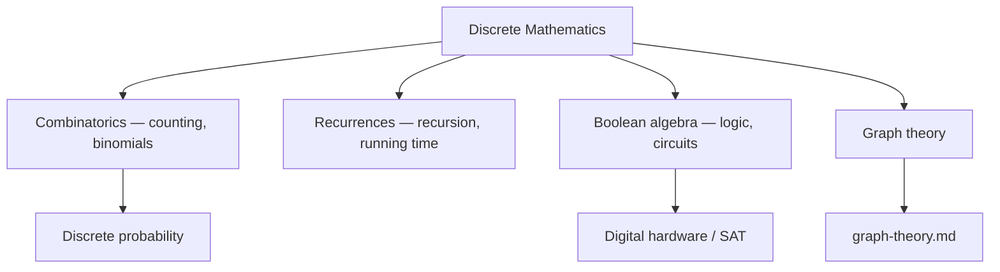

# Discrete Mathematics

Discrete mathematics studies structures that are **countable and separated** — integers,
finite sets, graphs, logical values — rather than the continuous quantities of
[calculus](calculus.md). It is, more than any other branch, *the mathematics of computer
science*: algorithms manipulate discrete state, data structures are discrete objects, and
correctness arguments run on the tools below. It draws on
[proof and logic](mathematical-proof-and-logic.md) and [set theory](set-theory.md) for its
foundations.

## Combinatorics: the art of counting

Counting sounds trivial and is not — it is how we bound running times, sizes of hypothesis
spaces, and probabilities. Two rules generate the rest: the **sum rule** (disjoint choices
add) and the **product rule** (independent stages multiply).

- **Permutations** — ordered arrangements. Arranging r of n distinct items:
  P(n, r) = n! / (n − r)!.
- **Combinations** — unordered selections. Choosing r of n:
  $$\binom{n}{r} = \frac{n!}{r!\,(n-r)!}.$$
  These **binomial coefficients** populate Pascal's triangle via the identity
  \(\binom{n}{r} = \binom{n-1}{r-1} + \binom{n-1}{r}\) and expand \((x+y)^n\) in the
  binomial theorem.
- **Pigeonhole principle** — if n items go into k < n boxes, some box holds ≥ ⌈n/k⌉.
  Trivial to state, surprisingly powerful in existence proofs.
- **Inclusion–exclusion** corrects for overcounting overlaps:
  |A ∪ B| = |A| + |B| − |A ∩ B|.

Counting is the bridge to **discrete probability**: when outcomes are equally likely, a
probability is just (favorable count)/(total count). This is the combinatorial core of
[probability](../statistics/probability.md) and the broader
[statistics](../statistics/index.md) field.

## Recurrences

A **recurrence relation** defines each term from earlier ones — the natural description of
recursive algorithms. The Fibonacci recurrence Fₙ = Fₙ₋₁ + Fₙ₋₂ is the classic example.
Recurrences are solved by characteristic equations (linear cases) or by the **Master
Theorem** for divide-and-conquer costs like T(n) = 2T(n/2) + O(n). Their correctness is
proved by **induction** — the discrete analogue of a limit argument — tying directly back
to [proof and logic](mathematical-proof-and-logic.md).

## Boolean algebra

Boolean algebra is the algebra of the two-element set {0, 1} under AND, OR, NOT. It is the
computational face of [propositional logic](mathematical-proof-and-logic.md): every logic
formula is a Boolean function, every Boolean function reduces to a normal form (e.g. sum of
products), and De Morgan's laws let us rewrite them. This is the mathematics of digital
circuits, of SAT solving, and of the boolean predicates that gate control flow in every
program.

## Why it matters (including AI/CS)

Discrete math is the day-to-day toolkit of [computer science](../computer-science/index.md):
combinatorics bounds the size of search spaces, recurrences give algorithmic complexity,
and Boolean algebra describes both hardware and logic. In AI it is pervasive — the state
spaces explored by [search and planning](../ai/search-and-planning.md) are discrete graphs,
the number of possible states drives tractability, and combinatorial counting underlies the
probabilistic reasoning inside [machine learning](../ai/machine-learning.md). Its most
prominent sub-branch, [graph theory](graph-theory.md), earns a note of its own.

## References

- [Rosen, *Discrete Mathematics and Its Applications*](rosen-discrete-mathematics.md) —
  the canonical undergraduate text for every topic here.
- [*Introduction to Algorithms* (CLRS)](../computer-science/introduction-to-algorithms.md)
  — recurrences and the Master Theorem in algorithmic context.
