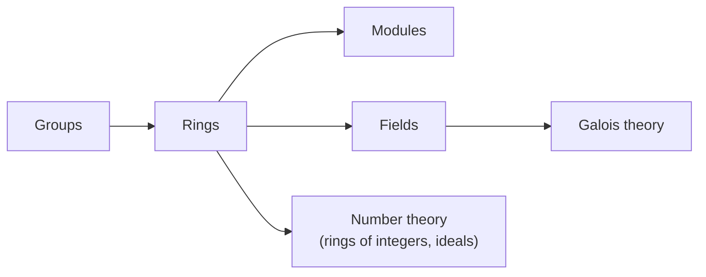

# Abstract Algebra (David S. Dummit & Richard M. Foote)

Dummit and Foote's *Abstract Algebra* (3rd edition, 2003) is the comprehensive
standard reference for a full-year introduction to modern algebra at the advanced
undergraduate or beginning graduate level. At roughly 900 pages it deliberately holds
more than any one course covers, which is precisely why it endures as a reference: it
develops each algebraic structure from first definitions through substantial results,
threading a large collection of worked examples and exercises so that the reader
experiences the recurring interplay between groups, rings, and fields rather than
learning them as isolated topics.

## Scope and approach

The book is organized as a tour of the major algebraic structures, in increasing
richness, with later parts freely using earlier ones:

- **Group theory** — subgroups, quotient groups and homomorphisms, group actions,
  the Sylow theorems, direct and semidirect products, and the classification of
  finitely generated abelian groups.
- **Ring theory** — ideals and quotient rings, Euclidean domains, principal ideal
  domains, unique factorization domains, and polynomial rings.
- **Modules** — modules over a ring, the structure theorem for finitely generated
  modules over a PID (which unifies the abelian-group classification and the
  rational/Jordan canonical forms of linear algebra), and tensor products.
- **Field theory and Galois theory** — field extensions, splitting fields, the
  fundamental theorem of Galois theory, solvability by radicals, and finite fields.
- **Further topics** — commutative algebra and algebraic geometry, homological
  algebra, and representation theory of finite groups.

The style is thorough and example-driven rather than terse: definitions are motivated,
proofs are complete, and cross-references show how a result in one structure recurs in
another. It presumes the proof fluency and basic set theory of a transition course but
is otherwise self-contained.

## Where it sits

This book is the anchor reference for [abstract-algebra.md](abstract-algebra.md): the
structural vocabulary of groups, rings, and fields that organizes much of modern
mathematics. Its ring and field theory is the machinery behind
[number-theory.md](number-theory.md) — unique factorization, ideals, finite fields,
and the algebraic number theory that studies the integers through the lens of ring
structure.

## Related notes

- [abstract-algebra.md](abstract-algebra.md) — the concept this book anchors.
- [number-theory.md](number-theory.md) — where ring and field theory pay off.
- [artin-algebra.md](artin-algebra.md) — the linear-algebra-forward companion text.

## References

- [Abstract Algebra, 3rd Edition — David S. Dummit & Richard M. Foote (Wiley)](https://www.wiley.com/en-us/Abstract+Algebra%2C+3rd+Edition-p-9780471433347)
