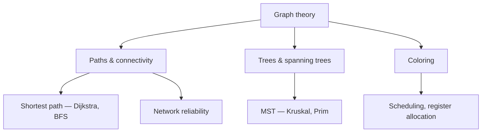

# Graph Theory

A **graph** is the mathematics of *relationships*: a set of objects and the connections
among them. Because "objects and connections" describes so much of the world — networks,
dependencies, maps, molecules, social ties, the web — graph theory is one of the most
broadly applied branches of mathematics and a cornerstone of computer science. It is a
sub-branch of [discrete mathematics](discrete-mathematics.md) and rests on
[set theory](set-theory.md) (a graph is a set of vertices plus a relation on them).

## Definitions

A graph G = (V, E) is a set of **vertices** V and a set of **edges** E ⊆ V × V connecting
them. Key variants:

- **Undirected vs directed** — edges are symmetric pairs, or arrows (**digraphs**).
- **Weighted** — edges carry costs (distances, capacities).
- **Simple** — no loops or repeated edges.

The **degree** of a vertex counts its incident edges; the **handshake lemma** states the
degree sum equals 2|E| (every edge contributes to two endpoints) — a one-line
counting-and-parity argument.

## Paths, connectivity, cycles

A **walk** is a sequence of adjacent vertices; a **path** repeats none; a **cycle** returns
to its start. A graph is **connected** if a path joins every pair of vertices. Two famous
special routes:

- An **Eulerian circuit** traverses every *edge* once — exists iff the graph is connected
  and every vertex has even degree (Euler's resolution of the Königsberg bridges, the
  founding result of the field).
- A **Hamiltonian cycle** visits every *vertex* once — with no simple characterization, and
  deciding its existence is **NP-complete**, one of graph theory's deep links to
  computational complexity.

## Trees and spanning trees

A **tree** is a connected acyclic graph. Two defining facts, provable by induction: a tree
on n vertices has exactly n − 1 edges, and there is a *unique* path between any two
vertices. Trees are the backbone data structure of computing — parse trees, file systems,
search trees, decision trees. A **spanning tree** of a connected graph is a subgraph that
is a tree touching every vertex; a **minimum spanning tree** (MST) minimizes total edge
weight, found greedily by Kruskal's or Prim's algorithms.

## Coloring

A proper **vertex coloring** assigns colors so no adjacent vertices share one; the fewest
colors needed is the **chromatic number** χ(G). The **Four Color Theorem** — every planar
map is 4-colorable — is the celebrated result here (and the first major proof to rely on
computer verification). Coloring is not decoration: it models register allocation in
compilers, scheduling with conflicts, and frequency assignment.

## Graph algorithms and ubiquity in CS/AI

Graph theory becomes engineering through **algorithms**: breadth-/depth-first search,
Dijkstra's and Bellman–Ford shortest paths, topological sort, max-flow/min-cut, and MST —
all catalogued in [*Introduction to Algorithms*](../computer-science/introduction-to-algorithms.md)
and central to [computer science](../computer-science/index.md). The state spaces explored
by [search and planning](../ai/search-and-planning.md) in AI *are* graphs, and modern
[machine learning](../ai/machine-learning.md) includes graph neural networks that compute
directly over this structure. Graphs are also the native model of
[distributed systems](../distributed-systems/index.md) — nodes as vertices, communication
links as edges — where connectivity and cut arguments bound reliability and consensus.

## References

- [Rosen, *Discrete Mathematics and Its Applications*](rosen-discrete-mathematics.md) —
  graphs, trees, coloring at undergraduate depth.
- [*Introduction to Algorithms* (CLRS)](../computer-science/introduction-to-algorithms.md)
  — the standard reference for graph algorithms.
