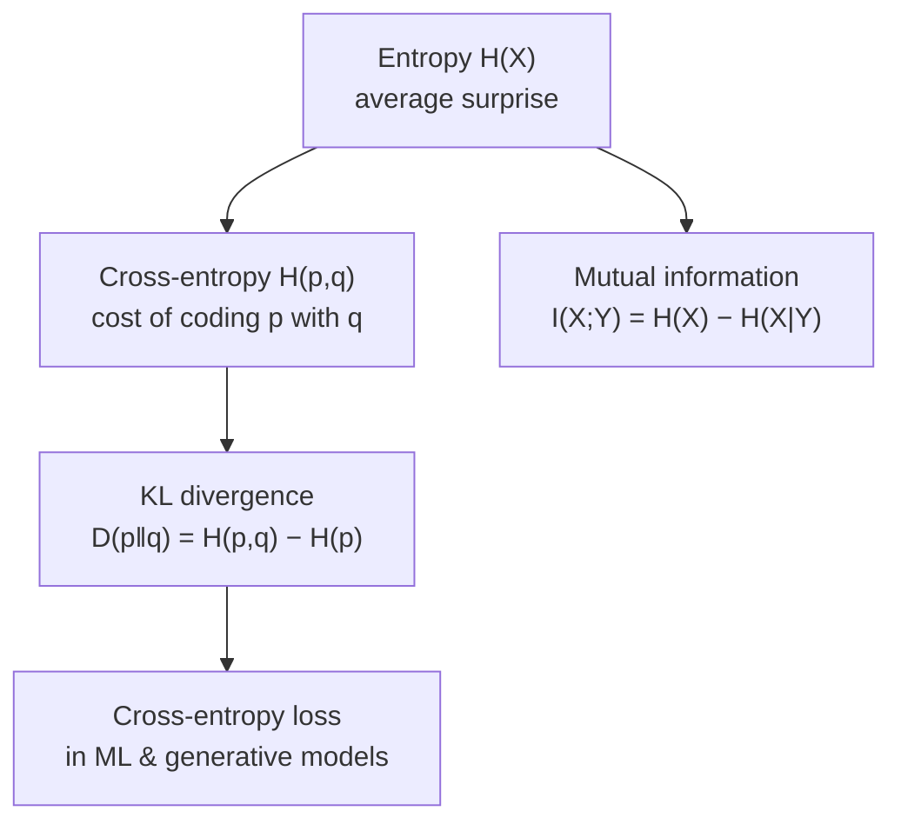

# Information Theory

Information theory, founded by Claude Shannon in 1948, is the mathematics of *quantifying
uncertainty and communication*. It answers two deceptively simple questions: how much can a
message be compressed, and how fast can it be sent reliably over a noisy channel? The answers
are governed by a single quantity — **entropy** — and its relatives now form the everyday
currency of machine learning loss functions and compression. It sits at the meeting point of
probability (see [../statistics/index.md](../statistics/index.md)) and
[discrete mathematics](discrete-mathematics.md).

## Entropy: the measure of surprise

The **entropy** of a discrete random variable $X$ with distribution $p$ is

$$ H(X) = -\sum_x p(x)\log p(x). $$

Read it as the *expected surprise*: rare outcomes ($p$ small) carry large $-\log p$ surprise,
common ones carry little, and entropy averages them. With a base-2 log the unit is **bits**,
and $H(X)$ is exactly the average number of bits needed to encode outcomes of $X$ — no code
can do better. A fair coin has $H = 1$ bit; a biased coin has less, because it is more
predictable; a certain outcome has $H = 0$.

## Cross-entropy and KL divergence

Suppose the true distribution is $p$ but we encode using a model $q$. The average cost is the
**cross-entropy**

$$ H(p,q) = -\sum_x p(x)\log q(x), $$

and the *excess* cost of using the wrong model is the **Kullback–Leibler divergence**

$$ D_{\mathrm{KL}}(p \,\|\, q) = \sum_x p(x)\log\frac{p(x)}{q(x)} = H(p,q) - H(p). $$

KL divergence is always $\ge 0$, and $0$ only when $p = q$ — so it behaves like a "distance"
from truth to model, though it is not symmetric. This is the exact reason
[machine learning](../ai/machine-learning.md) minimizes **cross-entropy loss**: since $H(p)$
is fixed by the data, minimizing cross-entropy is minimizing $D_{\mathrm{KL}}(p \| q)$, i.e.
making the model's distribution match reality. It is also the training objective behind
[generative models](../ai/generative-models.md), where the network learns the data
distribution by minimizing this gap (and appears directly in the variational bound of VAEs).

## Mutual information

**Mutual information** measures how much knowing one variable tells you about another:

$$ I(X;Y) = H(X) - H(X \mid Y) = D_{\mathrm{KL}}\big(p(x,y)\,\|\,p(x)p(y)\big). $$

It is the reduction in uncertainty about $X$ once $Y$ is observed — zero exactly when $X$ and
$Y$ are independent. It underlies feature selection, the information-bottleneck view of deep
representation learning, and independence testing in [../statistics/index.md](../statistics/index.md).

## Shannon's two coding theorems

- **Source coding (compression).** No lossless code can compress data below its entropy rate;
  and codes approaching that bound exist. Entropy *is* the fundamental compression limit —
  Huffman and arithmetic coding chase it in practice.
- **Channel coding (transmission).** Every noisy channel has a **capacity** $C$, the maximum
  rate of reliable communication. Below $C$, arbitrarily reliable transmission is possible
  with good error-correcting codes; above it, reliable communication is impossible. This
  result stunned engineers who assumed noise inevitably meant errors.

## A worked example

A language model predicts the next token with distribution $q$; the actual token is drawn
from the true distribution $p$. Training minimizes cross-entropy $H(p,q)$, and **perplexity**
— the standard LM metric — is just $2^{H(p,q)}$, the effective number of equally likely
choices the model is deciding among. A perplexity of 10 means the model is as uncertain as if
choosing uniformly among 10 tokens. Lower cross-entropy, lower perplexity, better model. The
[../ai/](../ai/machine-learning.md) metric and the Shannon quantity are literally the same thing.

## Why it matters

Information theory gives machine learning its loss functions (cross-entropy), its
regularizers and objectives (KL divergence in variational methods and RLHF), its evaluation
metrics (perplexity), and its intuition about what a model has actually *learned* (mutual
information). It defines the hard limits of compression and communication that all of digital
technology operates within, and it connects probability, [discrete mathematics](discrete-mathematics.md),
and the practice of modern [generative models](../ai/generative-models.md) into one framework.

## References

- [Elements of Information Theory](cover-thomas-information-theory.md) — Cover & Thomas, the canonical text
- [Discrete Mathematics and Its Applications](rosen-discrete-mathematics.md) — Kenneth Rosen, for the combinatorial and coding groundwork
