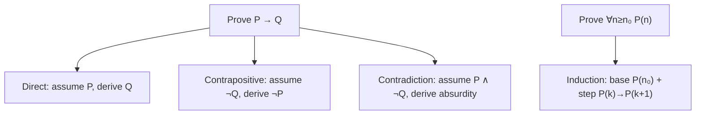

# Mathematical Proof and Logic

Logic is the grammar of mathematics, and a **proof** is a finite chain of valid
inferences that establishes a statement beyond doubt from stated assumptions. Everything
else in mathematics — [set theory](set-theory.md), [analysis](real-analysis.md),
[algebra](abstract-algebra.md) — is built on this foundation. Learning to read and write
proofs is the transition from computing answers to *knowing why they are true*.

## Propositional logic

A **proposition** is a statement that is either true or false. Propositions combine
through connectives:

| Connective | Symbol | Reads | True when |
|---|---|---|---|
| Negation | ¬P | not P | P is false |
| Conjunction | P ∧ Q | P and Q | both true |
| Disjunction | P ∨ Q | P or Q | at least one true |
| Implication | P → Q | if P then Q | false only when P true, Q false |
| Biconditional | P ↔ Q | P iff Q | P and Q agree |

The implication P → Q is the workhorse of mathematics, and its logic surprises beginners:
it is *vacuously true* whenever P is false. Two derived forms matter constantly. The
**contrapositive** ¬Q → ¬P is logically equivalent to P → Q (same truth table); the
**converse** Q → P is *not* equivalent. Confusing a statement with its converse is one of
the most common reasoning errors. A **tautology** is a formula true under every assignment
(e.g. P ∨ ¬P); a **contradiction** is false under every assignment.

## Predicate logic and quantifiers

Propositional logic cannot express "every integer has a successor." **Predicate logic**
(first-order logic) adds *predicates* P(x) over a domain and two quantifiers:

- **Universal** ∀x P(x) — "for all x, P(x)."
- **Existential** ∃x P(x) — "there exists x with P(x)."

Quantifier *order* is meaning. "∀x ∃y (y > x)" (every number is exceeded by some number)
is true over the integers; the swap "∃y ∀x (y > x)" (one number exceeds all) is false.
Negation flips quantifiers and negates the body — the rule that drives most disproofs:

$$\neg\,\forall x\, P(x) \equiv \exists x\, \neg P(x), \qquad \neg\,\exists x\, P(x) \equiv \forall x\, \neg P(x).$$

So to disprove a universal claim you exhibit a single **counterexample**. This
quantifier machinery — the **predicate calculus** — is exactly the reasoning skeleton
used to specify systems precisely; see [systems thinking](../systems-thinking/index.md)
for how the same formal language models feedback and constraints, and it underlies formal
specification and verification in [computer science](../computer-science/index.md).

## What a proof is, and the core techniques

A proof starts from axioms, definitions, and previously proven results, and reaches the
claim by inference rules (e.g. *modus ponens*: from P and P → Q conclude Q). The standard
strategies:

- **Direct proof** — assume the hypothesis, march to the conclusion.
- **Contrapositive** — prove ¬Q → ¬P instead; often easier because the negated forms are
  more concrete.
- **Contradiction** (*reductio ad absurdum*) — assume the statement is false and derive
  an impossibility.
- **Mathematical induction** — to prove P(n) for all integers n ≥ n₀, prove the **base
  case** P(n₀) and the **inductive step** P(k) → P(k+1). **Strong induction** assumes
  P(n₀), …, P(k) to prove P(k+1); it is logically equivalent and rests on the
  well-ordering of the naturals.

### Canonical example: √2 is irrational

By contradiction, suppose √2 = a/b in lowest terms. Then a² = 2b², so a² is even, so a is
even (contrapositive: odd² is odd), say a = 2c. Then 4c² = 2b², i.e. b² = 2c², so b is
even too — contradicting "lowest terms." Hence √2 is irrational. This one argument
threads negation, contrapositive, and contradiction together.

## Why it matters (including AI/CS)

Rigor is what lets a result be *trusted and reused*. In computing, propositional and
predicate logic are the basis of Boolean circuits, SAT/SMT solvers, type systems, and
program verification; induction is the standard tool for proving algorithm correctness and
termination (see [discrete mathematics](discrete-mathematics.md) and
[Rosen](rosen-discrete-mathematics.md)). In AI, formal logic underpins knowledge
representation, automated theorem proving, and the search for provable guarantees on
[machine learning](../ai/machine-learning.md) systems. The habit of stating assumptions
and quantifiers explicitly — the discipline of proof — is also the discipline of writing
precise specifications.

## References

- [Rosen, *Discrete Mathematics and Its Applications*](rosen-discrete-mathematics.md) —
  the standard undergraduate treatment of logic and proof.
- [Spivak, *Calculus*](spivak-calculus.md) — a model of proof-based exposition.
- [Rudin, *Principles of Mathematical Analysis*](rudin-principles-of-mathematical-analysis.md)
  — rigor carried into analysis.
