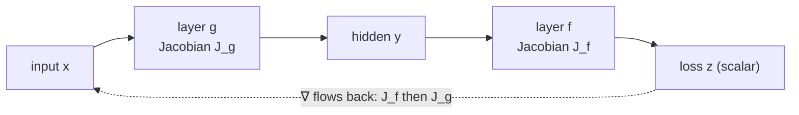

# Multivariable Calculus

Multivariable calculus extends the derivatives and integrals of
[calculus.md](calculus.md) to functions of many variables — functions whose input is a
vector and whose output may be a scalar or another vector. This is the mathematics that sits
directly underneath gradient-based learning: the loss of a
[../ai/neural-networks.md](../ai/neural-networks.md) is a scalar function of millions of
parameters, and every idea below is a tool for differentiating it. It marries the smooth
analysis of [calculus.md](calculus.md) with the vector-and-matrix machinery of
[linear-algebra.md](linear-algebra.md).

## Partial derivatives and the gradient

For a scalar function $f(\mathbf{x}) = f(x_1, \dots, x_n)$, the **partial derivative**
$\partial f / \partial x_i$ is the ordinary derivative taken with respect to one variable
while holding the others fixed. Collecting all of them into a vector gives the **gradient**:

$$ \nabla f = \left( \frac{\partial f}{\partial x_1}, \dots, \frac{\partial f}{\partial x_n} \right). $$

The gradient is the single most important object here: it points in the direction of
**steepest ascent**, and its negative points downhill. Gradient descent is nothing more than
repeatedly stepping in the direction $-\nabla f$ — the entire premise of
[../ai/backpropagation-and-gradient-descent.md](../ai/backpropagation-and-gradient-descent.md).

## Jacobian and Hessian

Two matrices organize higher-order derivative information:

- The **Jacobian** $J$ of a *vector-valued* map $\mathbf{f}: \mathbb{R}^n \to \mathbb{R}^m$
  stacks all first partials, $J_{ij} = \partial f_i / \partial x_j$. It is the best *linear*
  approximation of the map at a point — the multivariable analogue of the derivative — and it
  is exactly the local linear map that backprop multiplies through, layer by layer.
- The **Hessian** $H$ of a scalar function collects the second partials,
  $H_{ij} = \partial^2 f / \partial x_i \partial x_j$. It describes local *curvature*. Its
  [linear-algebra.md](linear-algebra.md) eigenvalues classify critical points: all positive
  means a minimum, all negative a maximum, mixed signs a **saddle point** — the structures that
  dominate high-dimensional loss surfaces.

## The multivariable chain rule

Composition still differentiates by the chain rule, but now the "multiplication" is
**matrix multiplication of Jacobians**. For $\mathbf{y} = \mathbf{g}(\mathbf{x})$ and
$\mathbf{z} = \mathbf{f}(\mathbf{y})$,

$$ J_{\mathbf{z}/\mathbf{x}} = J_{\mathbf{z}/\mathbf{y}} \; J_{\mathbf{y}/\mathbf{x}}. $$

A deep network is a long composition of such maps, so its overall Jacobian is a long product of
per-layer Jacobians. **Reverse-mode automatic differentiation** — i.e. backpropagation —
evaluates that product from the output backward, which is efficient precisely because the final
output (the loss) is a single scalar.

## Vector fields

A **vector field** assigns a vector to every point of space — a gradient field
$\nabla f$ is the canonical example. Operators like divergence and curl summarize how a field
spreads or rotates, and integral theorems (Green's, Stokes', the divergence theorem) generalize
the [calculus.md](calculus.md) Fundamental Theorem to higher dimensions. Beyond physics, gradient
fields are the picture of an optimization landscape: following the field downhill *is* training,
and the same fields describe the flow of a system in
[differential-equations.md](differential-equations.md).

## Example

Take $f(x, y) = x^2 + 3y^2$. The gradient is $\nabla f = (2x, 6y)$, zero only at the origin.
The Hessian is the constant matrix $\begin{pmatrix} 2 & 0 \\ 0 & 6 \end{pmatrix}$, whose
eigenvalues $2$ and $6$ are both positive — confirming the origin is a minimum. The unequal
eigenvalues mean the bowl is steeper in $y$ than in $x$, so plain gradient descent zig-zags,
which is exactly the ill-conditioning that momentum and adaptive optimizers were invented to fix.

## Why it matters (and the AI role)

Multivariable calculus is the direct mathematical engine of
[../ai/deep-learning.md](../ai/deep-learning.md). The gradient tells the optimizer which way to
step, the Jacobian is what backprop chains through the network, and the Hessian's curvature
explains why some directions train slowly and motivates second-order and adaptive methods. It is
also the foundation of continuous [../linear-optimization/index.md](../linear-optimization/index.md)
— gradients define descent directions, and constrained optimization uses gradients through
Lagrange multipliers and the KKT conditions.

## References

- [Calculus](spivak-calculus.md) — Michael Spivak (single-variable groundwork)
- [Principles of Mathematical Analysis](rudin-principles-of-mathematical-analysis.md) — Walter Rudin (differentiation in $\mathbb{R}^n$, Ch. 9)
- [Introduction to Linear Algebra](strang-linear-algebra.md) — Gilbert Strang (matrices and eigenvalues)
