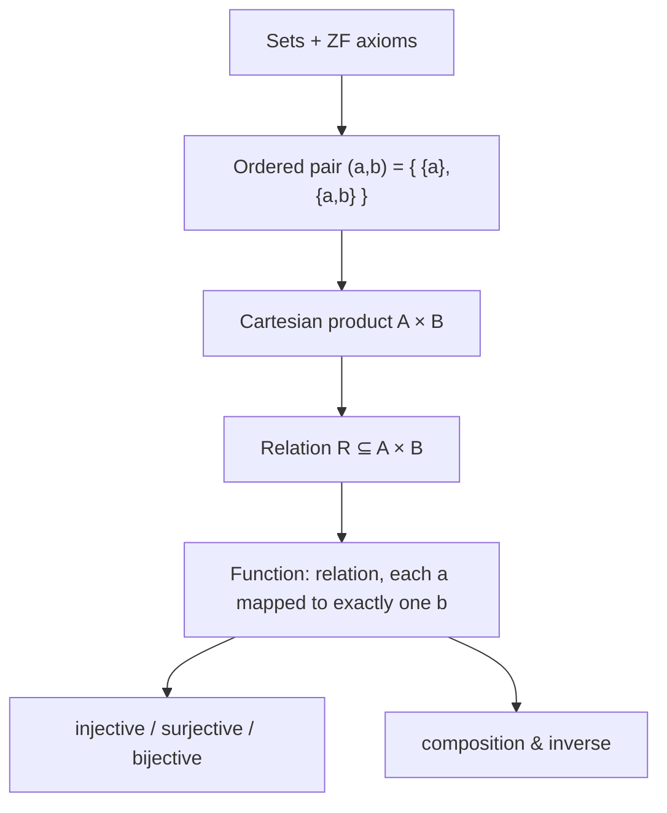

# Naive Set Theory

Paul Halmos's slim 1960 textbook builds the standard machinery of sets, relations, and functions from the Zermelo–Fraenkel axioms — but "naively," meaning it uses just enough formalism to be honest and no more, aiming to give the working mathematician the set-theoretic vocabulary the rest of mathematics is written in. It is worth keeping here because **relations and functions, defined precisely as sets, are the substrate for nearly every abstraction in computing**: types, state transitions, database keys, and the mappings a program computes are all, underneath, the objects Halmos constructs.

## Sets from axioms, briefly

Halmos develops sets through the ZF axioms — extensionality (a set is determined by its members), pairing, unions, powers, specification (subsets carved out by a property), infinity, and choice — treating each as a tool rather than an object of deep study. Extensionality gives the identity criterion that everything else rests on: two sets are equal exactly when they have the same elements.

## Ordered pairs, relations, functions

The chapters that matter most for computing are the constructions that turn "membership" into structure:

- **Ordered pair.** Halmos adopts the Kuratowski definition, `(a, b) = {{a}, {a, b}}`, so that order is recovered purely from unordered sets. This is the trick that lets everything below be *just sets*.
- **Cartesian product.** `A × B` is the set of all ordered pairs `(a, b)` with `a ∈ A`, `b ∈ B`.
- **Relation.** A relation from `A` to `B` is any subset `R ⊆ A × B`. Its domain and range are the sets of first and second coordinates that actually appear. Equivalence relations (reflexive, symmetric, transitive) partition a set into classes; partial orders give the reflexive-antisymmetric-transitive structure behind lattices and dependency graphs.
- **Function.** A function is a relation `f ⊆ A × B` in which each `a` in the domain is paired with **exactly one** `b`. From this single constraint Halmos derives injective (one-to-one), surjective (onto), and bijective maps, composition, inverses, and images/preimages of subsets.

The payoff is conceptual economy: a function is not a new kind of thing, it is a relation with a uniqueness condition, and a relation is not a new kind of thing, it is a set of pairs. Everything reduces to membership.

## Why it matters here

The function-as-a-set-of-pairs definition is the quiet foundation under [type theory](../logic/categorical-logic-and-type-theory.md): a typed term is an element, a type is (informally) a set of admissible values, and a typed function is a map between them — the point where Halmos's set theory hands off to the categorical account Jacobs gives. The same relational vocabulary underlies the data models in [Designing Data-Intensive Applications](../distributed-systems/designing-data-intensive-applications.md), where a relation in Codd's sense is exactly Halmos's subset of a product, and keys are the uniqueness constraints that make a relation a function. Program semantics in the [Dijkstra–Scholten](../logic/predicate-calculus-and-program-semantics.md) sense also lives here: a predicate is the characteristic function of a subset of the state space, and a program's meaning is a relation between initial and final states.

## References

- [Naive Set Theory — Paul R. Halmos (Springer, reprint of the 1960 edition)](https://link.springer.com/book/10.1007/978-1-4757-1645-0)
